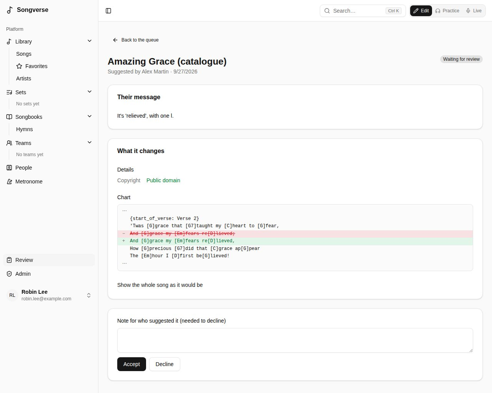

## Reviewers

A reviewer (or a global admin) checks songs submitted to the global catalogue. The **Review** page lists what's waiting. For each song you can:

- **Approve and publish** it, optionally with a trust label shown on the global song ("Official publisher text"). The song itself moves to the catalogue, credited to whoever it came from; their files stay theirs;
- **Merge into** a similar song already in the catalogue: theirs is folded into it - their versions, files and sets move over, their way of singing it becomes their version of it, and their changed details come to you as a suggestion;
- **Ask for changes**, or **Reject** it, with a note for the submitter.

You can't review your own submissions. Global admins can also **Publish now** their own songs without a review.

The **Review** page also lists **Suggested changes** to catalogue songs (see [Suggesting a change](/library/#suggesting-a-change)). Each shows what it changes, from the song as it was when it was suggested; **Accept** saves it to the song in its author's name, **Decline** needs a note. If the song was changed since in the same place, it says where, and it can only be declined.

## Global admins

Global admins manage the whole server from **Dashboard**, in the sidebar's **Admin** section (reviewers find **Review** there).

### Users

Everyone with an account, with their status, songs and storage. For each user you can:

- **Change storage limit** - leave it blank to use the default;
- **Make reviewer** or remove the role;
- **Ban** them (they're signed out and can't sign in until unbanned; their content stays);
- **Delete user**, choosing what happens to what they personally own: delete it now, or keep it for a **transfer link**. Whoever opens that link while signed in, before it expires, becomes its owner.

### Auth

How Songverse sends email (verification, password reset) through Resend, and whether **Google sign-in** is offered. Settings saved here take effect immediately; **Revert to environment variables** goes back to the server's configuration.

### Security

How the API protects itself. **Limit requests** caps how many requests it takes a minute: per signed-in user, per address before signing in, and a tighter number for the expensive ones (uploads, artwork and artist lookups, joining by link). Over a limit, the request is refused until the minute is out and the app says "Too many requests, try again in a moment". **Proxies in front of the API** says how many proxies (a load balancer, Traefik…) sit before it, so it counts each visitor by their own address rather than the proxy's. **API documentation** decides who can read `/api/docs`: anyone, or only global admins. **Content-Security-Policy** tells browsers which scripts, connections and frames Songverse's pages may use, so a script slipped into a page wouldn't run: **Enforced** (the default), **Only reported** - nothing is refused, and what would have been goes to the web server's log, to try a change first - or **Off**. Each setting shows where it comes from - saved here, an environment variable, or the default - and **Revert to environment variables** goes back to the server's configuration.

### Storage

Where uploaded files are kept (object storage such as Cloudflare R2, or local disk for development), how much is used, and the **default storage limit** per user. Global admins have no limit.

### Stem separation

The server recordings are split into stems on (a Demucs API, see [Separating a recording into stems](/library/#separating-a-recording-into-stems)): its **API address** and **API key** (leave the key blank to keep the current one), the **Quick pass model** (htdemucs; asking for 6 parts uses htdemucs_6s), **Then a finer pass** and its model (htdemucs_ft), which replaces the quick stems when the server has time, and the **Separations per person in 30 days** (empty: no limit). **Test connection** checks the address and key and lists the server's models. The server must be able to reach the API back to say when stems are ready; otherwise Songverse checks every 2 minutes.

**Who can use it**: a person allowed by email address can split the recordings of the songs they can edit; a team ticked here lets every member split the team's songs' recordings. Global admins always can. **Revert to environment variables** goes back to the server's configuration.

### Catalogs

Manages the published songbook catalogs (see [Songbooks](/songbooks/#from-a-published-songbooks-catalog)): add one, edit its entries in a table, import or export them as CSV or JSON.

### Server maintenance

The **Metadata** page has two maintenance tasks: **Check status** compares the database migrations on the server with what's applied, and **Run seed script** re-applies the built-in data (tag categories, tags, tuning presets). It's safe to re-run.

**Background jobs** shows whether the Worker - the server process that does the slow work in the background (finding artwork and artists, songbook uploads, recorded takes, the hourly clean-up of expired transfers) - is running, how many jobs wait in each queue or failed, and the last ones' results, refreshed every few seconds. The admin's backfills have a queue of their own, so a new song's lookups never wait behind one. It also warns when the Worker has no `SETTINGS_ENCRYPTION_KEY`, or not the API's: it then can't use the secrets saved here (the providers' keys, storage). It says which ffmpeg the Worker has, which turns recorded takes into Opus (see [Recording a part](/library/#recording-a-part)); without it, takes stay as recorded (WAV), about eight times bigger. **Failed jobs** lists the jobs that failed, with why; **Clear failed jobs** empties that list, in every queue. **No Worker is running** means jobs wait: see Deploy.md in the repository to set one up, or to let the API run them itself (`JOBS_IN_API`).

**Metadata providers** lists where songs and artists are looked up - MusicBrainz, Apple Music, Deezer and Spotify - in the order they're asked. Move one with the arrows, and tick what each is asked for, among what it can do: **Song info** (a song's **Auto detect**, see [The library](/library/)), **Album artwork** (a song's image), **Artist pictures** and **Artist bios** (MusicBrainz's are Wikipedia's, found through Wikidata). **(needs a key)** beside one means it's ticked but can't be asked until its settings have a key. Auto detect's matches closest to the title and artist come first, then the song's first release, and this order breaks what's left; a new song's artwork and an artist's picture come from the first provider here, among those ticked, that has one. **Save configuration** keeps the list; **Revert to environment variables** goes back to `METADATA_PROVIDERS` (those listed, in order, for all they can do, like `musicbrainz,deezer`), or to all four in this order without it.

Each provider's **Settings** open under it:
- **MusicBrainz**: the **Contact** sent to MusicBrainz with each request, as it asks - a web address or an email address (else `MUSICBRAINZ_CONTACT`).

- **Apple Music**: the **Apple Music storefront (country)** searched - two letters, like us or fr - and, optionally, the Apple Music API's MusicKit key. Without a key, Apple Music is searched through iTunes Search, which needs none. With one, it's searched through the Apple Music API: the same songs, plus their ISRC, who wrote them, and artist pictures. Create a MusicKit key in your Apple Developer account (Certificates, Identifiers & Profiles > Keys), then enter its **Team ID**, **Key ID** and **Private key (.p8)** - the whole file, BEGIN and END lines included. The private key is kept encrypted and never shown again: leave it blank to keep the current one. Until you have a key, **Developer token URL (without a key)** can take an address that answers with a developer token (`{"token": "eyJ…"}`, or `APPLE_MUSIC_TOKEN_URL`); each token is kept until it expires. Its tokens are signed by whoever runs that address, not your Apple account, so they can stop working at any time - a key, once saved, is used instead. **Test connection** tries a search with the key or the token. **Revert to environment variables** clears both and goes back to `APPLE_MUSIC_TEAM_ID`, `APPLE_MUSIC_KEY_ID` and `APPLE_MUSIC_PRIVATE_KEY` (or `APPLE_MUSIC_TOKEN_URL`), or to iTunes Search without them.
- **Deezer** needs no key.
- **Spotify** needs an app: create one on Spotify for Developers (developer.spotify.com > Dashboard > Create app, with the Web API) and enter its **Client ID** and **Client secret** - kept encrypted and never shown again; leave it blank to keep the current one - and the **Market (country)** searched (else `SPOTIFY_MARKET`, else the Apple Music storefront). No one signs in to Spotify: Songverse asks as the app. Its matches bring the song's Spotify link and ISRC. **Test connection** tries a search; **Revert to environment variables** goes back to `SPOTIFY_CLIENT_ID` and `SPOTIFY_CLIENT_SECRET`, or to not asking Spotify without them.

**Song artwork** turns a song's artwork on or off (**Find artwork for songs**): found on its own for a new song, from the providers ticked for **Album artwork**. **Save configuration** keeps it; **Revert to defaults** goes back to on. **Find artwork for songs without one** looks up to 50 songs at a time, newest first, in the background: its result shows under **Background jobs**. A song nothing matched isn't tried again; one whose lookup failed (a provider down or refusing) is, next time. See [Artwork](/library/#artwork).

**Artist pictures and bios** turns them on or off (**Look up artists' pictures and bios**): a picture from the providers ticked for **Artist pictures**, and a short bio from Wikipedia, found through MusicBrainz and Wikidata, in English and French. **Save configuration** keeps it; **Revert to environment variables** goes back to `ARTIST_LOOKUPS` (`off` turns them off), or on without it. **Look up artists not looked up yet** asks about up to 25 at a time, the most recently credited first, in the background: its result shows under **Background jobs**. An artist whose lookup failed is tried again next time. See [Artists](/library/#artists).
