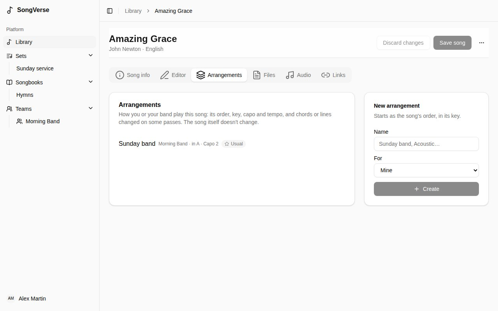
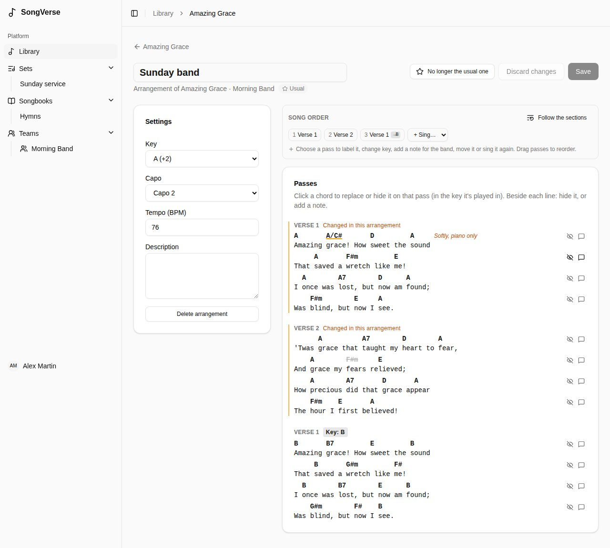

An **arrangement** is how you or your band play a song: its order, key, capo and tempo, and chords or lines changed on some passes. **The song itself never changes**, so you can arrange songs you can't edit, like global catalogue songs.

## Making one

On a song's **Arrangements** tab, give it a name ("Sunday band", "Acoustic") and choose who it's **For**: you, or a team you're an admin of. It starts as the song's order, in its key.

Team arrangements are seen by the team's members and changed by its admins.

## Editing it

- **Settings** - its **Key** (from the song's), **Capo**, **Tempo** and a description.
- **Song order** - which passes are played, in what order, with key changes and notes, like [the song's own order](/song-editor/#the-song-order).
- **Passes** - the chart as this arrangement plays it, in the key each pass is played in:
  - **click a chord** to replace it on that pass (type it in the key it's played in), **hide** it for the band, or put it back **as in the song**;
  - beside each line, **hide the line** on that pass, or add a **note** to it ("Softly, piano only").

Passes you've changed are marked **Changed in this arrangement**, here and on the band's charts. **Save** when you're done.

### The team's usual arrangement

A team admin can make a team arrangement **the team's usual one** for a song. When the song is added to one of the team's sets, that's the arrangement it plays.

### When the song changes

If the song is edited after you last checked the arrangement, the arrangement editor says so. It keeps working meanwhile. Changes that point at something since removed from the song (a chord or line that's gone) are listed on their pass: remove them, or leave them - they do nothing. **Mark as checked** once you've looked it over.

## Your own view of a chart

When you open a song in a set, the **My view** bar changes the chart **for you only**:

- **Hide chords** - then tap a chord to hide it (one that's too fast for you, say). **Show hidden** brings them back.
- **Simpler chords** - Gmaj7 shows as G, Bm7b5 as Bdim.
- **No bass notes** - D/F# shows as D.
- **Do Ré Mi** - chord names in solfège.
- **Capo shapes** - with a capo, chords as the shapes you play rather than as they sound.

Hidden and simpler chords are kept per song (and per arrangement). Solfège and capo shapes apply to every chart; you can also set them in [your account](/account/#chart-display).
