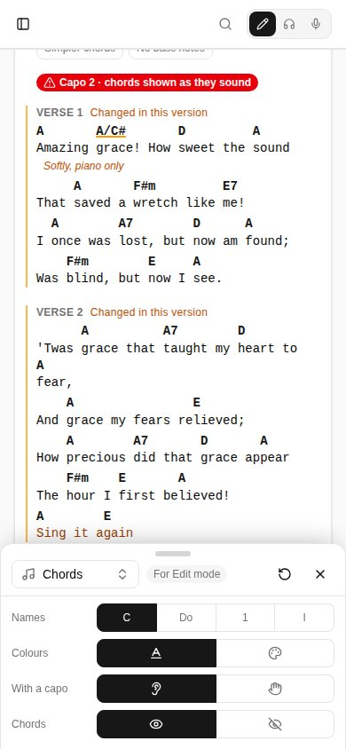
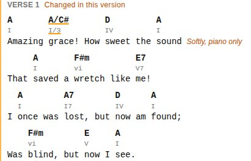
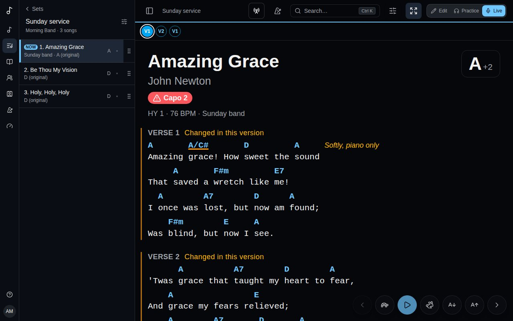

The **Display** button (sliders) opens a small panel at the bottom of the screen: how the chart reads, changed while you look at it. It's on a song's page in Practice, on a set's songs, in Live's header (an icon only) and beside the song editor's preview. On a phone the panel covers only the bottom of the screen, so the chart above stays in view, scrolls and takes taps. On a large screen it's a column down the right with every section in it at once, and the page moves over to make room. Every change shows on the chart at once. **×** closes the panel, and so does dragging it down by its handle.

## One setting per mode

What you change is kept for the mode you're in - **Edit**, **Practice** or **Live** - and saved on your account, so every device you sign in on reads the same way. Live can have big text and no diagrams while Practice has guitar diagrams and two columns. The panel says which mode it's changing (**For Live mode**).

Anything a mode hasn't changed comes from your account's [Chart display](/account/#chart-display). **↺** puts the mode back to those settings.

## What it changes

On a phone, the list at the top of the panel picks a section; a large screen shows them all, one under the other:

- **Text** - **Lyrics** and **Chords**, each a size (**−** and **+**, from 75% to 300%; Live starts at 150%). The chords follow the lyrics' size until you change theirs; the link button beside them (**Chords follow the lyrics' size**) ties them together again. Headings and notes follow the lyrics, and the chords stay over their letters at any size; Live's own **Smaller text** and **Bigger text** buttons change the lyrics, and the chords with them while they're linked. **Font** (monospace, where chords line up with each letter, or proportional) and **Spacing** between lines (**Compact**, **Normal**, **Relaxed**).
- **Chords** - **Names** in letters, solfège, Nashville numbers or Roman numerals (see [Nashville numbers and chord colours](/versions/#nashville-numbers-and-chord-colours)); chords **With a capo** as they sound or as the shapes to play; their **Colour** (**Accent**, **Muted**, **By chord type** or **A colour of your own**), **Font** (**As the lyrics**, proportional or monospace) and **Weight** (**Bold** or **Regular**); and **Chords** shown or hidden (**Lyrics only**, which hides both rows). Sharps and flats show as ♯ and ♭.

  Under them, a **Second row** of chords, off until you turn it on (Roman numerals the first time), has the same options, plus **Where** it goes - **Under the chords**, **Over the chords**, **Beside each chord** as a small superscript, or side by side on the same line (**Side by side, after** or **Side by side, before**) - the **Gap** between the two rows, and its **Size** against the main chords. Letters with the shapes to play makes a capo song readable for everyone: the chords as they sound, the shapes under them, in italics. Turned off, the second row keeps its settings for when you turn it on again. Each chord stays over its letter with both rows, and a second row that would only repeat the first - the capo's shapes in a song without a capo - isn't shown. Tapping a chord opens its card with the chord as each row names it.

  
- **Instrument** - **Diagrams**: **None**, **Guitar**, **Ukulele** or **Piano** (see [Chord diagrams](/versions/#chord-diagrams)). With a guitar or a ukulele, its **Tuning** and **Left-handed** diagrams; with a piano, the **Hands**. The tuning, left-handed and hands are your account's, the same in every mode.

  **Where** the diagrams sit, for this mode: **Hidden (a tapped chord still shows its diagram)**, **At the top** (the song's chords once each, scrolling away with the chart; fold them to one line), **Docked at the bottom, for the section being played** (a bar at the bottom of the screen with the chords of the section crossing the upper third of the screen, changing as you scroll or autoscroll; it sits above a docked stem player and Live's controls, and folds to its handle, remembered on the device) or **Beside each section** (small diagrams of that section's chords to the right of its heading; under it on a phone). Tapping a diagram plays it wherever it is.
- **Layout** - **Columns**: **Auto** flows a long song into as many columns as the screen fits, a section never split between two; **1**, **2** or **3** set how many at most. A phone always has one.
- **Controls** (Live only) - where Live's buttons are: **Footer**, a bar along the bottom; **Floating**, round buttons over the chart, at a **Position** (**Bottom right**, **Bottom left**, **Bottom centre** or **Right edge**, below the line you read) and an **Opacity** from 20% to 100%, fading to a faint outline after a few seconds and back with a touch or a key (a faded button doesn't take the touch that wakes it); or **Hidden**, nothing over the chart: the keys, a page-turner pedal and swipes still work, and a tap at the very bottom of the screen brings the buttons up for a moment. Under **Show**, turn each off or on: **Previous / next**, **Autoscroll**, **Text size**, **Metronome**, **Structure bar** and **Transpose** (the key is then shown without opening the transpose card). See [Playing a set live](/sets/#playing-a-set-live).

The panel opens at the section you used last. Changes are saved a moment after the last one; offline, they're kept on the device and saved once you're back online.
