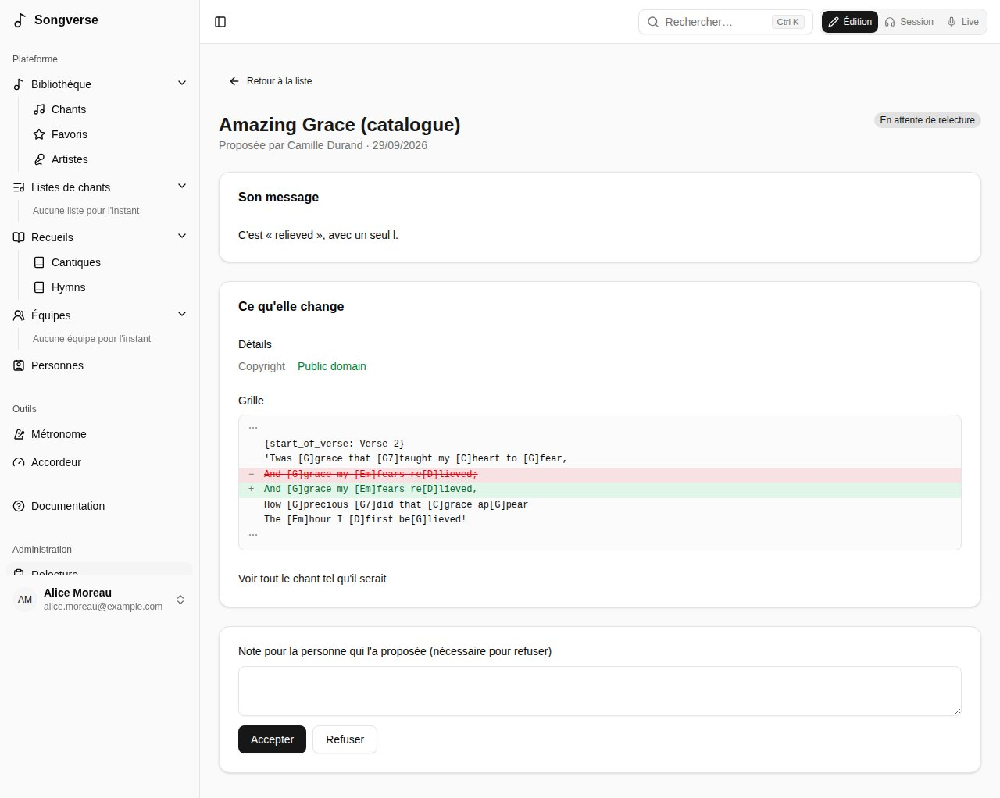

## Relecteurs

Un relecteur - qui a un rôle qui permet de relire, comme le rôle intégré **Reviewer** (voir [Rôles](/fr/admin/#rôles)), ou un administrateur global - vérifie les chants proposés au catalogue global. La page **Relecture** liste ce qui attend. Pour chaque chant, vous pouvez :

- **Approuver et publier**, avec si vous voulez une mention de confiance affichée sur le chant global (« Texte officiel de l'éditeur »). Le chant lui-même passe au catalogue, au nom de la personne qui l'a proposé ; ses fichiers restent les siens ;
- **Fusionner avec** un chant semblable déjà dans le catalogue : le sien y est intégré - ses versions, fichiers et listes passent à ce chant, sa façon de le chanter devient sa version de celui-ci, et les détails qu'elle avait changés vous arrivent comme une proposition ;
- **Demander des modifications**, ou **Refuser**, avec une note pour la personne qui l'a proposé.

Vous ne pouvez pas relire vos propres propositions. Les administrateurs globaux peuvent aussi **Publier maintenant** leurs propres chants sans relecture.

La page **Relecture** liste aussi les **Modifications proposées** pour les chants du catalogue (voir [Proposer une modification](/fr/library/#proposer-une-modification)). Chacune montre ce qu'elle change, depuis le chant tel qu'il était quand elle a été proposée ; **Accepter** l'enregistre dans le chant au nom de son auteur, **Refuser** demande une note. Si le chant a été modifié depuis au même endroit, elle dit où, et ne peut qu'être refusée.

## Administrateurs globaux

Les administrateurs globaux gèrent tout le serveur depuis **Tableau de bord**, dans la section **Administration** de la barre latérale (les relecteurs y trouvent **Relecture**).

### Utilisateurs

Tous les comptes, avec leur statut, leurs rôles (ceux de leurs équipes en contour), leurs chants et leur stockage. Pour chaque personne, vous pouvez :

- **Rôles…** - cocher les rôles qu'elle a (voir [Rôles](/fr/admin/#rôles)) ; ceux qu'elle tient de ses équipes sont listés dessous, à changer dans **Équipes** ;
- **Bannir** (la personne est déconnectée et ne peut plus se connecter jusqu'à la levée du bannissement ; son contenu reste) ;
- **Supprimer l'utilisateur**, en choisissant ce que devient ce qui lui appartient : le supprimer tout de suite, ou le garder pour un **lien de transfert**. Qui ouvre ce lien en étant connecté, avant qu'il n'expire, en devient propriétaire.

### Authentification

Comment Songverse envoie ses e-mails (vérification, réinitialisation du mot de passe) via Resend, et si la **connexion avec Google** est proposée. Les réglages enregistrés ici prennent effet tout de suite ; **Revenir aux variables d'environnement** retourne à la configuration du serveur.

### Sécurité

Comment l'API se protège. **Limiter les requêtes** plafonne le nombre de requêtes qu'elle accepte par minute : par utilisateur connecté, par adresse avant connexion, et un nombre plus serré pour les requêtes coûteuses (envois de fichiers, recherches de pochettes et d'artistes, adhésion par lien). Au-delà, la requête est refusée jusqu'à la fin de la minute et l'application affiche « Trop de requêtes, réessayez dans un instant ». **Proxys devant l'API** indique combien de proxys (un répartiteur de charge, Traefik…) la précèdent, pour qu'elle compte chaque visiteur par sa propre adresse plutôt que celle du proxy. **Documentation de l'API** décide qui peut lire `/api/docs` : tout le monde, ou seulement les administrateurs globaux. **Content-Security-Policy** indique aux navigateurs quels scripts, connexions et cadres les pages de Songverse peuvent utiliser, pour qu'un script glissé dans une page ne s'exécute pas : **Appliquée** (par défaut), **Seulement signalée** - rien n'est refusé, et ce qui l'aurait été va dans le journal du serveur web, pour essayer un changement d'abord - ou **Désactivée**. Chaque réglage indique d'où il vient - enregistré ici, une variable d'environnement ou la valeur par défaut - et **Revenir aux variables d'environnement** retourne à la configuration du serveur.

### Équipes

Chaque équipe, avec ses rôles, ses membres, ses chants et son **espace de stockage** : ce qui est sur les chants d'une équipe y compte, quel que soit qui l'a envoyé, et non pour la personne qui l'a envoyé. **Rôles…** donne des rôles à l'équipe : chacun s'applique à tous ses membres, et un palier de stockage fixe l'espace de l'équipe.

### Rôles

Le seul endroit qui dit ce que chacun peut faire au-delà de ses chants et de ceux de ses équipes. Un rôle peut permettre de :

- **Relire les propositions** - la file du catalogue global (voir [Relecteurs](/fr/admin/#relecteurs)) ;
- **Séparer des enregistrements en pistes**, avec ses propres **Séparations par personne sur 30 jours** ou, laissé vide, celle de **Séparation en pistes** ;
- **Un palier de stockage** - combien une personne peut stocker, ou l'espace d'une équipe.

**Reviewer** (relecteur) et **Stem separation** (séparation en pistes) sont intégrés, avec ces noms, que vous pouvez changer : ils se modifient mais ne se suppriment pas. **Nouveau rôle** ajoute les vôtres, comme « Stockage 10 Go ». Donnez les rôles aux personnes dans **Utilisateurs** et aux équipes dans **Équipes**. On peut faire ce que permet l'un de ses rôles - les siens et ceux de ses équipes - et la plus grande limite l'emporte ; sans palier de stockage, les valeurs par défaut de **Stockage** s'appliquent. Les administrateurs globaux peuvent tout faire. Les changements s'appliquent tout de suite.

### Instruments

Les instruments que chacun peut choisir comme ce qu'il joue (voir [Rôles](/fr/account/#rôles)). Sous **Ajoutés**, ajoutez-en un qui manque à la liste avec son **Nom** et, s'il diffère, son nom **En français** (**Ajouter l'instrument**) ; **Renommer** le change, **Retirer** l'enlève, ainsi qu'à ceux qui l'avaient choisi. **Déjà dans la liste** montre ceux qui y sont d'office.

### Stockage

Où sont gardés les fichiers envoyés (un stockage objet comme Cloudflare R2, ou le disque local pour le développement), l'espace utilisé, le plus gros fichier de chaque type (**Taille maximale des fichiers** : PDF, ChordPro, MusicXML, ABC, Texte, Image, Audio, Autre - 25 Mo, audio 50 Mo, sauf réglage ici, jusqu'à 500 Mo, car un envoi est gardé dans la mémoire du serveur jusqu'à son stockage ; **Rétablir** revient à la valeur par défaut), et les limites de stockage par défaut : **Limite par défaut par utilisateur (Mo)** et **Limite par défaut de l'espace d'une équipe (Mo)**, pour qui n'a pas de palier de stockage (voir [Rôles](/fr/admin/#rôles)). Ce qui est sur les chants d'une équipe compte dans l'espace de l'équipe ; le reste de ce qu'on envoie, dans sa propre limite. Les administrateurs globaux n'ont pas de limite.

### Séparation en pistes

Le serveur sur lequel les enregistrements sont séparés en pistes (une API Demucs, voir [Séparer un enregistrement en pistes](/fr/library/#séparer-un-enregistrement-en-pistes)) : son **Adresse de l'API** et sa **Clé d'API** (laisser la clé vide pour garder l'actuelle), le **Modèle de la passe rapide** (htdemucs ; demander 6 pistes utilise htdemucs_6s), **Puis une passe plus fine** et son modèle (htdemucs_ft), qui remplace les pistes rapides quand le serveur a le temps, et les **Séparations par personne sur 30 jours** (vide : pas de limite). **Tester la connexion** vérifie l'adresse et la clé et liste les modèles du serveur. Le serveur doit pouvoir joindre l'API en retour pour dire quand les pistes sont prêtes ; sinon Songverse vérifie toutes les 2 minutes.

**Qui peut l'utiliser** : qui a un rôle qui le permet - le rôle intégré **Stem separation**, ou l'un des vôtres - donné à la personne ou à son équipe (voir [Rôles](/fr/admin/#rôles)) ; elle peut séparer les enregistrements des chants qu'elle peut modifier et de ceux de son équipe. Les administrateurs globaux le peuvent toujours. **Revenir aux variables d'environnement** retourne à la configuration du serveur.

### Catalogues

Gère les catalogues de recueils publiés (voir [Recueils](/fr/songbooks/#à-partir-du-catalogue-dun-recueil-publié)) : en ajouter, modifier leurs entrées dans un tableau, les importer ou les exporter en CSV ou JSON.

### Maintenance du serveur

La page **Métadonnées** a deux tâches de maintenance : **Vérifier** compare les migrations de la base de données présentes sur le serveur avec celles appliquées, et **Exécuter le script de départ** réapplique les données intégrées (catégories d'étiquettes, étiquettes, accordages). On peut le relancer sans risque.

**Tâches de fond** montre si le Worker - le processus serveur qui fait le travail lent en arrière-plan (trouver illustrations et artistes, les imports de recueils, les prises enregistrées, le nettoyage horaire des transferts expirés) - tourne, combien de tâches attendent dans chaque file ou ont échoué, et le résultat des dernières, actualisés toutes les quelques secondes. Les recherches en lot de l'administrateur ont leur propre file : les recherches d'un nouveau chant n'attendent jamais derrière. Il signale aussi un Worker sans `SETTINGS_ENCRYPTION_KEY`, ou pas celle de l'API : il ne peut alors pas utiliser les secrets enregistrés ici (clés des sources, stockage). Il indique quel ffmpeg a le Worker, qui convertit les prises enregistrées en Opus (voir [Enregistrer une piste](/fr/library/#enregistrer-une-piste)) ; sans lui, les prises restent telles qu'enregistrées (WAV), environ huit fois plus lourdes. **Tâches en échec** liste les tâches qui ont échoué, avec la raison ; **Effacer les tâches en échec** vide cette liste, dans toutes les files. **Aucun Worker ne tourne** signifie que les tâches attendent : voir Deploy.md dans le dépôt pour en installer un, ou laisser l'API les exécuter elle-même (`JOBS_IN_API`).

**Sources de métadonnées** liste où chercher les chants et les artistes - MusicBrainz, Apple Music, Deezer et Spotify - dans l'ordre où elles sont interrogées. Déplacez-en une avec les flèches, et cochez ce que chacune fournit, parmi ce qu'elle sait faire : **Infos du chant** (la **Détection automatique** d'un chant, voir [La bibliothèque](/fr/library/)), **Illustrations d'album** (l'image d'un chant), **Photos d'artistes** et **Biographies d'artistes** (celles de MusicBrainz viennent de Wikipédia, via Wikidata). **(demande une clé)** à côté signifie qu'elle est cochée mais ne peut être interrogée tant que ses réglages n'ont pas de clé. Les résultats de la détection automatique les plus proches du titre et de l'artiste viennent en premier, puis la première sortie du chant, et cet ordre départage le reste ; l'illustration d'un nouveau chant et la photo d'un artiste viennent de la première source ici, parmi celles cochées, qui en a une. **Enregistrer la configuration** garde la liste ; **Revenir aux variables d'environnement** revient à `METADATA_PROVIDERS` (celles listées, dans l'ordre, pour tout ce qu'elles savent faire, comme `musicbrainz,deezer`), ou aux quatre dans cet ordre sans elle.

Les **Réglages** de chaque source s'ouvrent en dessous :
- **MusicBrainz** : le **Contact** envoyé à MusicBrainz avec chaque requête, comme il le demande - une adresse web ou e-mail (sinon `MUSICBRAINZ_CONTACT`).

- **Apple Music** : la **Boutique Apple Music (pays)** interrogée - deux lettres, comme us ou fr - et, en option, la clé MusicKit de l'API Apple Music. Sans clé, Apple Music est interrogé via iTunes Search, qui n'en demande pas. Avec une clé, via l'API Apple Music : les mêmes chants, avec leur ISRC, leurs auteurs et les photos d'artistes. Créez une clé MusicKit dans votre compte Apple Developer (Certificates, Identifiers & Profiles > Keys), puis saisissez son **Team ID**, son **Key ID** et sa **Clé privée (.p8)** - tout le fichier, lignes BEGIN et END comprises. La clé privée est gardée chiffrée et n'est plus jamais affichée : laissez-la vide pour garder l'actuelle. En attendant une clé, **Adresse de jetons développeur (sans clé)** peut recevoir une adresse qui répond par un jeton développeur (`{"token": "eyJ…"}`, ou `APPLE_MUSIC_TOKEN_URL`) ; chaque jeton est gardé jusqu'à son expiration. Ses jetons sont signés par qui gère cette adresse, pas par votre compte Apple : ils peuvent cesser de fonctionner à tout moment - une clé, une fois enregistrée, est utilisée à la place. **Tester la connexion** fait une recherche avec la clé ou le jeton. **Revenir aux variables d'environnement** efface les deux et revient à `APPLE_MUSIC_TEAM_ID`, `APPLE_MUSIC_KEY_ID` et `APPLE_MUSIC_PRIVATE_KEY` (ou `APPLE_MUSIC_TOKEN_URL`), ou à iTunes Search sans elles.
- **Deezer** ne demande pas de clé.
- **Spotify** demande une application : créez-en une sur Spotify for Developers (developer.spotify.com > Dashboard > Create app, avec la Web API) et saisissez son **Client ID** et son **Client secret** - gardé chiffré et plus jamais affiché ; laissez-le vide pour garder l'actuel - et le **Marché (pays)** interrogé (sinon `SPOTIFY_MARKET`, sinon le pays Apple Music). Personne ne se connecte à Spotify : Songverse interroge en tant qu'application. Ses résultats apportent le lien Spotify du chant et son ISRC. **Tester la connexion** fait une recherche ; **Revenir aux variables d'environnement** revient à `SPOTIFY_CLIENT_ID` et `SPOTIFY_CLIENT_SECRET`, ou à ne pas interroger Spotify sans elles.

**Illustrations des chants** active ou non l'illustration des chants (**Trouver les illustrations des chants**) : trouvée toute seule pour un nouveau chant, depuis les sources cochées pour **Illustrations d'album**. **Enregistrer la configuration** le garde ; **Revenir aux réglages par défaut** revient à activé. **Trouver les illustrations des chants qui n'en ont pas** en cherche jusqu'à 50 à la fois, les plus récents d'abord, en arrière-plan : son résultat apparaît dans **Tâches de fond**. Un chant sans résultat n'est pas réessayé ; un chant dont la recherche a échoué (une source en panne ou qui refuse) l'est, la fois suivante. Voir [Illustration](/fr/library/#illustration).

**Photos et biographies des artistes** les active ou non (**Chercher les photos et biographies des artistes**) : une photo depuis les sources cochées pour **Photos d'artistes**, et une courte biographie de Wikipédia, trouvée via MusicBrainz et Wikidata, en anglais et en français. **Enregistrer la configuration** le garde ; **Revenir aux variables d'environnement** revient à `ARTIST_LOOKUPS` (`off` les désactive), ou activé sans elle. **Chercher les artistes pas encore cherchés** en cherche jusqu'à 25 à la fois, les plus récemment crédités d'abord, en arrière-plan : son résultat apparaît dans **Tâches de fond**. Un artiste dont la recherche a échoué est réessayé la fois suivante. Voir [Artistes](/fr/library/#artistes).

