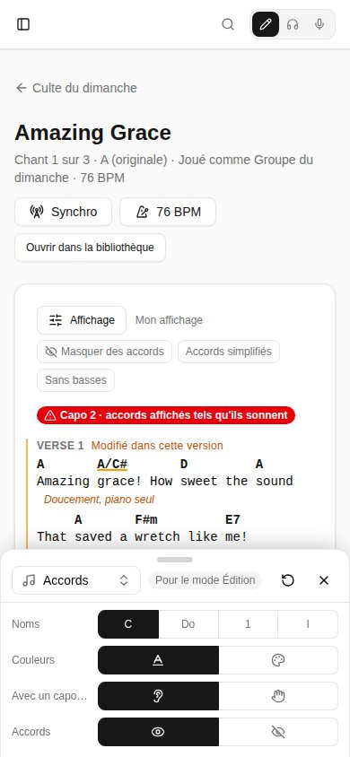
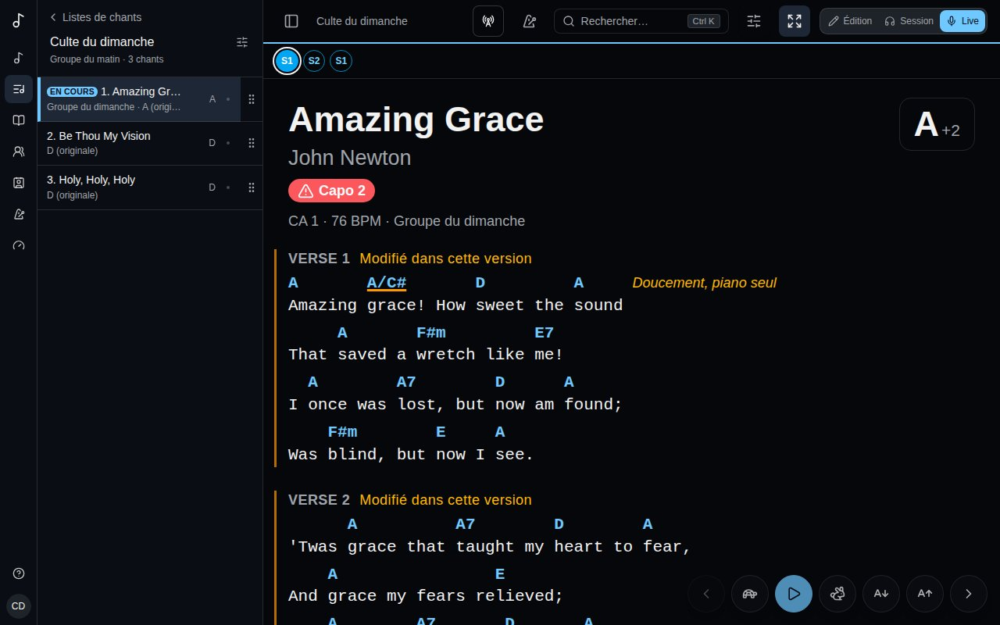

Le bouton **Affichage** (curseurs) ouvre un petit panneau en bas de l'écran : la façon dont la grille se lit, réglée pendant que vous la regardez. Il se trouve sur la page d'un chant en mode Session, sur les chants d'une liste, dans l'en-tête du Live (une icône seule) et à côté de l'aperçu de l'éditeur. Sur un téléphone, le panneau ne couvre que le bas de l'écran : la grille au-dessus reste visible, défile et réagit aux touchers. Sur un grand écran, c'est une colonne à droite qui montre toutes les parties à la fois, et la page se décale pour lui faire de la place. Chaque réglage se voit aussitôt sur la grille. **×** ferme le panneau, tout comme le faire glisser vers le bas par sa poignée.

## Un réglage par mode

Ce que vous changez est gardé pour le mode où vous êtes - **Édition**, **Session** ou **Live** - et enregistré sur votre compte : tous les appareils où vous vous connectez lisent de la même façon. Le Live peut avoir un grand texte sans diagrammes pendant que la Session a les diagrammes de guitare et deux colonnes. Le panneau indique le mode qu'il règle (**Pour le mode Live**).

Ce qu'un mode n'a pas changé vient de l'[Affichage des grilles](/fr/account/#affichage-des-grilles) de votre compte. **↺** remet le mode sur ces réglages.

## Ce qu'il règle

Sur un téléphone, la liste en haut du panneau choisit une partie ; un grand écran les montre toutes, l'une sous l'autre :

- **Texte** - **Paroles** et **Accords**, chacun une taille (**−** et **+**, de 75 % à 300 % ; le Live commence à 150 %). Les accords suivent la taille des paroles tant que vous ne changez pas la leur ; le bouton de lien à côté (**Les accords suivent la taille des paroles**) les relie à nouveau. Les titres et les notes suivent les paroles, et les accords restent au-dessus de leurs lettres à toute taille ; les boutons **Texte plus petit** et **Texte plus grand** du Live changent les paroles, et les accords avec tant qu'ils sont liés. **Police** (à chasse fixe, où les accords s'alignent sur chaque lettre, ou proportionnelle) et **Interligne** (**Serré**, **Normal**, **Aéré**).
- **Accords** - **Noms** en lettres, en solfège, en chiffres Nashville ou en chiffres romains (voir [Chiffres Nashville et couleurs des accords](/fr/versions/#chiffres-nashville-et-couleurs-des-accords)), **Couleurs** par type d'accord, accords **Avec un capodastre** tels qu'ils sonnent ou en formes à jouer, et **Accords** affichés ou masqués (**Paroles seules**).
- **Instrument** - **Diagrammes** : **Aucun**, **Guitare**, **Ukulélé** ou **Piano** (voir [Diagrammes d'accords](/fr/versions/#diagrammes-daccords)). Avec une guitare ou un ukulélé, son **Accordage** et les diagrammes pour **Gaucher** ; avec un piano, les **Mains**. L'accordage, gaucher et les mains sont ceux de votre compte, les mêmes dans tous les modes.
- **Mise en page** - **Colonnes** : **Auto** répartit un long chant sur autant de colonnes que l'écran en contient, sans jamais couper une partie en deux ; **1**, **2** ou **3** fixent un maximum. Un téléphone en a toujours une.
- **Commandes** (Live seulement) - où sont les boutons du Live : **Barre du bas** ; **Flottantes**, des boutons ronds par-dessus la grille, à une **Position** (**En bas à droite**, **En bas à gauche**, **En bas au centre** ou **Bord droit**, sous la ligne lue) et une **Opacité** de 20 % à 100 %, qui s'estompent en un léger contour après quelques secondes et reviennent au toucher ou à une touche (un bouton estompé ne prend pas le toucher qui le réveille) ; ou **Masquées**, rien par-dessus la grille : les touches, une pédale tourne-page et les balayages marchent toujours, et un toucher tout en bas de l'écran fait apparaître les boutons un instant. Sous **Afficher**, activez ou non chacune : **Précédent / suivant**, **Défilement**, **Taille du texte**, **Métronome**, **Barre de structure** et **Transposer** (la tonalité s'affiche alors sans ouvrir la carte de transposition). Voir [Jouer une liste en live](/fr/sets/#jouer-une-liste-en-live).

Le panneau s'ouvre sur la dernière partie utilisée. Les réglages sont enregistrés un instant après le dernier ; hors ligne, ils restent sur l'appareil et sont enregistrés au retour de la connexion.
