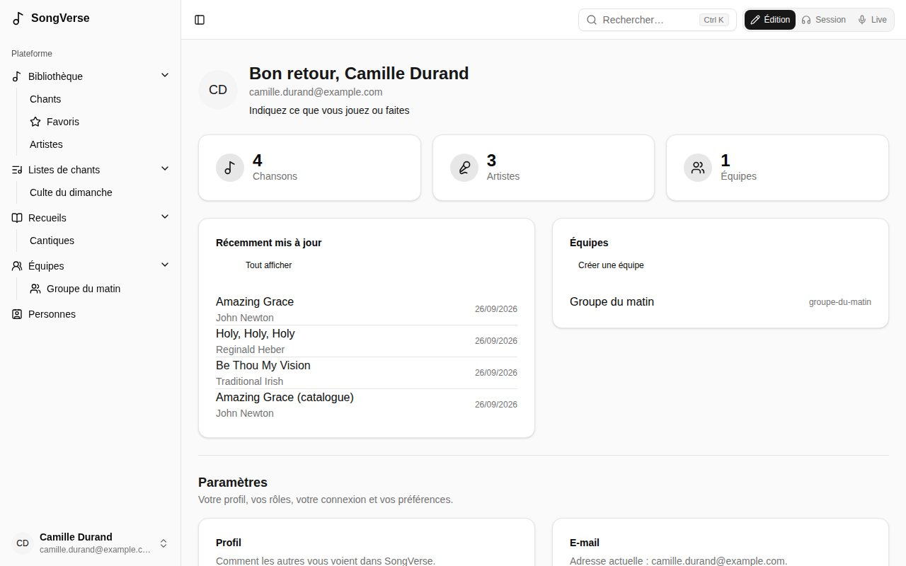
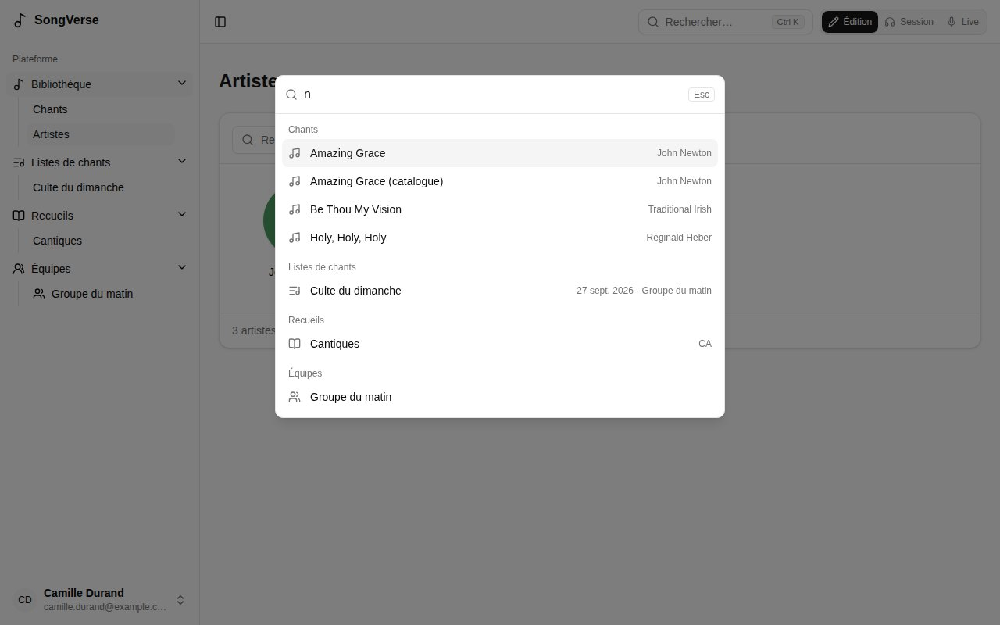

## Créer votre compte

1. Ouvrez [SongVerse](https://app.songverse.one) et choisissez **S'inscrire**.
2. Indiquez votre nom, votre adresse e-mail et un mot de passe, puis **Créer un compte**.
3. Ouvrez le lien de l'e-mail de vérification que nous vous envoyons. Vous pouvez vous connecter une fois votre adresse vérifiée.

Si votre SongVerse le propose, vous pouvez aussi utiliser **Continuer avec Google** au lieu d'un mot de passe.

## Se connecter

- Avec votre **adresse e-mail et votre mot de passe**. Oublié ? **Mot de passe oublié ?** vous envoie un lien pour en choisir un nouveau.
- Avec une **clé d'accès (passkey)**, une fois ajoutée (l'empreinte, le visage ou le verrouillage d'écran de votre appareil - voir [Votre compte](/fr/account/#clés-daccès-passkeys)).
- Avec **Google**, s'il est proposé.

## Se repérer

La barre latérale à gauche mène partout :

- **Bibliothèque** - tous les chants que vous pouvez voir : les vôtres, ceux de vos équipes et ceux du catalogue global. Voir [La bibliothèque](/fr/library/).
- **Listes de chants** - vos listes, affichées en dessous. Voir [Listes de chants](/fr/sets/).
- **Recueils** - des collections de chants, numérotées ou non. Voir [Recueils](/fr/songbooks/).
- **Équipes** - les groupes dont vous faites partie. Voir [Équipes](/fr/teams/).
- **Personnes** - les personnes avec qui vous partagez des chants. Voir [Personnes](/fr/people/).

Sur un ordinateur ou une tablette, la barre latérale a deux parties : une colonne d'icônes pour ces sections et, à côté, un panneau qui liste le contenu de la section où vous êtes - vos chants, vos listes, vos recueils, vos équipes ou vos personnes - avec une case **Filtrer…** en haut. Ce que vous consultez y est marqué : le chant, la liste ou le recueil suivant est à un clic. Le panneau de la bibliothèque propose aussi vos [listes intelligentes](/fr/library/) et **Artistes**, et **+** commence un nouveau chant, une nouvelle liste, un nouveau recueil ou une nouvelle équipe. Dans une liste de chants, le panneau montre ses chants, dans l'ordre, avec la version et la tonalité de chacun : passez de l'un à l'autre, ou à la liste elle-même depuis son nom ; **Listes de chants**, en haut, montre à nouveau vos listes.

Le bouton en haut à gauche, le bord de la barre latérale ou **Ctrl B** (**⌘ B** sur Mac) ferment le panneau et ne laissent que la colonne d'icônes ; un clic sur une icône le rouvre. SongVerse retient s'il est ouvert. Sur téléphone, la barre latérale s'ouvre par-dessus la page depuis le bouton en haut à gauche, avec toutes les sections et leurs listes.

Votre nom, en bas de la barre latérale, ouvre un menu avec le **Tableau de bord** (vos chants et vos équipes), les **Paramètres du compte** et **Se déconnecter**.

## Rechercher

Le champ de recherche en haut de chaque page - une loupe sur un téléphone - trouve tout : **Chants** (par titre, sous-titre, version, artiste ou numéro CCLI), **Listes de chants**, **Recueils** et **Équipes**, regroupés par type, sans tenir compte des majuscules ni des accents (« elevation » trouve « Élévation »). **Ctrl K** (**⌘ K** sur un Mac) l'ouvre de n'importe où. Les flèches parcourent les résultats, **Entrée** en ouvre un et **Échap** ferme la recherche. Vide, il affiche les listes à venir.

Un numéro de recueil trouve son entrée : tapez l'abréviation du recueil ou une partie de son nom et le numéro - **HY 42**, **HY42**, **Cantiques 42** - ou seulement **42** pour ce numéro dans tous les recueils. Les entrées viennent en premier, sous **Dans les recueils**.

## Édition, Session et Live

Le sélecteur en haut à droite de chaque page change le mode de SongVerse. Chaque mode a son propre aspect, pour que vous sachiez toujours où vous en êtes :

- **Édition** - pour écrire les chants, préparer les versions et les listes. Des gris neutres.
- **Session** - pour apprendre et répéter, seul ou avec le groupe. Vert. Les pistes d'un chant s'y écoutent (voir [Pistes](/fr/library/#pistes)).
- **Live** - sur scène. Toujours sombre, presque noir avec des accords bleus, et les chants d'une liste s'ouvrent en plein écran (voir [Jouer une liste en live](/fr/sets/#jouer-une-liste-en-live)).

Édition et Session suivent le réglage clair ou sombre de votre appareil. Le bouton lune dans le menu de votre compte (votre nom, en bas de la barre latérale) les passe en sombre, le soleil les repasse en clair ; revenez au réglage de votre appareil et SongVerse suit de nouveau l'appareil. Le mode Live n'a pas ce bouton : il est toujours sombre.

SongVerse retient le mode sur chaque appareil : la tablette sur votre pupitre peut rester en Live pendant que votre ordinateur reste en Édition.

## Hors ligne

SongVerse fonctionne aussi sans réseau : vos listes des deux semaines à venir, vos propres chants et ce que vous choisissez sont conservés sur l'appareil. Voir [Hors ligne](/fr/offline/).

## Langue

SongVerse existe en français et en anglais. Choisissez la vôtre dans **Paramètres du compte** > **Langue**. Cette documentation existe aussi dans les deux langues : utilisez le menu des langues en haut de chaque page.

## Qui voit quoi

Tout, dans SongVerse, appartient à quelqu'un :

- ce qui est **personnel** n'est qu'à vous, sauf si vous le partagez ;
- ce qui appartient à une **équipe** est vu par ses membres et modifié par ses administrateurs ;
- les chants **globaux** sont dans le catalogue commun, pour tout le monde. Un relecteur les vérifie avant de les ajouter (voir [Proposer au catalogue global](/fr/library/#proposer-au-catalogue-global)).
