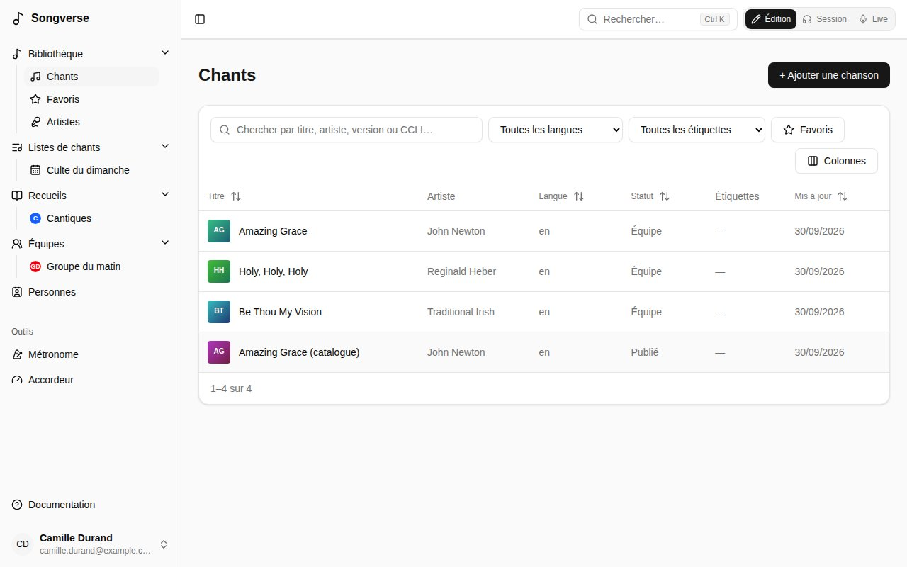
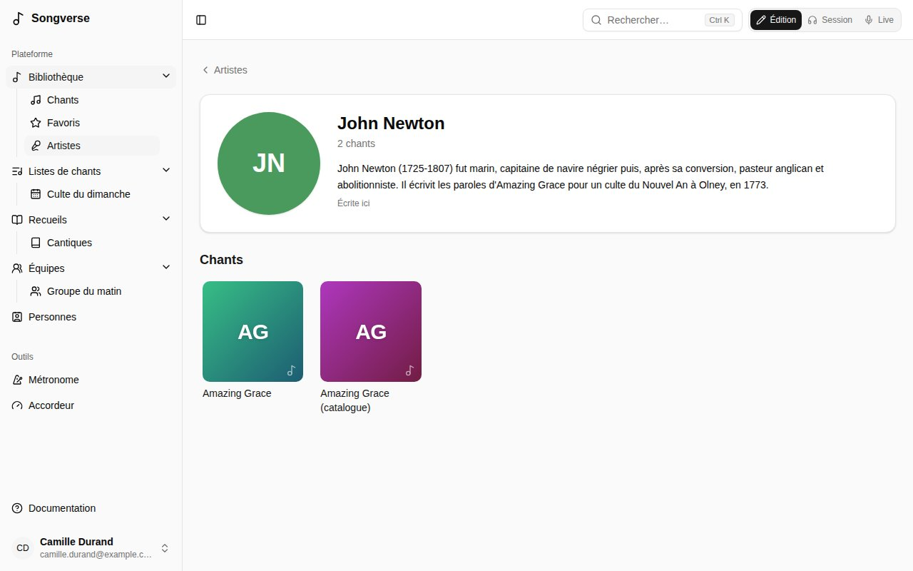
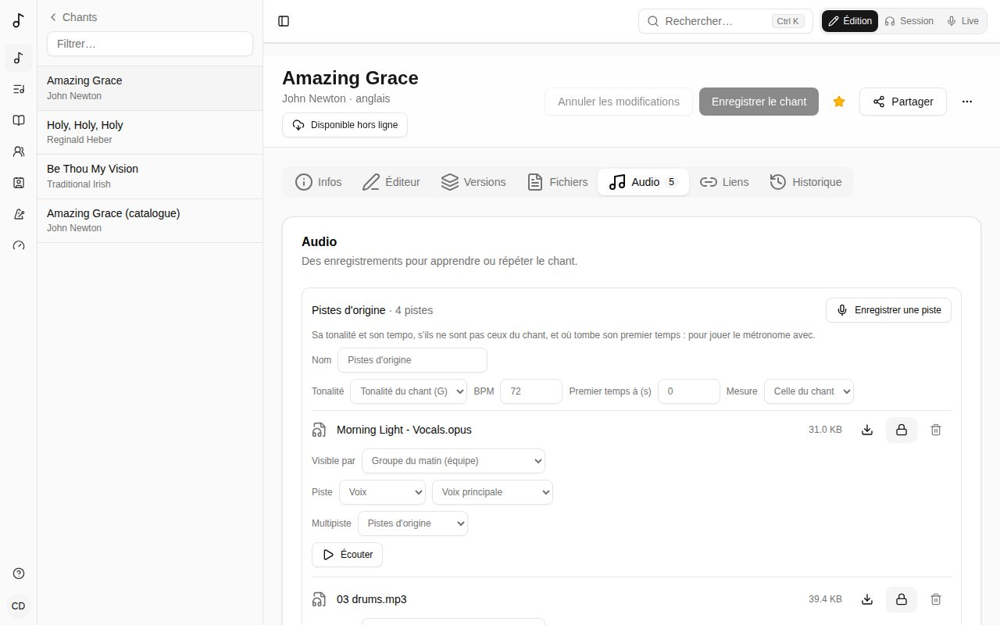
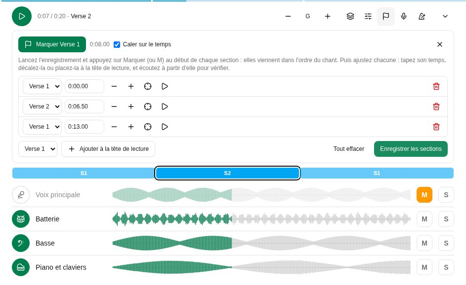
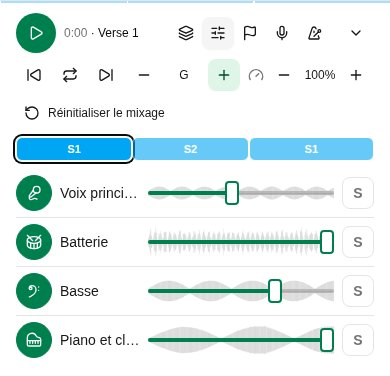
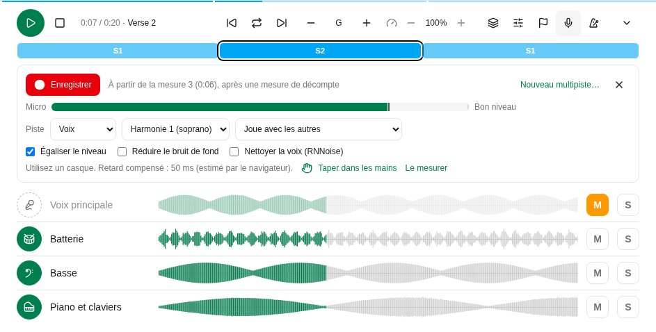
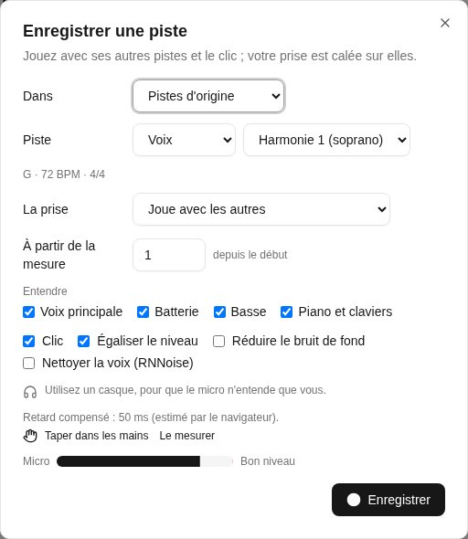

La **Bibliothèque** contient tous les chants que vous pouvez voir : les vôtres, ceux de vos équipes et ceux du catalogue global. **Bibliothèque** s'ouvre sur son accueil ; **Chants**, en dessous dans la barre latérale, est la liste complète, avec **Favoris**, **Artistes** et vos listes intelligentes à côté.

## L'accueil de la bibliothèque

**Bibliothèque** s'ouvre sur son accueil : des rangées de chants, puis les chants modifiés en dernier.

- **Nouveautés** - les derniers chants que vous pouvez voir ; **Tout voir** les liste tous dans **Chants**, les plus récents d'abord.
- **Consultés récemment** - les chants que vous avez ouverts en dernier (sur leur page, dans une liste de chants ou en Live). Vous seul·e voyez les vôtres.
- **Favoris** - les chants que vous avez marqués d'une étoile : l'étoile à côté de **Partager** sur la page d'un chant (**Ajouter aux favoris**, **Retirer des favoris**). La rangée apparaît dès que vous en avez un. **Tout voir** les liste, comme le filtre **Favoris** au-dessus de la liste et dans le panneau de la barre latérale. Vos favoris sont à vous.
- **Populaires dans vos équipes** - ce que vos équipes jouent et consultent le plus : les chants de leurs listes et ouverts par leurs membres ces 90 derniers jours.

Quand une rangée a plus de chants qu'il n'en tient, faites-la glisser, ou utilisez à la souris les flèches à côté de son titre.

Un chant sans image à lui a une couverture tirée de son titre : une couleur et ses initiales. Sous les rangées, **Modifiés récemment** montre les chants modifiés en dernier, et son lien ouvre **Chants**. La recherche en haut de l'accueil cherche dans **Chants**.

## Chercher et filtrer

**Chants** est la liste complète, et rien d'autre :

- **Recherchez** par titre, artiste ou numéro CCLI.
- **Filtrez** par langue (**Toutes les langues**) et étiquette (**Toutes les étiquettes**), ou n'affichez que vos **Favoris**.
- **Triez** par colonne en cliquant sur son titre.
- La colonne **Statut** dit où en est un chant : **Personnel** ou **Équipe** s'il n'a jamais été proposé au catalogue global, puis où en est sa proposition (**En attente de relecture**, **Publié**…).

## Artistes

**Artistes** montre toutes les personnes créditées comme artiste sur les chants que vous pouvez voir, en grille : sa photo (ou ses initiales), son nom et son nombre de chants ; la recherche les filtre. Les noms écrits différemment (avec ou sans majuscules ou accents) comptent pour un seul artiste.

Choisissez-en un pour sa page : sa photo, une courte biographie et ses chants. La photo vient de Deezer, Spotify ou Apple Music (selon les réglages de votre administrateur) et la biographie de Wikipédia (**Depuis Wikipédia** ouvre l'article), en anglais ou en français selon la langue de Songverse ; un artiste est cherché quand un chant le crédite pour la première fois, ou à la première ouverture de sa page. Son nombre de chants ouvre la liste **Chants** avec **De** suivi du nom ; le **×** à côté montre de nouveau tout le monde.

Un administrateur global peut **Ajouter une photo** (glissée et zoomée dans le cercle), **Retirer la photo**, **Modifier la biographie** - écrite ici, elle remplace celle de Wikipédia dans cette langue ; laissée vide, celle de Wikipédia revient - et **Chercher à nouveau**. Un artiste est le même pour tous : ces changements apparaissent à tous ceux qui voient un de ses chants.

## Listes intelligentes

**Chants** affiche d'abord 50 chants ; les suivants arrivent quand vous faites défiler jusqu'en bas (ou avec **Afficher plus**), et recharger ou revenir en arrière ramène tous ceux déjà affichés. **Colonnes** choisit les colonnes affichées - Artiste et Étiquettes au départ, avec le titre ; Langue, Statut, Mis à jour, Ajouté et CCLI aussi si vous le voulez - et leur ordre (le titre reste en premier), retenus sur cet appareil.

Une recherche, des filtres et un tri que vous utilisez souvent peuvent devenir une liste intelligente : réglez-les dans **Chants**, puis **Enregistrer comme liste intelligente** et donnez-lui un nom. Elle apparaît en haut du panneau de la bibliothèque dans la barre latérale (sous **Bibliothèque** sur téléphone). Une liste intelligente garde les filtres, pas les chants : un nouveau chant qui correspond y apparaît tout seul.

Sur une liste intelligente, changez les filtres et **Enregistrer les changements de la liste** garde les nouveaux ; **Renommer** et **Supprimer la liste** font ce qu'ils disent. Les listes intelligentes sont les vôtres : personne d'autre ne les voit.

## Ajouter un chant

Choisissez **+ Ajouter une chanson**. Un **nom** et au moins un **artiste** suffisent ; tout le reste peut venir plus tard.

- **Déjà dans votre bibliothèque ?** Pendant que vous tapez le nom, Songverse montre les chants que vous avez déjà sous ce titre. Vous pouvez ouvrir l'existant, **Partir de celui-ci** (reprendre ses détails), ou **Le lier à ce chant** - quand le vôtre en est une traduction ou une adaptation (voir [Chants liés](/fr/library/#chants-liés)). Une interprétation acoustique ou pour les jeunes n'est pas un nouveau chant : c'est une [version](/fr/versions/).
- La **Détection automatique** cherche le chant en ligne - sur MusicBrainz, Apple Music, Deezer et Spotify, selon les réglages de votre administrateur - et complète ce qui manque, comme l'artiste, l'album et l'année. Choisissez **Chercher le chant**, puis **Utiliser** sur la bonne correspondance. La même sortie trouvée sur plusieurs d'entre eux est un seul résultat, qui les nomme tous. Les plus proches du titre et de l'artiste viennent en premier ; parmi eux, la première sortie du chant avant les suivantes (une compilation, un album live) et avant les versions comme le karaoké. Une fois le chant enregistré, les liens Apple Music, Deezer et Spotify du résultat s'ajoutent aux **Liens** (s'il ne les a pas déjà), et l'illustration de sa sortie devient l'image du chant. Les résultats de Spotify, et d'Apple Music quand votre administrateur a configuré son API, apportent aussi l'ISRC du chant - et, pour Apple Music, qui l'a écrit (comme **Auteur-compositeur**) - s'ils sont encore vides.
- **La grille** : collez les paroles et les accords, ou ajoutez un fichier (`.cho`, `.txt` ou `.pdf`). Songverse reconnaît le ChordPro, les accords écrits au-dessus des paroles et les paroles seules. Vous pouvez ensuite la travailler dans l'[éditeur](/fr/song-editor/). Un PDF est conservé dans **Fichiers** et, s'il contient du texte (pas un scan), ses paroles et accords remplissent la zone de texte : chaque accord se place sur la syllabe au-dessus de laquelle il est imprimé, vérifiez-en quelques-uns avant d'enregistrer. Un PDF scanné n'a pas de texte à lire : collez les paroles.

Puis **Enregistrer le chant**.

## La page d'un chant

Ouverte depuis une liste - **Chants** tels que vous les avez cherchés et triés, vos **Favoris**, une liste intelligente, les chants d'un artiste ou un [recueil](/fr/songbooks/) - la page d'un chant montre où il se trouve (« 2 sur 12 · Favoris »), avec les chants d'avant et d'après de chaque côté : une touche mène au suivant, toujours dans la même liste.

Un chant a des onglets :

- **Infos** - son nom et ses artistes, et sous **Plus de détails** : compositeurs, auteurs et autres crédits, album, année, tonalité, tempo, mesure, capo suggéré, durée, copyright, numéros CCLI et ISRC, une référence (par exemple le passage biblique dont il s'inspire), des notes et des étiquettes. Il liste aussi les recueils qui le contiennent.
- **Éditeur** - la grille elle-même. Voir [L'éditeur de chants](/fr/song-editor/).
- **Versions** - la façon dont vous et vos équipes le jouez et le chantez. Voir [Versions](/fr/versions/).
- **Fichiers** - partitions, fichier d'origine de la grille, images (25 Mo maximum chacun, sauf si votre administrateur a fixé d'autres limites ; l'onglet l'indique). Les PDF, images, fichiers audio et vidéo et le texte brut s'ouvrent dans le navigateur ; tout autre fichier (une page web, par exemple) est téléchargé, pour ne jamais pouvoir s'exécuter dans Songverse.
- **Audio** - des enregistrements pour apprendre ou répéter (MP3, Opus, M4A, WAV, OGG… 50 Mo maximum chacun, sauf si votre administrateur a fixé une autre limite), et les pistes du chant (voir plus bas). Importer des fichiers audio demande un rôle qui le permet (voir [Rôles](/fr/admin/#rôles)) ; sans cela, l'onglet le dit, et vous pouvez toujours [enregistrer une piste](/fr/library/#enregistrer-une-piste) dans Songverse.
- **Liens** - le chant sur Spotify, Apple Music, Deezer et YouTube. Collez un lien, ou trouvez-le : la loupe à côté d'un service (**Chercher sur Spotify**…) y cherche le chant par son titre et son premier artiste et liste quelques résultats, avec leur pochette, leur artiste et leur album (la chaîne d'une vidéo, sur YouTube) ; choisissez-en un et il est enregistré comme lien. Apple Music et Deezer peuvent toujours être cherchés ; Spotify et YouTube une fois que votre administrateur les a configurés.

Les modifications des onglets **Infos** et **Éditeur** sont enregistrées ensemble par **Enregistrer le chant** ; les fichiers, l'audio et les liens sont enregistrés dès que vous les ajoutez. **Annuler les modifications** retire ce qui n'est pas enregistré. Le menu **⋯** permet d'**Exporter en ChordPro** ou de **Supprimer le chant**.

### Illustration

L'image d'un chant est l'illustration de l'album ou du single où il figure, depuis Apple Music, Deezer ou Spotify (selon les réglages de votre administrateur), conservée sur le stockage de Songverse. Un nouveau chant la reçoit tout seul, d'après son titre et son premier artiste, quand l'un d'eux a un résultat assez proche ; en attendant, sa couverture est tirée de son titre. Elle apparaît sur l'accueil de la bibliothèque, dans **Chants** et sur la page du chant - à côté de son titre, en Édition et en Session - pour tous ceux qui peuvent voir le chant.

Dans **Infos**, **Illustration** la montre. Si vous pouvez modifier le chant, **Trouver l'illustration** liste leurs résultats, chacun avec sa provenance - choisissez l'album ou le single d'où il vient ; sur un ordinateur, le survoler affiche son nom complet. S'il n'y est pas, **Ajouter une image** en prend une à vous : faites glisser et zoomez pour choisir le carré affiché, puis **Utiliser cette image**. **Retirer** l'enlève. Les images sont gardées carrées, en 800×800 maximum.

Voilà le chant en mode **Édition**. En **Session**, sa page est la grille elle-même, lue avec vos réglages d'accords, avec sa tonalité, son capo et son tempo, et l'enregistrement ou les pistes du chant en bas (voir [Pistes](/fr/library/#pistes)). Sur un écran large, la grille se répartit en colonnes, sans jamais couper une section entre deux ; le bouton des colonnes au-dessus choisit **Auto** (autant que la place le permet), **1**, **2** ou **3**, retenu sur cet appareil ; **Modifier** vous ramène à l'édition. Quand le chant a un PDF (une partition, la grille d'où il vient), **Grille** / **PDF** au-dessus bascule vers les pages du PDF - s'il y en a plusieurs, choisissez lequel ; un long PDF montre sa première page pendant que la suite arrive - ici, sur sa page dans une liste et en Live. Songverse retient votre choix pour le chant sur votre compte : chaque appareil où vous êtes connecté - la tablette sur scène aussi - l'affiche de la même façon ; pour les chants où vous n'avez rien choisi, votre réglage **Lire les chants en** décide (voir [Affichage des grilles](/fr/account/#affichage-des-grilles)). En **Live**, il s'ouvre comme les chants d'une liste.

Le **Capo suggéré** n'est qu'une suggestion (par exemple le capo de l'enregistrement) : il s'applique quand une version n'indique pas le sien.

Un chant peut aussi vous être partagé par une de vos [personnes](/fr/people/) : il est marqué **Partagé par** elle, et vous pouvez le lire, ou aussi le modifier si elle a choisi **Peut modifier**.

Si un chant n'est pas à vous (un chant global, ou un chant d'équipe dont vous n'êtes pas administrateur), vous pouvez le lire, en faire votre version et y ajouter vos propres fichiers (voir [Qui voit un fichier](/fr/library/#qui-voit-un-fichier)), mais pas le modifier.

## Chants liés

Une traduction ou une adaptation (paroles simplifiées, pour enfants) est un chant à part entière - son propre titre, sa langue, son propriétaire, ses [versions](/fr/versions/) et ses fichiers - lié au chant dont il vient. Sa page le dit (« Traduction de Amazing Grace »), et **Chants liés**, dans **Infos**, liste les chants liés à celui-ci. **Ajouter une traduction** commence un nouveau chant lié à lui. Vous pouvez traduire un chant du catalogue et garder votre traduction pour vous, ou la proposer au catalogue elle aussi.

Dans une liste, un chant qui a des chants liés peut passer à l'un d'eux (sa **Traduction**).

## Qui voit un fichier

Chaque fichier des onglets **Fichiers** et **Audio** a son propre réglage **Visible par**, choisi par qui l'a ajouté :

- **Moi seulement** - vous seul·e. C'est le réglage des nouveaux fichiers : enregistrements et pistes sont souvent sous le droit d'auteur de quelqu'un d'autre.
- **Groupe du matin (équipe)** - vous et les membres de cette équipe (une de vos équipes).
- **Les personnes avec qui je le partage** - vous et les [personnes avec qui le chant est partagé](/fr/people/#partager-un-chant), pour qui le partage (un chant personnel ou d'équipe).
- **Tous ceux qui voient ce chant** - pour qui peut modifier le chant.

Choisissez-le avant d'ajouter des fichiers, sous la zone de dépôt, ou changez-le ensuite sous le fichier. Les autres voient qui a partagé un fichier (« Partagé par Hugo avec Groupe du matin ») ; un fichier que vous ne pouvez pas voir n'apparaît nulle part, ni dans le chant, ni dans ses listes, ni en Session, ni hors ligne.

Toute personne qui voit un chant peut y ajouter ses propres fichiers, même sans pouvoir le modifier : ils sont à elle, et elle seule les voit sauf si elle les partage avec une de ses équipes. Ceux qui modifient le chant peuvent supprimer les fichiers qu'ils voient, mais seul·e le ou la propriétaire d'un fichier choisit qui le voit.

## Les fichiers audio et leurs originaux

Un fichier audio au-delà de 320 kb/s - sa taille pour sa durée : un WAV, FLAC ou AIFF - est converti en Opus en arrière-plan après son envoi, une fraction de la taille, tel quel : rien n'est coupé, il reste en place avec son multipiste. **En cours de traitement…** s'affiche dessous jusque-là. Les fichiers MP3, AAC ou Opus sont gardés tels qu'envoyés.

Avec un rôle qui garde les originaux sans perte (voir [Rôles](/fr/admin/#rôles)), l'original est gardé aussi, en FLAC - un WAV à sa fréquence d'échantillonnage et sa résolution, un FLAC tel quel - à côté de la copie Opus qui est jouée. **FLAC**, à côté du bouton de téléchargement du fichier, le télécharge ; les pistes en sont séparées plutôt que de la copie. Les deux comptent dans votre stockage.

## Pistes

Les pistes (ou stems) sont les parties du chant enregistrées séparément : voix, batterie, basse, etc. Importez-les dans l'onglet **Audio**. Un fichier nommé d'après sa partie (« Voix.mp3 », « 03 drums.opus », « Basse.mp3 », « Alto.wav ») devient cette piste tout seul. Pour les autres fichiers, choisissez sa partie sous le fichier, en deux temps :

- **Voix** : **Voix principale**, une harmonie - **Harmonie 1 (soprano)**, **Harmonie 2 (alto)**, **Harmonie 3 (ténor)**, **Harmonie 4 (basse)** - **Chœurs**, ou **Autre nom…** de votre choix (« Contre-chant »).
- **Instrument** : **Batterie**, **Basse**, **Guitare**, **Piano et claviers** ou **Autres**, avec un nom si vous voulez (« Guitare acoustique », « Violon »).
- **Repères** : le clic, les décomptes et les repères parlés, avec un nom (« Clic », « Guide »).

**Pas une piste** est pour un enregistrement complet. Une piste enregistrée par quelqu'un d'autre dit qui, dans le lecteur de pistes (**Enregistrée par** sous son nom) et sous le fichier. Sur une piste enregistrée dans un multipiste, ou quand les pistes d'un chant viennent de plusieurs personnes, le bouton rond du lecteur porte la photo de qui l'a enregistrée (ou ses initiales).

Si les pistes (ou un enregistrement) ne sont pas dans la tonalité du chant ou à son tempo, une version live un ton plus haut par exemple, indiquez les leurs dans le cadre des pistes au-dessus des fichiers (ou sous le fichier) : **Tonalité** et **BPM**, et **Mesure** pour sa mesure. Laissés sur **Tonalité du chant**, vides et sur **Celle du chant**, ce sont ceux du chant. **Premier temps à (s)** indique où tombe son premier temps, en secondes depuis son début (vide : à 0:00) : avec le tempo, il place le métronome sur l'enregistrement. Cochez **Intro libre** quand ce qui précède ce premier temps est joué librement, hors du temps : le métronome l'attend alors.

En mode **Session** (voir [Édition, Session et Live](/fr/getting-started/#édition-session-et-live)), un chant qui a un enregistrement ou des pistes affiche le lecteur de pistes en bas de sa page, et de sa page dans une liste. Il s'ouvre réduit, sur une ligne : **Lecture**, et ce qu'il joue - le nom de l'enregistrement, ou celui du multipiste et son nombre de pistes. Quand le chant a un enregistrement, c'est lui qui est chargé d'abord : un seul fichier, rapide à charger. S'il a aussi des pistes, **Multipiste** passe à elles, et elles ne sont téléchargées qu'à ce moment. Un chant qui n'a que des pistes les charge. Les commandes propres aux pistes - couper, solo, le mixage - sont dans le lecteur agrandi.

À côté de **Lecture**, **Arrêter, retour au début** (le carré) arrête les pistes et les ramène au début. Quand l'écran est assez large, le lecteur réduit montre aussi la forme d'onde de ce qui est entendu, les pistes combinées, à côté de ce qu'il joue : cliquez dessus pour vous y rendre.

La flèche au bout l'agrandit : une ligne par partie avec un bouton rond à son instrument (un micro pour la voix, une batterie, une clé de fa, une guitare, un piano…) - touchez-le pour couper cette partie et jouer avec le reste, de nouveau pour la remettre - sa forme d'onde et **S** (solo : ne joue que les parties en solo, vert quand il est actif). Sur un écran plus large, **M** (couper) est à côté de **S**, comme sur une table de mixage. La ligne en haut du lecteur montre où en est la lecture, dans les deux vues : cliquez ou faites-la glisser pour aller ailleurs dans le chant (ou utilisez les flèches du clavier). Pendant un solo, un bouton rond retire sa partie du solo ou l'y ajoute ; retirez la dernière pour entendre de nouveau toutes les parties. Cliquez sur une forme d'onde pour vous y rendre. La forme d'onde de chaque piste a sa longueur : une prise qui s'arrête avant la fin du chant s'y arrête aussi. **Combiner les pistes** (le bouton calques) affiche les boutons ronds des pistes et une seule forme d'onde de ce qui est entendu au lieu d'une ligne par piste, pour laisser plus de place à la grille ; Songverse s'en souvient. Avec le **Mixage** activé aussi, le bouton et le curseur de chaque piste sont listés en compact en dessous. À côté du temps se trouvent les outils du lecteur : **Combiner les pistes**, **Mixage**, **Placer les sections**, **Enregistrer une piste** et **Clic avec l'enregistrement**. Sur un téléphone, le multipiste, la transposition et la vitesse passent sur une deuxième ligne. La flèche du haut le réduit de nouveau, ce qui désactive le **Mixage** ; il s'ouvre réduit sur la page de chaque chant. Les fichiers commencent à se télécharger dès que la page du chant s'ouvre en mode Session (la ligne du haut montre où il en est), si bien que **Lecture** est en général immédiat. Une fois téléchargés, ils ne le sont plus de nouveau. Sur un iPhone, un iPad ou un Mac avec un Safari antérieur à 18.4, qui ne sait pas lire les fichiers Opus que Songverse enregistre et sépare, Songverse les décode lui-même : ils mettent quelques secondes de plus à charger, puis se jouent comme ailleurs.

**Mixage** donne à chaque piste un curseur de volume : sur un téléphone, il est posé sur la forme d'onde de la piste ; sur un écran plus large, il est à côté. Chaque forme d'onde grandit ou rétrécit avec son volume, pour voir l'équilibre d'un coup d'œil, et la forme d'onde combinée le suit aussi. Songverse retient les volumes de chaque chant sur l'appareil ; **Réinitialiser le mixage** remet toutes les pistes au maximum.

#### Les sections d'un enregistrement

Une fois les sections placées sur un multipiste (voir plus bas), le lecteur les montre en bande au-dessus des pistes : chaque section à sa place, aussi longue qu'elle dure, aux couleurs de la barre de structure du mode Live (S1, R, P…), celle en cours entourée. Touchez-en une pour vous y rendre. Celle en cours est nommée à côté du temps (« 0:41 / 3:52 · Refrain »), et la ligne en haut du lecteur prend les couleurs des sections, vives là où la lecture est passée, pâles devant, pour voir la forme du chant même lecteur réduit.

Les sections placées, le lecteur a trois boutons de plus, à côté de **Lecture** (dans le lecteur réduit aussi, quand l'écran est assez large) : **Section précédente** (retour au début de celle en cours, ou à la précédente dans ses deux premières secondes), **Section suivante**, et **Boucler cette section** (les flèches en boucle), qui rejoue en boucle la section sous la tête de lecture, pour travailler un passage ; tant qu'elle est active, les boutons de section déplacent la boucle, et **Arrêter, retour au début** revient au début de la boucle. Touchez-le de nouveau pour continuer. Au clavier : **0** arrête, **[** et **]** vont à la section précédente et suivante, **L** boucle.

**Placer les sections** (le bouton drapeau), pour qui peut modifier les fichiers du multipiste, les place :

- Lancez l'enregistrement et appuyez sur **Marquer** (ou la touche **M**) au début de chaque section : elles viennent dans l'ordre du chant (« Marquer Couplet 1 », « Marquer Refrain »…), si bien que chanter l'ordre d'un bout à l'autre les place toutes.
- Puis ajustez chacune dans la liste : tapez son temps (« 1:02.35 »), décalez-la **Plus tôt** ou **Plus tard** (d'un temps, quand l'enregistrement a un tempo), **Placer à la tête de lecture**, ou **Écouter juste avant** pour vérifier à l'oreille. **Caler sur le temps** les garde sur les temps de l'enregistrement.
- Ou déplacez-les sur la bande elle-même, comme dans un logiciel de montage vidéo : pendant le placement, le début de chaque section a une poignée, affichée quand le pointeur survole la bande (toujours, sur un écran tactile). Faites-la glisser pour déplacer la section, calée sur le temps - maintenez **Alt** pour la placer n'importe où - ou donnez-lui le focus et utilisez les flèches : un temps à la fois, ou 10 ms avec **Maj**. Une section ne peut pas passer au-delà de ses voisines, et le temps s'affiche sous la poignée pendant qu'elle bouge. La bande et la liste restent synchronisées.
- **Ajouter à la tête de lecture** place n'importe quelle section, chantée plus souvent que l'ordre du chant ne le dit par exemple ; **Retirer** en enlève une.
- **Enregistrer les sections** les garde sur chaque fichier du multipiste, ses autres prises comprises. Elles désignent les sections du chant, et survivent donc à ses modifications.

**Transposer** monte ou descend les pistes d'un demi-ton à la fois (**Un demi-ton plus haut**, **Un demi-ton plus bas**), pendant la lecture : pour la tessiture d'un chanteur, ou une autre tonalité. Entre les deux boutons, la tonalité entendue : « B (+2) » pour des pistes en A. La ligne de chaque piste a alors son bouton flèches, **Transposer** (le nom de la piste) : enfoncé, la piste est transposée ; relâché, elle joue telle qu'enregistrée. La batterie, le clic et les repères commencent relâchés, toutes les autres pistes enfoncées. Songverse retient la transposition, et quelles pistes sont transposées, pour chaque chant sur l'appareil. En jeu synchronisé, ce sont celles du meneur.

Une prise enregistrée pendant que les pistes étaient transposées est chantée dans cette tonalité, et sa ligne le dit (« chantée à +2 »). Le lecteur la décale de la différence : à +2, elle joue telle que chantée ; à 0, elle est descendue de 2 pour aller avec le reste. Sur la page d'un chant dans une liste, les pistes sont transposées dans la tonalité de la liste, sauf si vous choisissez autrement : des pistes en A, pour une liste en C, jouent en C (+3).

**Vitesse** joue les pistes plus lentement ou plus vite dans la même tonalité, de 50 % à 150 % par pas de 5 % (**Plus lent**, **Plus rapide**), pour apprendre lentement un passage difficile ou prendre le chant à un autre tempo. Le pourcentage entre les deux boutons la ramène à 100 %. La tête de lecture, les formes d'onde et les sections restent dans le temps de l'enregistrement. Tant que la vitesse n'est pas à 100 %, la piste de clic et de repères se tait, car un clic étiré bave, et le métronome joue son temps au nouveau tempo à sa place. L'enregistrement attend le retour à 100 % : une prise chantée sur des pistes ralenties ne tomberait pas juste à pleine vitesse. Songverse retient la vitesse pour chaque chant sur l'appareil, et le lecteur réduit l'affiche (« 80 % »). En jeu synchronisé, la vitesse du meneur est celle de tous. Une vidéo YouTube a la même commande **Vitesse**.

Le bouton du métronome à côté, **Clic avec l'enregistrement**, joue le [métronome](/fr/metronome/) avec les pistes : au tempo de l'enregistrement (ou du chant), son premier temps là où tombe celui de l'enregistrement, avec votre motif et votre son. Il bat dès 0:00, sur le temps de l'enregistrement, même quand son premier temps vient plus tard : le décompte sert à l'enregistrement. Avec **Intro libre** cochée pour l'enregistrement, ou **Décompte seulement** sur la page Métronome, il attend le premier temps, avec votre décompte avant. Il suit **Lecture**, la pause et la tête de lecture. En jeu synchronisé, celui du meneur est celui de chacun (voir [Jouer synchronisé](/fr/sets/#jouer-synchronisé)).

Le chant continue de jouer quand vous allez sur une autre page ou quittez le mode Session, et sur un téléphone écran verrouillé, où l'écran de verrouillage peut aussi le mettre en pause. Un petit bouton en bas à droite montre ce qui joue : touchez le nom du chant pour y revenir, ou mettez-le en pause de là.

Un chant sans pistes joue son dernier enregistrement dans le même lecteur, comme une seule partie. Un chant sans aucun audio mais avec un lien YouTube (onglet **Liens**) y joue sa vidéo YouTube, et les parties ne peuvent pas être séparées. Le lecteur s'ouvre réduit, sur une ligne : **Lecture** l'agrandit et joue, car YouTube ne joue qu'une vidéo affichée - à côté des commandes, ou au-dessus d'elles, de toute la largeur d'un téléphone. **Réduire le lecteur** (la flèche) met la vidéo en pause pour la même raison. **Vitesse** fonctionne comme pour les pistes, mais une vidéo YouTube ne peut pas être transposée : le lecteur de YouTube ne laisse pas modifier son son. Pour jouer le chant dans une autre tonalité, ajoutez son enregistrement à l'onglet **Audio**. La ligne en haut est aussi sa tête de lecture : cliquez ou faites-la glisser pour aller ailleurs dans la vidéo. Elle continue dans une petite fenêtre en bas à droite quand vous allez sur d'autres pages ; le nom du chant vous y ramène. YouTube s'arrête quand le téléphone se verrouille et ne joue pas hors ligne : dans ces cas, ajoutez l'enregistrement dans l'onglet **Audio**.

Les pistes gardées sur votre appareil pour le hors ligne (**Avec l'audio**, voir [Hors ligne](/fr/offline/)) se lisent aussi hors ligne.

### Multipistes

Un chant peut avoir plus d'un jeu de pistes : ses **Pistes d'origine**, et des multipistes - des pistes enregistrées ensemble, une autre version ou vos propres couches (voir [Enregistrer une piste](/fr/library/#enregistrer-une-piste)). Chacun a son cadre dans l'onglet **Audio**, avec son **Nom**, son nombre de pistes (et d'autres prises), la liste pour laquelle il a été enregistré s'il y en a une (**Pour aucune liste** l'en retire), et ce dans quoi ses pistes ont été enregistrées : tonalité, tempo, mesure et premier temps, qu'elles partagent. Ses fichiers sont listés dans son cadre : ses pistes d'abord - importées ou séparées - puis **Enregistrements**, les pistes que des personnes y ont enregistrées dans Songverse, chacune disant qui et quand, pour ne jamais les confondre avec les pistes. Elles se jouent toujours avec les pistes de ce multipiste. Sous une piste, la liste **Multipiste** la déplace dans un autre, ou dans un **Nouveau multipiste** à elle : importez les fichiers d'une autre version, puis rassemblez-les ainsi.

En mode **Session**, le lecteur de pistes joue un multipiste à la fois : quand un chant en a plusieurs, la liste à côté du temps passe de l'un à l'autre (**Enregistrement**, quand le chant en a un, **Pistes d'origine**, puis les autres par leur nom, ou **Multipiste 2**…). Songverse retient votre choix pour chaque chant sur l'appareil, et pour chaque page de chant d'une liste. En jeu synchronisé, chacun joue le multipiste du meneur, avec ses propres fichiers.

### Séparer un enregistrement en pistes

Quand un admin a configuré la séparation en pistes et vous y a autorisé (vous ou votre équipe), **Séparer en pistes** sous un enregistrement de l'onglet **Audio** le sépare en ses pistes sur un serveur de séparation : **4 pistes : voix, batterie, basse, autre** (par défaut), **6 pistes : plus guitare, piano**, ou **2 pistes : voix et instrumental**. Ne séparez qu'un enregistrement que vous avez le droit d'utiliser ainsi.

Les premières pistes arrivent en quelques minutes dans un nouveau multipiste nommé d'après ses pistes, **Séparé (4 pistes)**, verrouillé, dans la tonalité et le tempo de l'enregistrement et avec ses sections, et avec la même visibilité que lui. La liste **Séparations en pistes** sous les fichiers dit où en est chacune : **En attente**, **Séparation…**, **Prêt - une version plus fine arrive** - une séparation plus lente et meilleure qui remplace les pistes sur place quand le serveur a le temps, souvent la nuit - puis **Prêt**, avec **Haute qualité** une fois la version plus fine arrivée. 6 pistes n'ont pas de version plus fine : il n'existe pas de modèle plus fin pour 6. La liste, et le cadre du multipiste, nomment aussi les modèles utilisés (**Modèles : htdemucs → htdemucs_ft**), et la liste garde le nom de l'enregistrement après sa suppression - le supprimer n'empêche pas la version plus fine, que le serveur a déjà. Une séparation échouée dit pourquoi, avec **Réessayer**. La page vérifie d'elle-même ; les pistes comptent dans votre espace de stockage.

Là où l'enregistrement n'a ni tonalité, ni tempo, ni mesure, ni premier temps, ni sections, le serveur a pu les trouver : son cadre dit **Trouvé par l'analyse : …** (Em, 72 BPM, 3/4, sections…). Vérifiez-les : **C'est juste** les garde, et en changer un le confirme. Les sections trouvées sont placées sur celles du chant, dans l'ordre - vérifiez-les dans **Placer les sections**. Ce que l'enregistrement dit déjà n'est jamais remplacé.

Pour le séparer de nouveau - 6 pistes après 4, par exemple - utilisez encore **Séparer en pistes**. **Remplacer les pistes précédentes** (coché) met les nouvelles à la place de celles de la dernière séparation : leurs sections et leur nom sont repris, et les enregistrements faits dedans passent dans les nouvelles. Décochez-le pour garder les deux.

### Enregistrer une piste

Vous pouvez enregistrer une piste directement dans Songverse, sur un ordinateur, un téléphone ou une tablette avec un micro :

- **Enregistrer un nouveau multipiste**, en bas de l'onglet **Audio** : la première couche d'un chant, ou une autre version, avec le métronome seul. Donnez-lui un **Nom**, un **Tempo (BPM)** et une **Mesure** (ceux du chant pour commencer). Il commence par une mesure de décompte, qui est gardée : le premier temps du multipiste tombe une mesure plus loin.
- **Enregistrer une piste**, dans le cadre d'un multipiste : une autre piste de ce multipiste, en entendant les autres (décochez-en une sous **Entendre** pour la laisser de côté) et le clic, à son tempo, avec une mesure de décompte avant son premier temps.

#### Dans le lecteur de pistes

En mode **Session**, le bouton micro du lecteur de pistes, **Enregistrer une piste**, enregistre dans le multipiste en lecture sans le quitter. Un petit enregistreur s'ouvre au-dessus des pistes, avec les mêmes options **Piste**, **La prise** et de nettoyage, et le retard (**Taper dans les mains**, **Le mesurer**) :

- Vous entendez le lecteur tel qu'il est : vos pistes coupées, en solo et la transposition, et le métronome si **Clic avec l'enregistrement** est activé. Enregistrée transposée, la prise est gardée telle que chantée dans cette tonalité (voir plus haut).
- Dès que le micro est ouvert, **Micro** montre son niveau sur un vumètre, la crête gardée un instant, et dit si c'est **Trop faible**, un **Bon niveau** ou **Trop fort** (ça sature) : vérifiez avant d'enregistrer.
- Il enregistre à partir de la tête de lecture : placez-la n'importe où dans le chant, et la prise commence au début de cette mesure (« À partir de la mesure 17 (0:42) »), après une mesure de décompte. Elle ne remplace que le passage qu'elle couvre : la piste qu'elle remplace est gardée de part et d'autre (un punch-in et out), ou c'est le silence.
- Pendant l'enregistrement, la prise se dessine là où elle est enregistrée. **Arrêter** la termine.
- La prise est ensuite une piste comme les autres, **Nouvelle prise** : écoutez-la, coupez-la ou mettez-la en solo, et déplacez **Caler** pour l'ajuster. **Garder** l'ajoute au multipiste ; **Supprimer** l'abandonne ; **Recommencer** refait une prise.
- Pour enregistrer une piste en sections (les couplets, puis le refrain), appuyez sur **Ajouter une section** après une prise : placez la tête de lecture au début de la section suivante et **Enregistrer** de nouveau. Chaque section rejoint la même prise, avec un court fondu enchaîné à chaque bout, et le lecteur les compte (« 2 sections »). **Supprimer** n'abandonne que la dernière, **Tout supprimer** toutes, et **Garder** les enregistre toutes en un seul fichier.
- Touchez le nom d'une piste que vous avez enregistrée ou importée, sauf si elle est verrouillée (voir [Fichiers verrouillés](/fr/library/#fichiers-verrouillés)) - la petite flèche après lui - pour voir ce qu'on peut en faire : **Enregistrer dedans** ouvre l'enregistreur sur cette piste, ce que vous enregistrez ne remplaçant que le passage couvert ; **Fusionner avec…** y mélange une autre de vos pistes chantée dans la même tonalité, en un seul fichier joué à leur place (les deux sont gardés comme autres prises) ; **Supprimer** le supprime, après confirmation.
- **Nouveau multipiste…** enregistre plutôt la première couche d'un autre multipiste, comme ci-dessous.

#### Depuis l'onglet Audio

**Dans** passe d'un multipiste du chant à l'autre, ou à **Nouveau multipiste**. Sur la page d'un chant dans une liste, un nouveau multipiste peut être celui de cette liste (**Pour cette liste**) : là, c'est celui que joue le lecteur de pistes, sauf si vous en choisissez un autre.

Choisissez la **Piste** que vous enregistrez (une voix, un instrument ou des repères, comme ci-dessus), vérifiez que **Micro** vous entend à un **Bon niveau**, décochez **Clic** pour enregistrer sans métronome, et appuyez sur **Enregistrer** ; **Arrêter** termine la prise. Utilisez un casque, pour que le micro n'entende que vous, pas le clic et les autres pistes.

**La prise** indique ce qu'elle devient une fois gardée, quand le multipiste a déjà cette piste :

- **Remplace** celle qui y est, gardée comme **Autre prise** : pas jouée, mais là pour y revenir.
- **Joue avec les autres** : une deuxième piste du même genre (deux guitares).
- **Gardée comme autre prise, pas jouée**.

Dans l'onglet **Audio**, **Utiliser cette prise** sous une autre prise la joue à la place de celle de sa piste, qui devient l'autre prise.

#### Fichiers verrouillés

L'audio que vous importez est verrouillé au départ (le bouton cadenas à côté du fichier, enfoncé) : il est gardé tel qu'importé. Un fichier verrouillé ne peut pas être supprimé, remplacé par une autre prise, fusionné ni nettoyé, et le lecteur de pistes n'affiche ni à qui il est ni d'actions dessus ; sa piste, sa tonalité, son tempo et ses sections peuvent toujours changer. Une prise enregistrée à côté d'une piste verrouillée joue avec elle plutôt qu'à sa place. Seul qui l'a importé peut le déverrouiller (**Déverrouiller**, le même bouton) - pour remplacer une piste par exemple - et le verrouiller de nouveau. Ce que vous enregistrez dans Songverse n'est pas verrouillé.

**À partir de la mesure** enregistre à partir d'une mesure plutôt que du début - un punch-in : le décompte est la mesure d'avant, et la prise remplacée s'entend jusque-là. Ce qui précède reste tel quel, et ce que vous enregistrez remplace la suite, avec un court fondu enchaîné à la jonction.

Ce que vous jouez est calé sur ce que vous avez entendu : Songverse compense le retard entre un son qui sort de l'appareil et le moment où le micro l'entend. La fenêtre l'indique - estimé par le navigateur pour commencer. Pour une valeur plus juste :

- **Taper dans les mains**, casque sur les oreilles : écoutez deux clics, puis tapez dans les mains sur chacun des huit suivants, près du micro. Cela mesure tout le trajet - casque Bluetooth compris.
- **Le mesurer**, avec le son sur les haut-parleurs (casque retiré, son monté) : Songverse joue quelques clics et les écoute.

Songverse retient la mesure sur cet appareil. Un casque filaire est préférable : le Bluetooth ajoute un retard grand et variable, et la fenêtre prévient quand le son semble aller vers du Bluetooth. Refaites la mesure si une prise sonne en retard.

**Écouter** rejoue la prise avec le reste. Si elle est encore un peu en avance ou en retard, déplacez **Caler** (en millisecondes) et réécoutez. **Garder** l'ajoute au multipiste comme cette piste, que vous seul voyez jusqu'à ce que vous choisissiez qui d'autre la voit (voir [Qui voit un fichier](/fr/library/#qui-voit-un-fichier)) ; **Recommencer** refait une prise. Une prise peut durer jusqu'à neuf minutes environ.

Une prise gardée est enregistrée en WAV, puis convertie en Opus en arrière-plan (mono, 96 kbit/s : environ un huitième de la taille) - **En cours de traitement…** s'affiche dessous jusque-là. Le silence après sa fin est coupé, jamais avant, pour qu'elle reste en place. **Égaliser le niveau** (coché pour commencer) l'amène à un volume standard ; **Réduire le bruit de fond** retire un bruit constant - souffle, ronflement, ventilateur - appris sur le décompte quand c'est possible, en douceur pour ne pas toucher à la musique. Pour une voix, **Nettoyer la voix (RNNoise)** va plus loin : un réseau de neurones entraîné sur des voix garde le chant et retire le reste - la pièce, la rue, un ventilateur - mais il n'est pas fait pour les instruments, qu'il peut hacher.

Pour faire de même après coup, **Nettoyer** sous un fichier audio que vous pouvez modifier propose **Nettoyer la voix (RNNoise)** pour une voix, **Égaliser le niveau** et **Réduire le bruit de fond** : c'est fait en arrière-plan, et le fichier revient en Opus, calé comme avant.

## Proposer au catalogue global

La carte **Catalogue global** de votre chant (ou d'un chant d'équipe que vous administrez) le propose à tout le monde. **Proposer à la relecture**, avec une note pour le relecteur si vous le souhaitez ; le copyright et le numéro CCLI aident mais ne sont pas obligatoires. Un relecteur le publie, demande des modifications ou le refuse, et vous suivez où il en est sur la même carte.

Une fois publié, le chant lui-même passe au catalogue - il n'y a pas de seconde copie. Votre bibliothèque le liste une seule fois, marqué **Publié par vous**, et sa page dit de qui il vient. Sa grille et ses détails (ses notes aussi) sont désormais à tout le monde, et seuls les administrateurs les modifient ; son [historique](/fr/song-editor/#historique) continue. Ce qui était à vous le reste : vos fichiers restent à vous (ou à l'équipe avec qui vous les avez partagés - voir [Qui voit un fichier](/fr/library/#qui-voit-un-fichier)), vos versions restent les vôtres, tout comme vos propres étiquettes.

Si un relecteur trouve que le chant est déjà dans le catalogue, il le fusionne avec celui-ci, et le vôtre y est intégré - il n'y a toujours qu'un seul chant. Vos [versions](/fr/versions/) passent au chant du catalogue (vérifiez-les : chacune dit ce qu'il faut revoir), tout comme vos fichiers (toujours à vous seul·e), vos étiquettes et leurs places dans les listes et les recueils. Votre façon d'avoir le chant - vos paroles, accords, ordre et tonalité - devient une de vos versions du chant, à votre nom, avec vos notes ; vos listes le jouent ainsi. Les détails que vous aviez modifiés (titre, crédits, droits) sont proposés aux relecteurs.

Les chants publiés avant que Songverse fonctionne ainsi avaient été copiés dans le catalogue ; ils ont été intégrés à leur chant du catalogue de la même façon.

## Proposer une modification

Seuls les administrateurs modifient un chant du catalogue global, mais tout le monde peut proposer une modification - y compris la personne qui l'a proposé au catalogue. Sur la page du chant, **Proposer une modification** : ses onglets **Infos** et **Éditeur** s'ouvrent comme pour votre propre chant. Faites votre modification, puis **Envoyer la proposition**, avec un mot pour le relecteur si vous le souhaitez. Le chant lui-même ne change pas encore.

Un relecteur voit ce qu'elle change - détails et crédits barrés et nouveaux, lignes de la grille supprimées et ajoutées - et l'accepte ou la refuse. Une proposition acceptée est enregistrée dans le chant à votre nom, dans son [historique](/fr/song-editor/#historique), par-dessus ce qui a changé depuis. Si la même partie (la grille, un détail, les crédits) a été modifiée autrement entre-temps, elle ne peut pas être acceptée telle quelle.

**Vos propositions**, sur la page du chant, montre où en est chacune et la note du relecteur ; **Retirer** reprend une proposition encore en attente.
