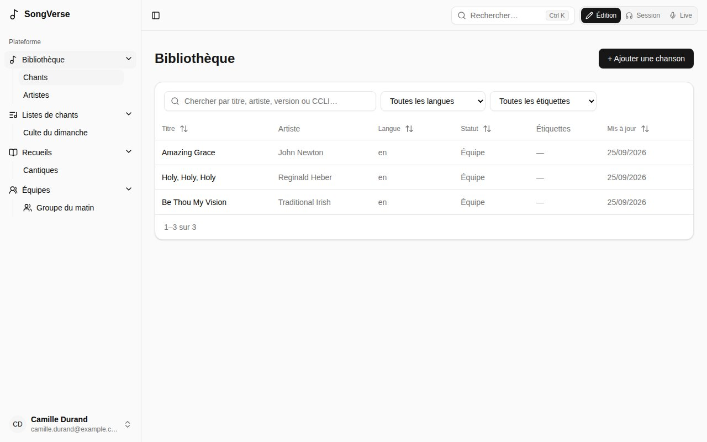
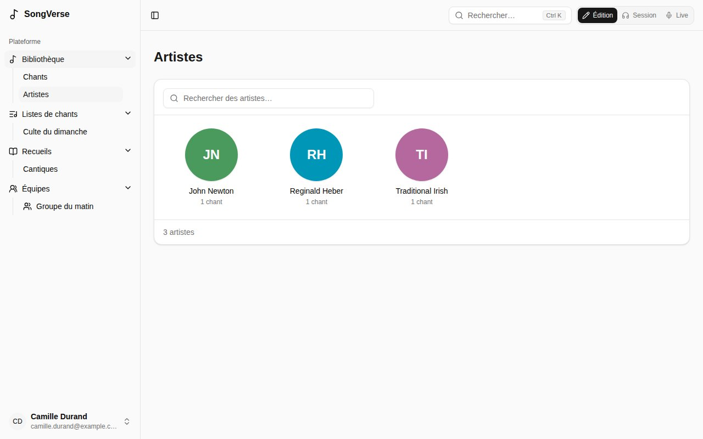
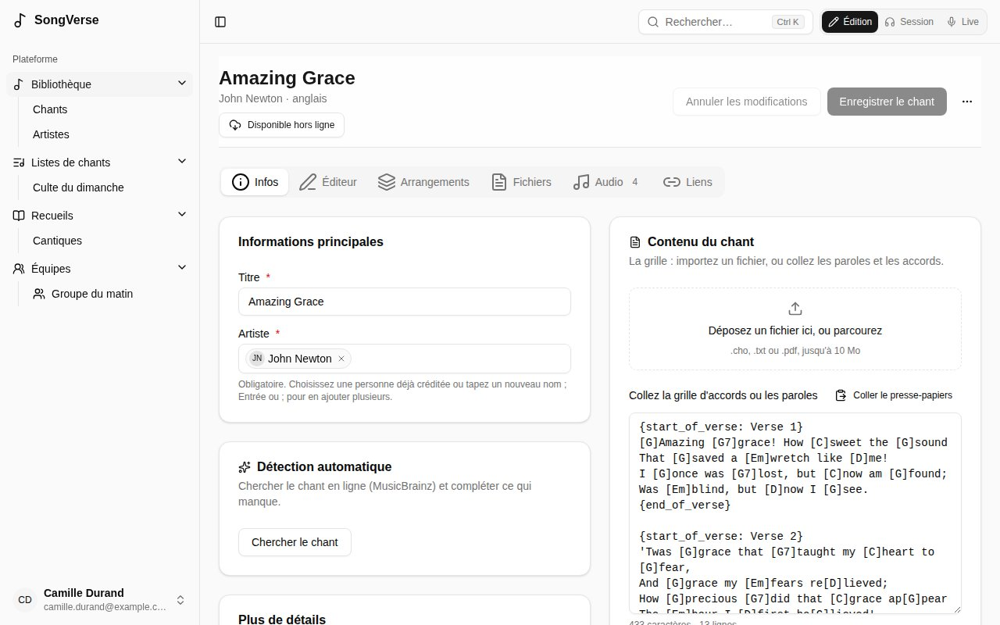
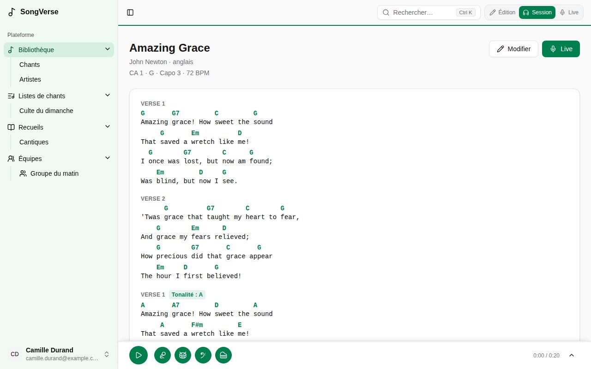
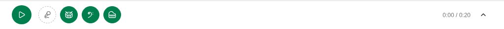
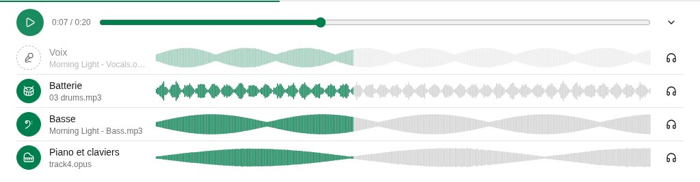
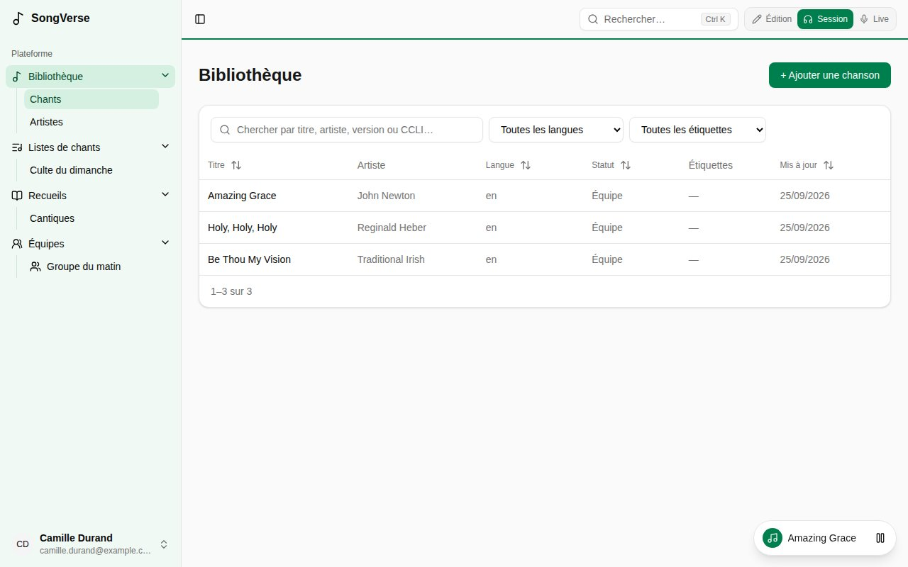

La **Bibliothèque** liste tous les chants que vous pouvez voir : les vôtres, ceux de vos équipes et ceux du catalogue global. Dans la barre latérale, elle s'ouvre sur **Chants** (où vous mène **Bibliothèque**), **Artistes** et vos listes intelligentes.

- **Recherchez** par titre, artiste, nom de version ou numéro CCLI.
- **Filtrez** par langue (**Toutes les langues**) et étiquette (**Toutes les étiquettes**).
- **Triez** par colonne en cliquant sur son titre.
- La colonne **Statut** dit où en est un chant : **Personnel** ou **Équipe** s'il n'a jamais été proposé au catalogue global, puis où en est sa proposition (**En attente de relecture**, **Publié**…).

## Artistes

**Artistes** montre toutes les personnes créditées comme artiste sur les chants que vous pouvez voir, en grille : une image ronde (ses initiales, pour l'instant), son nom et son nombre de chants ; la recherche les filtre. Les noms écrits différemment (avec ou sans majuscules ou accents) comptent pour un seul artiste. Choisissez-en un pour voir ses chants : la liste **Chants** affiche **De** suivi du nom, et le **×** à côté montre de nouveau tout le monde.

## Listes intelligentes

Une recherche, des filtres et un tri que vous utilisez souvent peuvent devenir une liste intelligente : réglez-les dans **Chants**, puis **Enregistrer comme liste intelligente** et donnez-lui un nom. Elle apparaît sous **Bibliothèque** dans la barre latérale. Une liste intelligente garde les filtres, pas les chants : un nouveau chant qui correspond y apparaît tout seul.

Sur une liste intelligente, changez les filtres et **Enregistrer les changements de la liste** garde les nouveaux ; **Renommer** et **Supprimer la liste** font ce qu'ils disent. Les listes intelligentes sont les vôtres : personne d'autre ne les voit.

## Ajouter un chant

Choisissez **+ Ajouter une chanson**. Un **nom** et au moins un **artiste** suffisent ; tout le reste peut venir plus tard.

- **Déjà dans votre bibliothèque ?** Pendant que vous tapez le nom, SongVerse montre les chants que vous avez déjà sous ce titre. Vous pouvez ouvrir l'existant, **Partir de celui-ci** (reprendre ses détails), ou **Créer la version** - une autre version du même chant, acoustique par exemple. Donnez un **Nom de la version** pour les distinguer.
- La **Détection automatique** cherche le chant en ligne (MusicBrainz) et complète ce qui manque, comme les crédits et l'album. Choisissez **Chercher le chant**, puis **Utiliser** sur la bonne correspondance.
- **La grille** : collez les paroles et les accords, ou ajoutez un fichier (`.cho`, `.txt` ou `.pdf`). SongVerse reconnaît le ChordPro, les accords écrits au-dessus des paroles et les paroles seules. Vous pouvez ensuite la travailler dans l'[éditeur](/fr/song-editor/). Un PDF est conservé dans **Fichiers**, mais son texte n'est pas lu : collez aussi les paroles.

Puis **Enregistrer le chant**.

## La page d'un chant

Un chant a des onglets :

- **Infos** - son nom et ses artistes, et sous **Plus de détails** : compositeurs, auteurs et autres crédits, album, année, tonalité, tempo, mesure, capo suggéré, durée, copyright, numéros CCLI et ISRC, une référence (par exemple le passage biblique dont il s'inspire), des notes et des étiquettes. Il liste aussi les recueils qui le contiennent.
- **Éditeur** - la grille elle-même. Voir [L'éditeur de chants](/fr/song-editor/).
- **Arrangements** - la façon dont vous et vos équipes le jouez. Voir [Arrangements](/fr/arrangements/).
- **Fichiers** - partitions, fichier d'origine de la grille, images (25 Mo maximum chacun).
- **Audio** - des enregistrements pour apprendre ou répéter (MP3, Opus, M4A, WAV, OGG… 50 Mo maximum chacun), et les pistes du chant (voir plus bas).
- **Liens** - le chant sur Spotify, Apple Music et YouTube.

Les modifications des onglets **Infos** et **Éditeur** sont enregistrées ensemble par **Enregistrer le chant** ; les fichiers, l'audio et les liens sont enregistrés dès que vous les ajoutez. **Annuler les modifications** retire ce qui n'est pas enregistré. Le menu **⋯** permet d'**Exporter en ChordPro** ou de **Supprimer le chant**.

Voilà le chant en mode **Édition**. En **Session**, sa page est la grille elle-même, lue avec vos réglages d'accords, avec sa tonalité, son capo et son tempo, et l'enregistrement ou les pistes du chant en bas (voir [Pistes](/fr/library/#pistes)) ; **Modifier** vous ramène à l'édition. En **Live**, il s'ouvre en plein écran, comme les chants d'une liste ; **×** revient à la bibliothèque.

Le **Capo suggéré** n'est qu'une suggestion (par exemple le capo de l'enregistrement) : il s'applique quand un arrangement n'indique pas le sien.

Si un chant n'est pas à vous (un chant global, ou un chant d'équipe dont vous n'êtes pas administrateur), vous pouvez le lire et l'arranger, mais pas le modifier.

## Pistes

Les pistes (ou stems) sont les parties du chant enregistrées séparément : voix, batterie, basse, etc. Importez-les dans l'onglet **Audio**. Un fichier nommé d'après sa partie (« Voix.mp3 », « 03 drums.opus », « Basse.mp3 ») devient cette piste tout seul. Pour les autres fichiers, choisissez la partie dans la liste **Piste** sous le fichier : **Voix**, **Chœurs**, **Batterie**, **Basse**, **Guitare**, **Piano et claviers**, **Autres** ou **Clic et repères**, ou **Pas une piste** pour un enregistrement complet.

Si les pistes (ou un enregistrement) ne sont pas dans la tonalité du chant ou à son tempo, une version live un ton plus haut par exemple, indiquez les leurs sous **L'enregistrement des pistes** (ou sous le fichier) : **Tonalité** et **BPM**. Laissés sur **Tonalité du chant**, et vides, ce sont ceux du chant. SongVerse les garde pour transposer et changer la vitesse plus tard.

En mode **Session** (voir [Édition, Session et Live](/fr/getting-started/#édition-session-et-live)), un chant qui a des pistes affiche le lecteur de pistes en bas de sa page, et de sa page dans une liste. Il commence sur une seule ligne : **Lecture**, puis un bouton rond par partie, avec son instrument (un micro pour la voix, une batterie, une clé de fa, une guitare, un piano…). Touchez-en un pour couper cette partie et jouer avec le reste ; touchez-le de nouveau pour la remettre. Survolez-en un pour voir son nom.

La flèche au bout l'agrandit : une ligne par partie avec le même bouton rond, sa forme d'onde et un bouton solo (le solo ne joue que les parties en solo), et une barre de position. Pendant un solo, un bouton rond, dans les deux vues, retire sa partie du solo ou l'y ajoute ; retirez la dernière pour entendre de nouveau toutes les parties. Cliquez sur une forme d'onde pour vous y rendre. La flèche du haut le réduit de nouveau, et SongVerse retient votre préférence. Les fichiers commencent à se télécharger dès que la page du chant s'ouvre en mode Session (la ligne du haut montre où il en est), si bien que **Lecture** est en général immédiat. Une fois téléchargés, ils ne le sont plus de nouveau.

Le chant continue de jouer quand vous allez sur une autre page ou quittez le mode Session, et sur un téléphone écran verrouillé, où l'écran de verrouillage peut aussi le mettre en pause. Un petit bouton en bas à droite montre ce qui joue : touchez le nom du chant pour y revenir, ou mettez-le en pause de là.

Un chant sans pistes joue son dernier enregistrement dans le même lecteur, comme une seule partie. Un chant sans aucun audio mais avec un lien YouTube (onglet **Liens**) y joue sa vidéo YouTube : la vidéo s'affiche à côté des commandes, comme YouTube l'exige, et les parties ne peuvent pas être séparées. Elle continue dans une petite fenêtre en bas à droite quand vous allez sur d'autres pages ; le nom du chant vous y ramène. YouTube s'arrête quand le téléphone se verrouille et ne joue pas hors ligne : dans ces cas, ajoutez l'enregistrement dans l'onglet **Audio**.

Les pistes gardées sur votre appareil pour le hors ligne (**Avec l'audio**, voir [Hors ligne](/fr/offline/)) se lisent aussi hors ligne.

## Proposer au catalogue global

La carte **Catalogue global** de votre chant le propose à tout le monde. **Proposer à la relecture**, avec une note pour le relecteur si vous le souhaitez ; le copyright et le numéro CCLI aident mais ne sont pas obligatoires. Un relecteur le publie, demande des modifications ou le refuse, et vous suivez où il en est sur la même carte. Votre chant reste à vous dans tous les cas.
