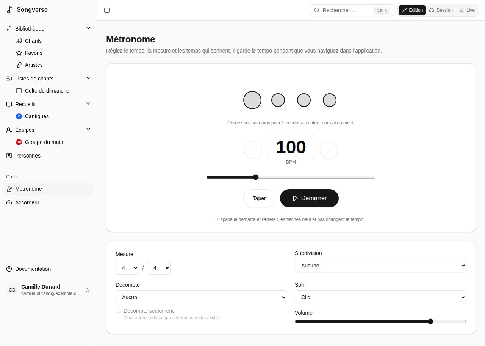

**Métronome**, dans la barre latérale, ouvre sa page : tout ce qu'il sait faire, réglé une fois et retenu sur cet appareil. Il garde le tempo pendant que vous naviguez dans Songverse ; un petit bouton en bas de l'écran montre son tempo et le temps, ramène à sa page et l'arrête.

## Tempo

- **−** et **+** changent le tempo d'un battement par minute à la fois ; tapez-le, ou faites glisser le curseur (de 20 à 300 BPM).
- **Taper** : tapez en rythme avec la musique, et le métronome prend ce tempo.
- **Démarrer** et **Arrêter**. Au clavier, **Espace** le démarre et l'arrête, et **↑** **↓** changent le tempo (de 5 avec **Maj**).

Un nouveau tempo prend effet au temps suivant, sans arrêt.

## Mesure et motif

- **Mesure** : le nombre de temps par mesure et la valeur du temps - **4 / 4**, **3 / 4**, **6 / 8**... Le tempo compte ces temps : en 6/8, des croches.
- Les cercles sont les temps de la mesure : celui que vous entendez s'allume, le premier de la mesure est plus grand. Cliquez sur un temps pour le rendre **accentué**, **normal** ou **muet** - par exemple, seulement les temps 2 et 4, ou une mesure sans son dernier temps.
- **Subdivision** ajoute des clics entre les temps : **2 par temps**, **Triolets** ou **4 par temps**, plus doux que les temps.

## Décompte

**Décompte** joue une ou deux mesures avant le chant, tous les temps entendus. Avec **Décompte seulement**, il se tait ensuite : les cercles continuent de montrer le temps, pour un groupe qui a juste besoin d'être lancé.

## Son et volume

**Son** : **Clic**, **Wood block** ou **Bip** ; et son **Volume**. Le son est produit sur votre appareil : le métronome fonctionne hors ligne.

Utilisez un casque filaire ou le haut-parleur de l'appareil : un casque Bluetooth l'entend avec une fraction de seconde de retard.

## Au tempo d'un chant

En [Live](/fr/sets/#jouer-une-liste-en-live), sur la page d'un chant dans une liste et sur la page d'un chant en mode Session, le bouton du métronome (sur la page d'un chant, il affiche son tempo : **76 BPM**) le démarre au tempo et à la mesure du chant (ceux de sa version, quand la liste en joue une) en une pression ; appuyez à nouveau pour l'arrêter. Il utilise votre motif, votre son et votre décompte de la page Métronome, et clignote avec le temps. Un chant sans tempo ne peut pas le démarrer : ajoutez-en un dans son onglet **Infos**.

En jouant avec d'autres, le métronome du meneur peut être celui de chacun, en rythme : voir [Jouer synchronisé](/fr/sets/#jouer-synchronisé).
