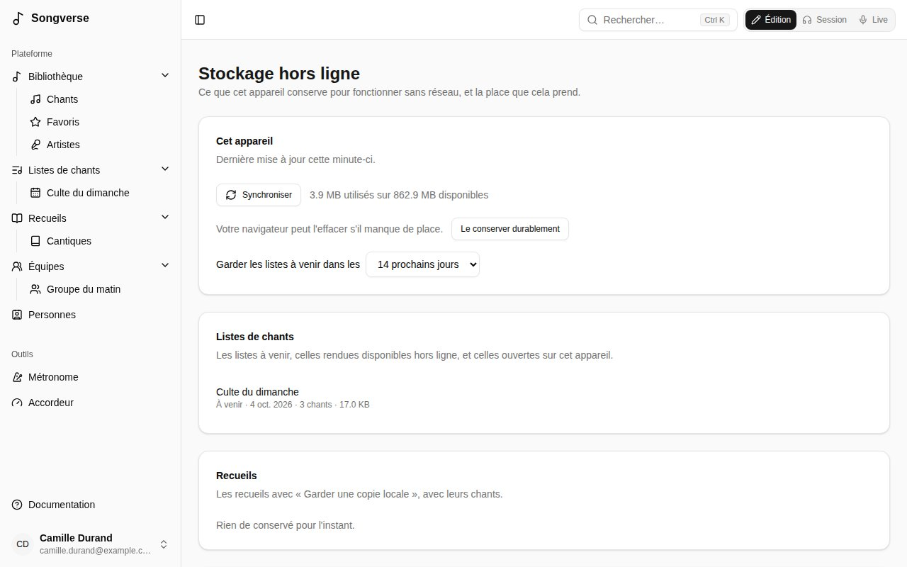

Une fois Songverse utilisé sur un appareil, il s'y ouvre même sans réseau (sur une scène sans Wi-Fi, par exemple). Vous restez connecté, et un bandeau indique que vous êtes hors ligne et quand l'appareil s'est mis à jour pour la dernière fois. Les modifications ne peuvent être enregistrées qu'une fois de retour en ligne.

Avant un concert, ouvrez Songverse une fois tant que vous avez une connexion : il se met à jour tout seul.

## Ce qui est conservé

Conservés automatiquement sur l'appareil, avec leurs chants :

- **vos listes des deux semaines à venir** (les jours sont un [réglage](#stockage-hors-ligne)), ouvertes ou non ;
- **toute autre liste que vous ouvrez** en ligne ;
- **vos propres chants**.

Vous pouvez en garder davantage :

- **Disponible hors ligne**, sur une liste ou un chant, le conserve sur tous les appareils où vous vous connectez.
- **Garder une copie locale**, sur un recueil, le conserve avec tous ses chants.
- **Avec l'audio**, à côté, télécharge aussi ses fichiers audio. Ils sont volumineux : ils ne viennent jamais autrement.

Les PDF, images et fichiers ChordPro d'un chant viennent avec lui.

Tant que Songverse est ouvert avec une connexion, il se met à jour toutes les quelques minutes : les chants et listes modifiés sont mis à jour. Une liste est retirée une fois supprimée, quand vous ne pouvez plus l'ouvrir, ou le lendemain de sa date. Un chant ou un recueil est retiré quand vous ne pouvez plus l'ouvrir ou ne le gardez plus.

## Hors ligne

- **Les listes** s'ouvrent en lecture seule. Leurs chants s'ouvrent avec leurs accords, et une liste se joue en **Live** du début à la fin.
- **Les chants** s'ouvrent en lecture seule : leur grille, les fichiers conservés avec eux (**Ouvrir** ; un fichier que le navigateur ne peut pas afficher sans risque est téléchargé à la place), et **Live**.
- **Les recueils** dont vous gardez une copie s'ouvrent avec leurs entrées.
- **La recherche** trouve tous les chants conservés sur l'appareil, et par leur numéro les entrées des recueils dont vous gardez une copie : un chant lancé par le leader peut toujours s'afficher en plein écran.
- Le reste affiche **Indisponible hors ligne**.

## Stockage hors ligne

**Stockage hors ligne**, dans le menu sous votre nom, montre ce que cet appareil conserve et la place que cela prend :

- la dernière mise à jour, et **Synchroniser** ;
- si le navigateur peut l'effacer s'il manque de place, et **Le conserver durablement** ;
- jusqu'où les listes sont gardées (**Garder les listes à venir dans les** 3 à 60 prochains jours) ;
- les listes, recueils et chants conservés, chacun avec **Retirer**. Retirer ce que vous avez rendu disponible hors ligne arrête de le garder sur tous vos appareils. Les listes à venir reviennent d'elles-mêmes ;
- **Tout retirer de cet appareil**.

## Confidentialité

Ce qui est conservé sur un appareil est lisible par quiconque l'utilise tant qu'il est déverrouillé. **Se déconnecter** l'efface.
