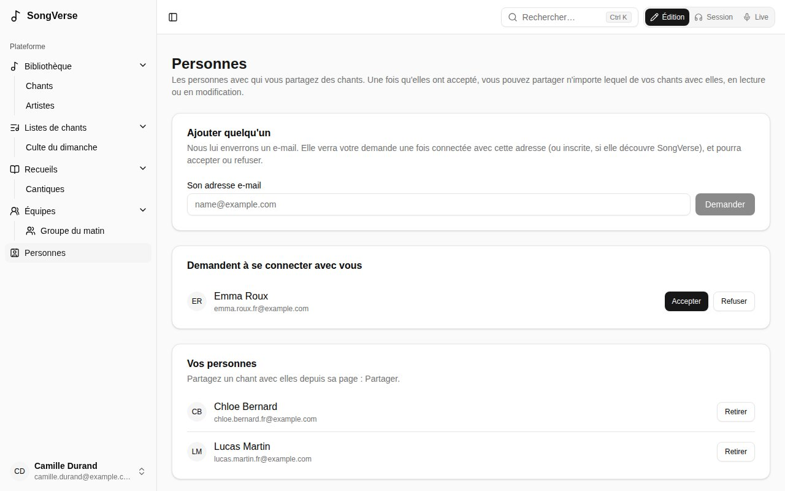
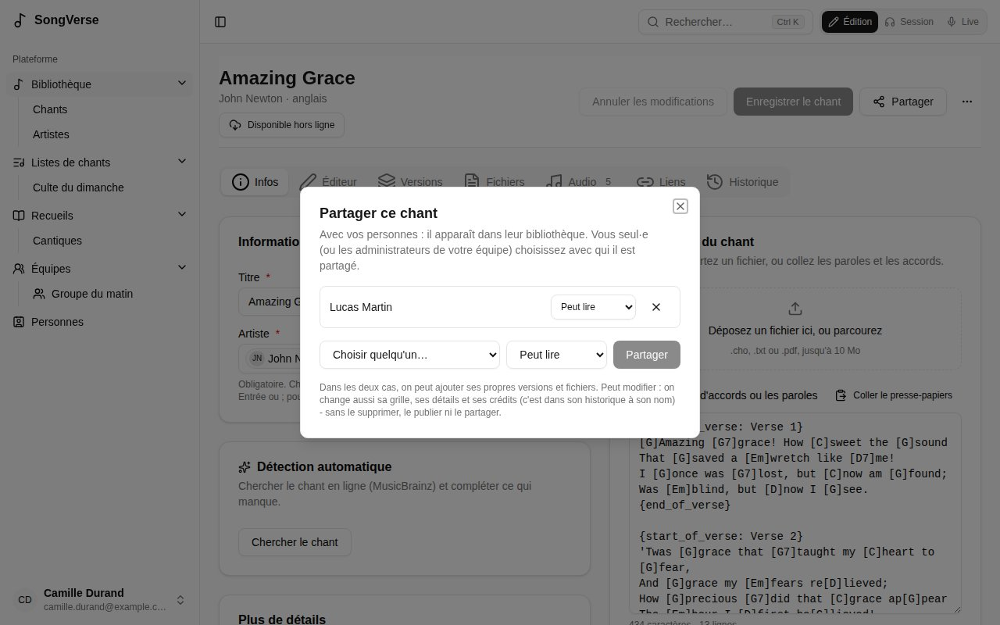

**Personnes**, dans la barre latérale, liste les personnes avec qui vous êtes connecté·e : celles avec qui vous pouvez partager des chants. Une équipe partage tout avec tous ses membres ; Personnes sert à partager un chant à la fois, avec une personne - un musicien invité, un ami d'une autre église.

## Ajouter quelqu'un

Sous **Ajouter quelqu'un**, tapez **Son adresse e-mail** puis **Demander**. SongVerse lui écrit que vous aimeriez partager des chants avec elle. La personne voit votre demande sous **Demandent à se connecter avec vous** une fois connectée avec cette adresse, et peut **Accepter** ou **Refuser**. En attendant, elle apparaît sous **En attente de réponse**, où **Annuler** la retire.

L'e-mail est le même qu'elle ait un compte ou non : quelqu'un qui découvre SongVerse s'inscrit avec cette adresse et y trouve votre demande. Redemander n'envoie pas d'autre e-mail, et vous pouvez faire jusqu'à 20 demandes par jour.

SongVerse ne dit jamais si une adresse a un compte, ni si quelqu'un a refusé : une demande reste simplement en attente.

Les personnes de vos équipes apparaissent sous **De vos équipes** : **Demander** leur envoie une demande en un clic. Si quelqu'un vous le demande pendant que vous le lui demandez, vous êtes connectés tout de suite.

**Retirer** vous déconnecte de quelqu'un : ce que l'un avait partagé avec l'autre ne l'est plus.

## Partager un chant

Sur la page de votre chant, **Partager** liste avec qui il est partagé, et ajoute une de vos personnes :

- **Peut lire** - il apparaît dans sa bibliothèque, marqué **Partagé par** vous. Elle peut en faire ses propres [versions](/fr/versions/), y ajouter ses fichiers (voir [Qui voit un fichier](/fr/library/#qui-voit-un-fichier)) et le mettre dans ses listes.
- **Peut modifier** - elle change aussi sa grille, ses détails et ses crédits. Ses modifications sont dans son [historique](/fr/song-editor/#historique) à son nom. Elle ne peut ni le supprimer, ni le publier, ni le partager à son tour.

Les fichiers que vous ajoutez au chant peuvent aussi aller aux personnes avec qui il est partagé : choisissez **Les personnes avec qui je le partage** sous **Visible par** (voir [Qui voit un fichier](/fr/library/#qui-voit-un-fichier)).

Changez ce qu'une personne peut faire, ou arrêtez de partager avec elle (**×**), au même endroit. Les administrateurs d'une équipe partagent ses chants de la même façon. Un chant du [catalogue global](/fr/library/#proposer-au-catalogue-global) est déjà à tout le monde : le publier met fin à ses partages.

Une personne avec qui un chant est partagé peut le retirer de sa bibliothèque : **Retirer de ma bibliothèque** dans le menu **⋯** du chant.
