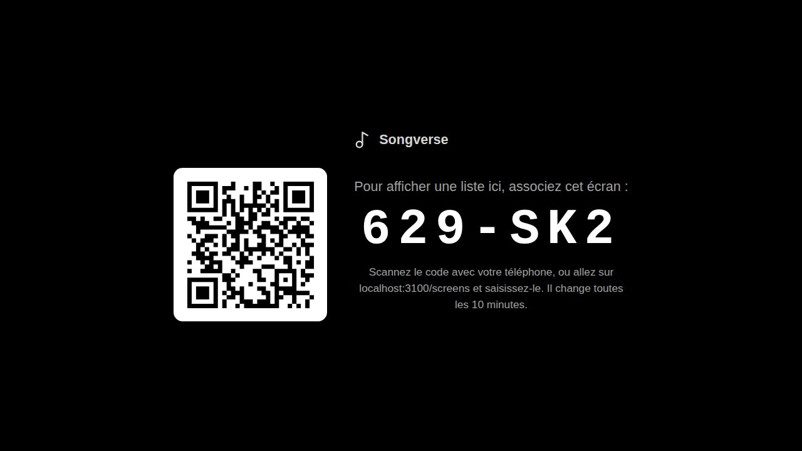
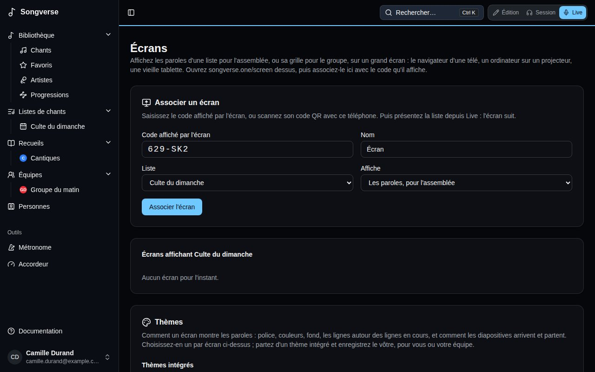
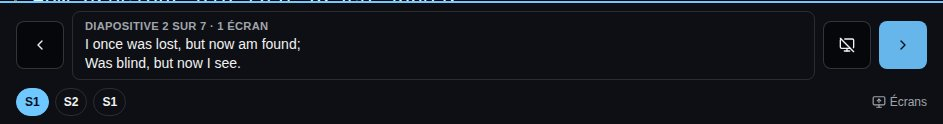
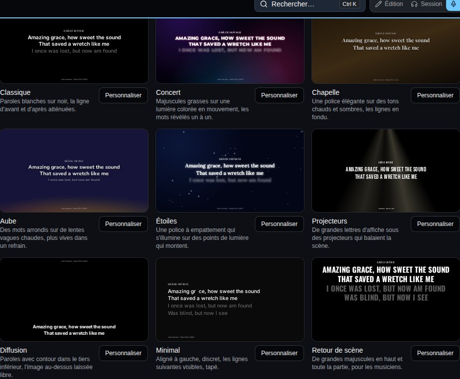

Un **écran** affiche une liste sur grand écran : les paroles pour l'assemblée, deux lignes à la fois, ou la grille pour le groupe. Ce peut être le navigateur d'une télé, un ordinateur ou un petit boîtier branché à un projecteur, ou une vieille tablette. Qui mène la liste la présente depuis [Live](/fr/sets/#jouer-une-liste-en-live), et chaque écran suit.

## Associer un écran

1. Sur l'écran, ouvrez **songverse.one/screen**. Personne ne s'y connecte : il affiche un code et un code QR. Le code change toutes les 10 minutes tant qu'il n'est pas utilisé.

   

2. Sur votre téléphone ou votre tablette, scannez le code QR, ou ouvrez **Écrans** depuis le menu Synchro de Live (**Écrans…**) et saisissez le code.
3. Donnez un **Nom** à l'écran (« Télé de l'église »), choisissez la **Liste** qu'il affiche et ce qu'il **Affiche** : **Les paroles, pour l'assemblée** ou **La grille, pour le groupe**. Puis **Associer l'écran**.

   

L'écran se souvient qu'il est associé : la fois suivante, ouvrez la même page et il se reconnecte tout seul. Seul qui peut modifier la liste (son propriétaire, ou un administrateur de son équipe) peut y associer un écran, puisque c'est lui qui la mène.

Dans **Écrans**, chaque écran de la liste peut être renommé, passé à une autre liste ou basculé entre paroles et grille ; l'écran change aussitôt. **Déconnecter** l'arrête : il revient à un nouveau code.

## Présenter depuis Live

La présentation passe par la [Synchro](/fr/sets/#jouer-synchronisé) : les écrans sont membres de la session de la liste.

1. Dans Live, ouvrez le menu Synchro, **Activer la synchro**, puis **Mener la liste**. Les écrans associés y figurent avec les autres membres, marqués « (écran) ».
2. Choisissez **Présenter sur les écrans**. Un panneau s'ouvre en bas de Live, avec ce que montrent les écrans.

- **Diapositive suivante** et **Diapositive précédente** (les flèches de chaque côté) avancent de deux lignes. Au clavier ou avec une pédale Bluetooth tourne-page, la flèche bas ou Page suivante avance, la flèche haut ou Page précédente recule. Après la dernière diapositive d'un chant, Live passe au chant suivant de la liste et les écrans suivent ; avant sa première, à la dernière diapositive du chant précédent.
- Les sections du chant (S1, R, S2…) sous la diapositive y mènent directement, pour un refrain repris ou un couplet sauté.
- **Écran noir** éteint tous les écrans, pour une prière, une prise de parole ou entre deux chants. Appuyez de nouveau pour faire revenir les paroles.
- **Arrêter la présentation**, dans le menu Synchro, laisse les écrans afficher le nom de la liste.

## Ce qu'affichent les écrans

Avec **Les paroles, pour l'assemblée**, les deux lignes de chaque diapositive sont grandes et centrées. La ligne d'avant est estompée au-dessus, celle d'après en dessous, et chaque diapositive apparaît en fondu - avec l'apparence par défaut ; un [thème](/fr/screens/#thèmes) change tout cela. Une section sans paroles, comme un instrumental, est une diapositive vide : on avance dans le chant au rythme du groupe. La première diapositive d'un chant affiche son titre, et la première et la dernière ses crédits en bas : qui l'a écrit, son copyright et son numéro de chant CCLI, tirés des informations du chant.

Avec **La grille, pour le groupe**, l'écran affiche la grille du chant avec ses accords, dans la tonalité de la liste, et garde la section chantée en évidence et à l'écran.

Les paroles sont celles de la version et de la tonalité que joue la liste. Les notes du chant et les accords ne sont jamais montrés à l'assemblée. Si l'écran perd sa connexion, il l'indique dans un coin et se reconnecte tout seul.

## Thèmes

Un thème, c'est l'apparence d'un écran : sa police, ses couleurs et son fond, les lignes autour des lignes en cours, la place des paroles, et la façon dont les diapositives arrivent et partent. Chaque écran a le sien : un retour de scène peut afficher de grandes majuscules en haut pendant que l'écran de l'assemblée a un fond animé. Choisissez-le dans **Thème**, sur la ligne de l'écran, sous **Vos écrans** ; l'écran change aussitôt.

Les **Thèmes intégrés** jouent chacun un chant d'exemple, pour voir comment ils bougent :

- **Classique** - paroles blanches sur noir, la ligne d'avant et d'après atténuées : l'apparence par défaut.
- **Concert** - majuscules grasses sur une lumière colorée en mouvement, les mots révélés un à un.
- **Chapelle** - une police élégante sur des tons chauds et sombres, les lignes en fondu.
- **Aube** - des mots arrondis sur de lentes vagues chaudes, plus vives dans un refrain.
- **Étoiles** - une police à empattement qui s'illumine sur des points de lumière qui montent.
- **Projecteurs** - de grandes lettres d'affiche sous des projecteurs qui balaient la scène.
- **Diffusion** - paroles avec contour dans le tiers inférieur, l'image au-dessus laissée libre pour une vidéo ou une diffusion en direct.
- **Minimal** - aligné à gauche et discret, les lignes suivantes visibles, tapé.
- **Retour de scène** - de grandes majuscules en haut et toute la partie, pour les musiciens.

**Personnaliser** en ouvre un dans l'éditeur de thème, avec son aperçu à côté des réglages - en **16:9** ou **4:3**, sur les paroles ou la grille des musiciens - qui change à mesure que vous les changez. **⏵** lance le chant d'exemple, **‹ ›** avancent diapositive par diapositive.

- **Texte** - la police, sa taille (**Ajustée à la ligne**, ou fixe), sa graisse, sa couleur, **Majuscules**, **Lisibilité** (une ombre, un contour ou un halo, pour des paroles sur un fond animé), l'alignement, l'interligne et l'espacement des lettres.
- **Lignes** - **La diapositive**, avec les lignes d'avant et d'après, ou **Toute la partie** avec les lignes de la diapositive mises en avant ; les lignes autour **Atténuées**, **Plus petites**, **Floues** ou **Masquées**.
- **Mise en page** - en haut, au centre, en bas ou **Tiers inférieur**, et une **Marge de sécurité** pour les téléviseurs qui rognent les bords.
- **Fond** - une **Couleur**, un **Dégradé**, ou de la lumière en mouvement : **Aurore**, **Vagues**, **Particules**, **Projecteurs**, jusqu'à quatre couleurs. **Suit le chant** envoie une pulsation de lumière à chaque diapositive et l'avive dans un refrain. **Assombrir** garde les paroles lisibles sur n'importe quel fond.
- **Mouvement** - **Entre les diapositives** : une coupe, un fondu, un glissement, une montée, une échelle, un flou ou un zoom, et sa durée (un nouveau chant prend deux fois plus de temps). **Apparition des mots** : d'un coup, ligne par ligne, mot par mot, lettre par lettre, tapés ou en lumière.
- **Titre et crédits** - afficher ou non le titre du chant et ses crédits (auteurs, copyright, numéro CCLI), sur quelles diapositives et où.
- **Accords** - pour **La grille, pour le groupe** : la couleur des accords et la taille de la grille.

L'éditeur vérifie le contraste entre les paroles et le fond et prévient en dessous de 4,5:1. Nommez le thème et **Enregistrer le thème** : il est à vous ou - si vous administrez une équipe - à l'équipe, pour que chaque membre puisse le choisir pour ses écrans (seuls ses administrateurs le modifient). Un thème que vous pouvez modifier a **Modifier** et **Supprimer** ; le supprimer remet ses écrans sur l'apparence par défaut.

Tout ce qui bouge est dessiné par la puce graphique de l'écran : ça reste fluide sur le navigateur d'un téléviseur. Un appareil qui demande moins d'animations a des fonds immobiles et de simples fondus.

Pour essayer un thème intégré sur un écran, ou afficher les paroles dans un logiciel de diffusion (comme source navigateur), ajoutez `?theme=` et son nom à l'adresse de l'écran : **songverse.one/screen?theme=stream**. C'est pour cet appareil seulement, tant que l'adresse ne change pas.
