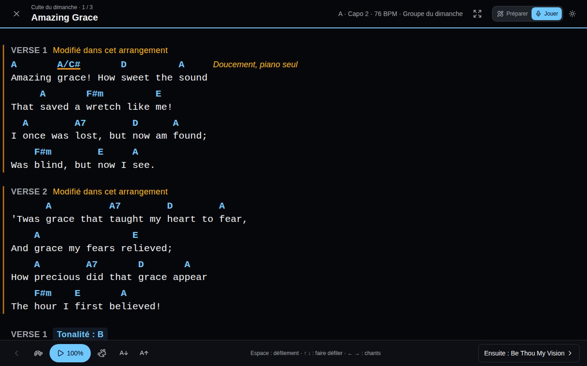

Une **liste de chants** rassemble les chants d'un culte, d'une répétition ou d'un concert. Vos listes s'affichent sous **Listes de chants** dans la barre latérale.

## Créer une liste

Choisissez **Listes de chants** > **Nouvelle liste** :

- **Date (facultatif)** - sans nom, la liste porte le nom de sa date.
- **Nom (facultatif)** - « Culte du dimanche », « Soirée jeunes ».
- **Propriétaire** - **Moi seulement**, ou une équipe dont vous êtes administrateur. Une liste d'équipe est vue par ses membres et modifiée par ses administrateurs.

## Les chants d'une liste

- **Ajouter des chants** en les cherchant par titre. Une liste d'équipe ne peut contenir que les chants de l'équipe et les chants globaux approuvés, pour que chaque membre puisse les ouvrir.
- **Réordonnez** en faisant glisser la poignée d'un chant (ou mettez le focus sur la poignée et utilisez Espace et les flèches).
- Pour chaque chant, choisissez :
  - sa **Version**, quand le chant en a plusieurs ;
  - son **Arrangement** - **Tel qu'écrit**, ou l'un de vos [arrangements](/fr/arrangements/) ou de ceux de votre équipe. Dans une liste d'équipe, l'arrangement habituel de l'équipe est choisi pour vous ;
  - sa **Tonalité** - déplace le chant depuis la tonalité de l'arrangement (« un ton plus bas ce dimanche ») sans changer l'arrangement.
- **×** retire un chant de la liste (le chant lui-même n'est pas touché).

### Pour cette liste seulement

Pour réordonner, sauter ou répéter des sections dans une seule liste, choisissez **Pour cette liste seulement…** dans le menu **Arrangement** du chant. Cela copie l'arrangement que la liste jouait (ou l'ordre du chant) et l'ouvre dans l'[éditeur d'arrangement](/fr/arrangements/#le-modifier). Il ne sert que dans cette liste, n'apparaît pas parmi les arrangements du chant, et disparaît quand le chant quitte la liste. Le bouton ✎ à côté du menu le rouvre.

## Jouer depuis une liste

Cliquez sur un chant de la liste pour ouvrir sa grille, telle que la liste la joue : son arrangement, dans la tonalité de la liste.

- **Précédent** et **Suivant** parcourent la liste dans l'ordre.
- **Mon affichage** change la grille pour vous seul - accords masqués, simplifiés, solfège, formes de capo. Voir [Votre propre affichage d'une grille](/fr/arrangements/#votre-propre-affichage-dune-grille).
- **Mes notes** sont privées : capo, repères, rappels. Vous seul les voyez.

## Jouer une liste sur scène

Sur scène, passez en mode **Jouer** - le bouton sur la page de la liste, ou le sélecteur de mode en haut à droite de chaque page. SongVerse passe en sombre (reposant dans une salle peu éclairée) et chaque chant de la liste s'ouvre en plein écran, en grand, tel que vous le lisez avec [Mon affichage](/fr/arrangements/#votre-propre-affichage-dune-grille).

- En haut : le chant, sa place dans la liste, sa tonalité, son capo et son tempo. **×** revient à la liste.
- En bas : ce qui vient ensuite - **Ensuite : …** y mène - et la flèche du chant précédent.
- Le **défilement** (le bouton lecture) fait défiler la grille au rythme du chant : sur sa durée quand elle est connue, sinon deux mesures par ligne à son tempo. La tortue et le lièvre le ralentissent ou l'accélèrent, un cran à la fois.
- Les boutons **A** réduisent ou agrandissent le texte ; SongVerse retient votre taille sur cet appareil.
- Le bouton d'agrandissement passe en plein écran, sans les barres du navigateur.
- L'écran reste allumé tant qu'un chant est ouvert.

Au clavier ou avec un pédalier tourne-page : **Espace** lance et met en pause le défilement, **↑** **↓** (ou Page précédente et Page suivante) font défiler, **←** **→** passent au chant précédent ou suivant.

## Partager une liste avec des invités

Sous **Partager**, **Créer un lien de partage** et envoyez-le à qui doit voir la liste - un musicien invité, par exemple. Toute personne connectée qui l'ouvre peut lire chaque chant de la liste, même ceux qui ne sont pas dans sa bibliothèque, et garder ses propres notes. Elle ne peut pas la modifier.

- **Réinitialiser le lien** arrête l'ancien lien ; les personnes déjà inscrites gardent l'accès.
- **Désactiver le lien** empêche de nouvelles personnes de rejoindre.
- **Invités** liste qui a rejoint ; vous pouvez les retirer.

Un invité peut **Quitter la liste** à tout moment.

## Passer une liste à une équipe, ou l'inverse

Changez le **Propriétaire** dans **Détails**. Quand une liste personnelle passe à une équipe, vos chants personnels y restent : ils sont partagés en lecture seule avec l'équipe et indiqués comme les vôtres. Un administrateur de l'équipe peut **Demander ce chant**, et vous pouvez le **Céder à l'équipe** - le chant devient alors celui de l'équipe.
