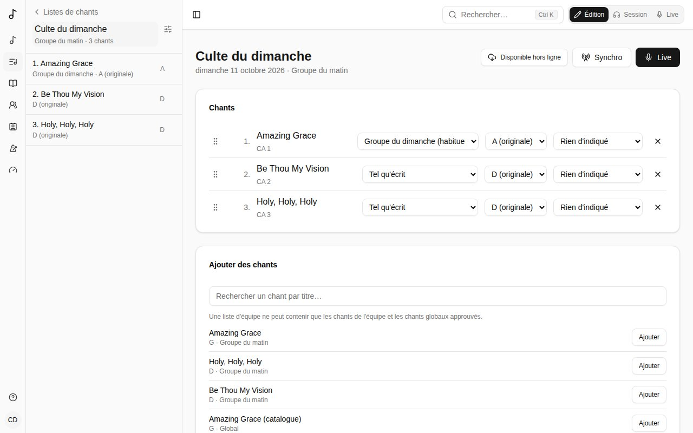
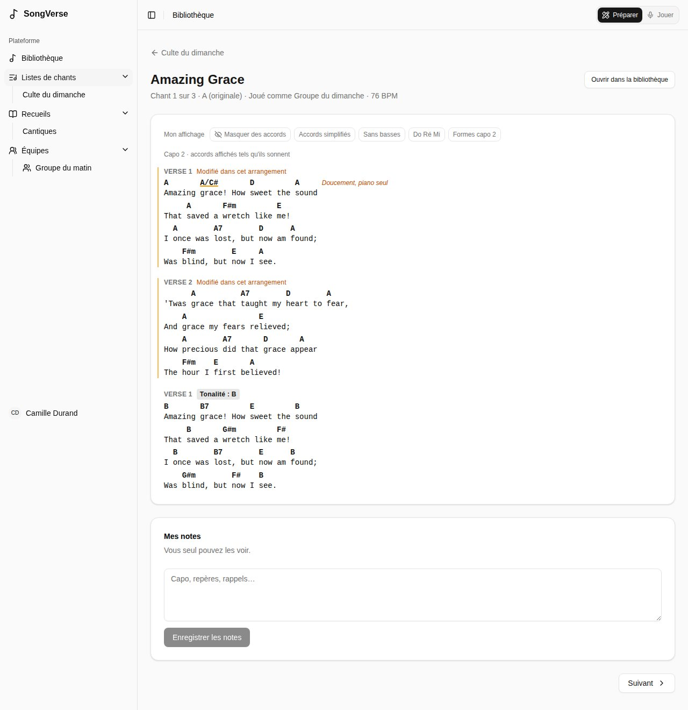
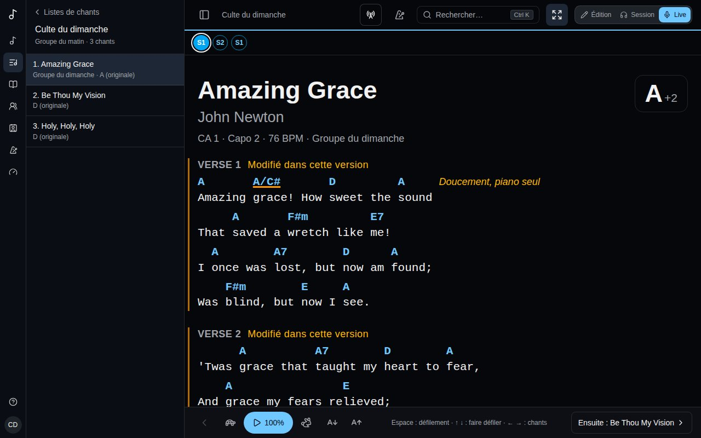
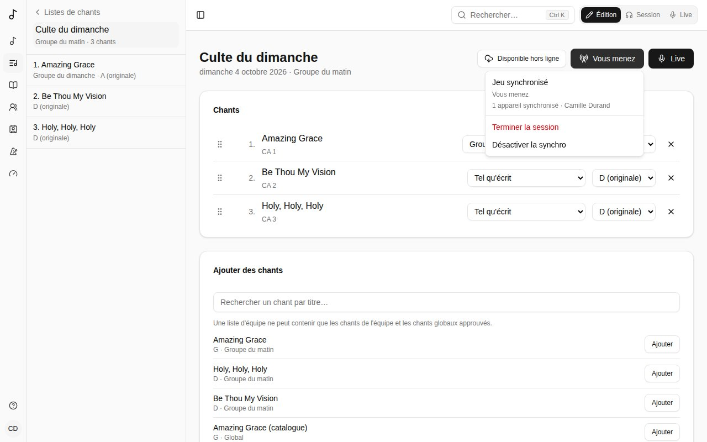

Une **liste de chants** rassemble les chants d'un culte, d'une répétition ou d'un concert. Vos listes s'affichent sous **Listes de chants** dans la barre latérale.

## Créer une liste

Choisissez **Listes de chants** > **Nouvelle liste** :

- **Date (facultatif)** - sans nom, la liste porte le nom de sa date.
- **Nom (facultatif)** - « Culte du dimanche », « Soirée jeunes ».
- **Propriétaire** - **Moi seulement**, ou une équipe dont vous êtes administrateur. Une liste d'équipe est vue par ses membres et modifiée par ses administrateurs.

## Les chants d'une liste

- **Ajouter des chants** en les cherchant par titre. Une liste d'équipe ne peut contenir que les chants de l'équipe et les chants globaux approuvés, pour que chaque membre puisse les ouvrir.
- **Réordonnez** en faisant glisser la poignée d'un chant (ou mettez le focus sur la poignée et utilisez Espace et les flèches).
- Pour chaque chant, choisissez :
  - sa **Traduction**, quand le chant a des [chants liés](/fr/library/#chants-liés) (le même chant dans une autre langue, par exemple) ;
  - sa **Version** - **Tel qu'écrit**, ou l'une de vos [versions](/fr/versions/) ou de celles de votre équipe. Dans une liste d'équipe, la version habituelle de l'équipe est choisie pour vous ;
  - sa **Tonalité** - déplace le chant depuis la tonalité de la version (« un ton plus bas ce dimanche ») sans changer la version.
- **×** retire un chant de la liste (le chant lui-même n'est pas touché).

### Pour cette liste seulement

Pour réordonner, sauter ou répéter des sections dans une seule liste, choisissez **Pour cette liste seulement…** dans le menu **Version** du chant. Cela copie la version que la liste jouait (ou l'ordre du chant) et l'ouvre dans l'[éditeur de version](/fr/versions/#le-modifier). Elle ne sert que dans cette liste, n'apparaît pas parmi les versions du chant, et disparaît quand le chant quitte la liste. Le bouton ✎ à côté du menu la rouvre.

## Jouer depuis une liste

Cliquez sur un chant de la liste pour ouvrir sa grille, telle que la liste la joue : sa version, dans la tonalité de la liste.

- **Précédent** et **Suivant** parcourent la liste dans l'ordre.
- **Mon affichage** change la grille pour vous seul - accords masqués, simplifiés, solfège, formes de capo. Voir [Votre propre affichage d'une grille](/fr/versions/#votre-propre-affichage-dune-grille).
- **Mes notes** sont privées : capo, repères, rappels. Vous seul les voyez.

## Jouer une liste en live

Sur scène, passez en mode **Live** - le bouton sur la page de la liste, ou le sélecteur de mode en haut à droite de chaque page. Songverse passe en sombre (reposant dans une salle peu éclairée) et chaque chant de la liste occupe toute la page à côté de la barre latérale, en grand, tel que vous le lisez avec [Mon affichage](/fr/versions/#votre-propre-affichage-dune-grille).

- La barre latérale reste à côté du chant sur une tablette ou un ordinateur, avec les chants de la liste (les chants joués cochés) : touchez-en un pour y aller. Le bouton en haut à gauche la masque ou la réaffiche ; sur un téléphone, où il n'y a pas de place à côté du chant, il l'ouvre par-dessus. L'en-tête montre aussi le nom de la liste.
- Dessous, la structure du chant : ses parties dans l'ordre où on les chante, en petits cercles - **S1** **R** **S2** **R** **P** **R** (strophe, refrain, pont…) - colorés par genre : intros et outros, strophes et pré-refrains, refrains, ponts et vamps, et instrumentaux, interludes et breaks ont chacun leur couleur. La partie en cours est entourée et celles déjà chantées sont pleines, au fil du défilement ; touchez-en une pour y aller.
- Le chant commence par son titre et son artiste, son numéro de recueil (**JEM 855 · JEM3**), son capo et son tempo, et défile avec les accords et les paroles.
- Sa tonalité est en haut à droite : **G**, avec un petit **+2** quand la liste le joue plus haut ou plus bas qu'écrit. Touchez-la pour transposer au dernier moment, avec **−** et **+** : seulement sur votre écran, pour ce chant, jusqu'à ce que vous le quittiez. **Revenir à la tonalité de la liste** l'annule.
- En bas : ce qui vient ensuite - **Ensuite : …** y mène - et la flèche du chant précédent.
- Le **défilement** (le bouton lecture) fait défiler la grille au rythme du chant : sur sa durée quand elle est connue, sinon deux mesures par ligne à son tempo. La tortue et le lièvre le ralentissent ou l'accélèrent, un cran à la fois.
- Le bouton du métronome, en haut, démarre le [métronome](/fr/metronome/) au tempo et à la mesure du chant, et clignote avec le temps ; appuyez à nouveau pour l'arrêter.
- Les boutons **A** réduisent ou agrandissent le texte ; Songverse retient votre taille sur cet appareil.
- Le bouton d'agrandissement passe en plein écran, sans les barres du navigateur.
- L'écran reste allumé tant qu'un chant est ouvert.

Au clavier ou avec un pédalier tourne-page : **Espace** lance et met en pause le défilement, **↑** **↓** (ou Page précédente et Page suivante) font défiler, **←** **→** passent au chant précédent ou suivant.

Sur un téléphone ou une tablette, balayez vers la gauche pour le chant suivant et vers la droite pour le précédent.

En Live, choisir une liste - dans les listes, la barre latérale ou l'accueil - l'ouvre directement en Live, sur son premier chant. Revenir à la liste reprend au dernier chant ouvert en Live sur cet appareil, plutôt qu'au premier. Un chant compte comme joué une fois sa grille défilée aux 95 % (à la main ou avec le défilement) ; un chant assez court pour tenir à l'écran compte quand vous passez au suivant. La page de la liste (en Édition ou en Session) montre les chants joués d'une coche et met en évidence le numéro du chant où le Live reprendra, et son bouton devient **Reprendre le Live**. **Reprendre au début** oublie où vous en étiez ; Songverse l'oublie aussi de lui-même au bout de 12 heures, pour que le service suivant reparte du premier chant.

### Un chant qui n'est pas dans la liste

Quand le leader lance un chant imprévu, utilisez la recherche (la loupe en haut) : par son titre, ou par son numéro s'il est annoncé ainsi (« Cantique 42 ! » : **CA 42**). En Live, le chant choisi s'ouvre de la même façon, avec le défilement et votre taille de texte. **Retour** (la flèche à côté du bouton de la barre latérale) revient au chant de la liste où vous étiez.

## Jouer synchronisé

Avec **Synchro**, tous ceux d'une liste jouent ensemble : une personne mène, et le métronome des autres - à l'écran et dans leurs oreilles - suit le sien, au même instant, et leur écran suit le chant du meneur. **Synchro** est sur la page de la liste, sur celles de ses chants et en haut du Live (l'icône d'antenne).

- **Activer la synchro**, sur chaque appareil : on voit qui mène et combien d'appareils sont synchronisés. La synchro reste active pendant que vous naviguez dans Songverse, et revient si la page se recharge ; **Désactiver la synchro** la quitte.
- Quelqu'un qui peut modifier la liste - son propriétaire, ou un administrateur de son équipe - choisit **Mener la liste**. Un autre peut prendre le relais avec **Mener à sa place** : le métronome continue comme il était.
- Le meneur démarre le [métronome](/fr/metronome/) : le bouton du métronome en Live ou sur la page d'un chant, ou la page Métronome, où il règle le tempo, la mesure et le motif. Celui de chacun démarre sur le même temps, et un nouveau tempo arrive chez tous sur le même temps. Le métronome des autres affiche **Suit** et le nom du meneur : ses réglages sont ceux du meneur, mais son son et son volume restent les leurs.
- Quand le meneur lance les pistes ou l'enregistrement d'un chant (sur la page d'un chant de la liste, en mode Session), chacun joue le même chant au même instant : la pause et la tête de lecture suivent aussi, comme le multipiste et la transposition du meneur, et chacun garde ses propres parties coupées et en solo. Les fichiers de chacun se téléchargent dès que la page du meneur ouvre le chant ; un appareil pas encore prêt rejoint à la position en cours. En Live, où il n'y a pas de lecteur, le petit bouton en bas à droite montre le chant en lecture. **Clic avec l'enregistrement** rend le métronome de chacun calé sur l'enregistrement (voir [Pistes](/fr/library/#pistes)).
- Quand le meneur passe à un autre chant de la liste, en Live ou sur sa page, l'écran de chacun suit. Vous pouvez regarder un autre chant entre-temps : au prochain changement du meneur, vous suivez à nouveau.
- Si un appareil perd sa connexion, son métronome garde le tempo seul, et se recale à son retour. Si le meneur perd la sienne, la session continue, et il reprend la main à son retour.
- **Terminer la session** arrête le métronome de chacun.
- Quelqu'un qui ne peut plus ouvrir la liste (retiré de son équipe, par exemple) cesse de la suivre dans la demi-minute, et quelqu'un qui ne peut plus la modifier cesse de la mener.

Après un rechargement, le navigateur ne laisse le métronome jouer qu'après une touche : **Touchez pour entendre le métronome** (sous **Synchro**, ou sur la page Métronome) le permet.

Pour que les temps tombent ensemble à l'oreille, utilisez un casque filaire ou le haut-parleur de l'appareil : un casque Bluetooth ajoute son propre retard. Pendant la synchro, un iPhone ou un iPad joue les pistes directement sur ses haut-parleurs (elles s'arrêtent alors écran verrouillé : le Live le garde allumé). Chaque appareil garde le tempo avec sa propre horloge, calée sur celle de Songverse ; seuls le tempo et le moment où tombe le temps passent par le réseau, jamais le son.

Si un appareil n'est pas en rythme avec les autres, ajoutez `?debug=sync` à l'adresse sur celui-ci : un encadré en haut à gauche montre ce qu'il sait de ses horloges (son écart avec celle de Songverse, le temps d'un aller-retour, si le minutage de sa sortie audio est utilisé, de combien son temps a été recalé). Il reste affiché dans cet onglet jusqu'à sa **×**. Envoyez ces chiffres avec le nom de l'appareil et du navigateur.

## Partager une liste avec des invités

Sous **Partager**, **Créer un lien de partage** et envoyez-le à qui doit voir la liste - un musicien invité, par exemple. Toute personne connectée qui l'ouvre peut lire chaque chant de la liste, même ceux qui ne sont pas dans sa bibliothèque, et garder ses propres notes. Elle ne peut pas la modifier.

- **Réinitialiser le lien** arrête l'ancien lien ; les personnes déjà inscrites gardent l'accès.
- **Désactiver le lien** empêche de nouvelles personnes de rejoindre.
- **Invités** liste qui a rejoint ; vous pouvez les retirer.

Un invité peut **Quitter la liste** à tout moment.

## Passer une liste à une équipe, ou l'inverse

Changez le **Propriétaire** dans **Détails**. Quand une liste personnelle passe à une équipe, vos chants personnels y restent : ils sont partagés en lecture seule avec l'équipe et indiqués comme les vôtres. Un administrateur de l'équipe peut **Demander ce chant**, et vous pouvez le **Céder à l'équipe** - le chant devient alors celui de l'équipe.
