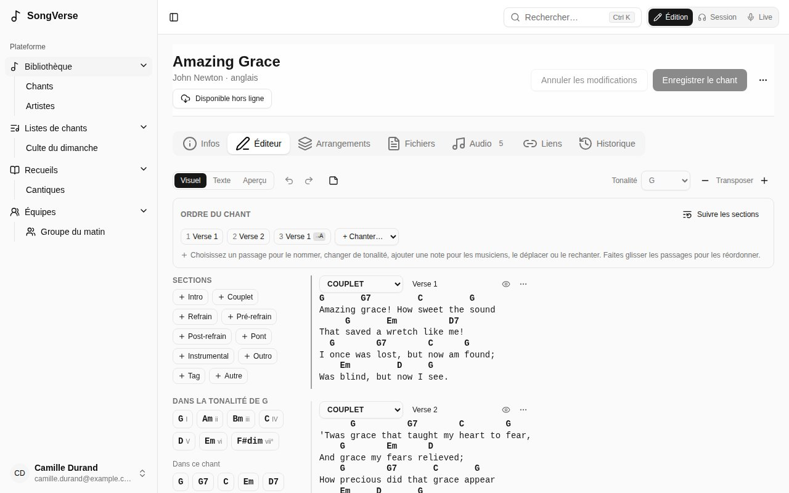
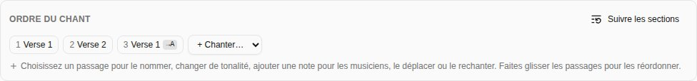
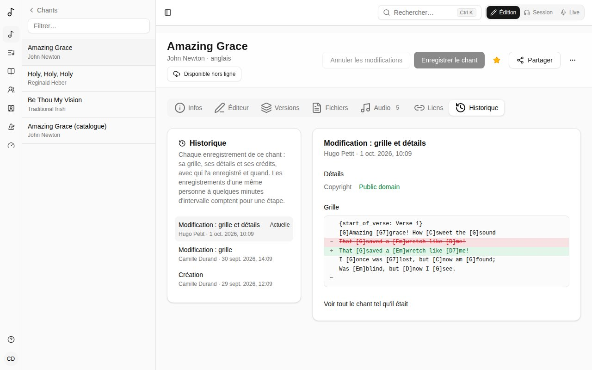

Ouvrez un chant et choisissez l'onglet **Éditeur**.

L'éditeur a trois modes, en haut à gauche :

- **Visuel** - la grille avec les accords au-dessus des mots. C'est là que vous passerez le plus de temps.
- **Texte** - la même grille en texte ChordPro, pour des modifications rapides en bloc. Les accords et les lignes que vous ne changez pas restent tels quels.
- **Aperçu** - la grille telle que les musiciens la verront. Sur un écran large, elle s'affiche aussi à côté de **Visuel** et **Texte**, mise à jour au fil de la saisie.

## Les accords

- **Tapez un accord** entre crochets à l'endroit où il se joue : `[G]Amazing grace`.
- **Déplacez un accord** en le faisant glisser sur une autre lettre, ou sélectionnez-le et utilisez les flèches ← →.
- **Cliquez sur un accord** pour le changer (avec des suggestions de la tonalité du chant et des variantes comme `G7` ou `Gsus4`) ou le supprimer.
- La palette à gauche liste les **accords de la tonalité** du chant (avec leur degré : I, IV, V…) et ceux **Dans ce chant**. Cliquez sur l'un d'eux pour l'ajouter au curseur, ou faites-le glisser sur un mot. **Autre accord** en ajoute un autre.

Modifier les paroles garde les accords avec elles : taper avant un accord l'emmène, et supprimer des mots qui portent des accords laisse les accords à l'endroit des mots, pour que vous les replaciez. Entrée coupe une ligne, et ses accords suivent leurs mots.

## Les sections

Chaque bloc est une section : intro, couplet, pré-refrain, refrain, post-refrain, pont, vamp (une phrase répétée autant qu'il faut), break, instrumental, interlude, outro ou tag.

- **Ajoutez une section** depuis la liste **Sections** de la palette : un clic l'ajoute après la section où vous êtes ; sur un ordinateur, faites-la plutôt glisser pour la déposer entre deux sections (une ligne montre où elle ira).
- Changez le **type** ou le **libellé** d'une section (« Couplet 2 ») en haut de celle-ci. Le bouton en forme d'œil masque son libellé sur la grille.
- Le menu **⋯** la déplace, la duplique ou la supprime.
- Une ligne peut être une **note pour le groupe** (« ×2, montée ») plutôt que des paroles.

## Tonalité et transposition

Choisissez la **Tonalité** du chant en haut à droite. **Transposer** − et + déplacent tous les accords et la tonalité d'un demi-ton.

## L'ordre du chant

L'**Ordre du chant**, au-dessus de la grille, est l'ordre dans lequel on le chante ; chaque fois qu'on chante une section est un *passage*.

- **+ Chanter…** ajoute un passage : le refrain une nouvelle fois, par exemple.
- **Choisissez un passage** pour le nommer (« Dernier refrain »), y changer de tonalité, ajouter une note pour le groupe, le déplacer, le rechanter juste après ou le retirer.
- **Faites glisser les passages** pour les réordonner.
- **Suivre les sections** revient à chanter chaque section une fois, dans l'ordre.

Les changements de tonalité et les notes s'affichent sur la grille à ce passage.

## Coller une grille

Collez une grille entière n'importe où - en ChordPro, ou avec les accords écrits au-dessus des paroles - et elle devient des sections avec les accords en place. Coller de simples paroles les tape, tout simplement. Un nom de section seul sur sa ligne (« Strophe 1 », « [Refrain] », « Pont », « Chorus », « Coro ») commence une section de ce type, en français, anglais, espagnol, allemand, italien ou portugais.

## Enregistrer

**Enregistrer le chant** enregistre la grille et les détails du chant ensemble. Si quelqu'un d'autre a enregistré le chant après que vous l'avez ouvert, Songverse vous le dit au lieu d'écraser ses modifications.

## Historique

L'onglet **Historique** liste chaque enregistrement du chant, du plus récent au plus ancien : qui l'a enregistré, quand, et ce qui a changé - la **grille**, les **détails** (titre, tonalité, droits…) ou les **crédits**. Les enregistrements d'une même personne à quelques minutes d'intervalle comptent pour une étape.

Choisissez une étape pour voir ce qu'elle a changé : détails et crédits avec l'ancienne valeur barrée et la nouvelle à côté, et les lignes de la grille supprimées et ajoutées. **Voir tout le chant tel qu'il était** montre le chant à cette étape.

Si vous pouvez modifier le chant, **Restaurer cet état** remet sa grille, ses détails et ses crédits tels qu'ils étaient à cette étape. C'est enregistré comme toute autre modification : la restauration apparaît dans l'historique et peut elle-même être annulée. Les étiquettes, fichiers, liens et versions ne font pas partie de l'historique et restent tels quels. Enregistrez ou annulez vos propres modifications avant de restaurer.

Les chants créés avant l'historique commencent par **Avant le début de l'historique** : le chant tel qu'il était alors.
