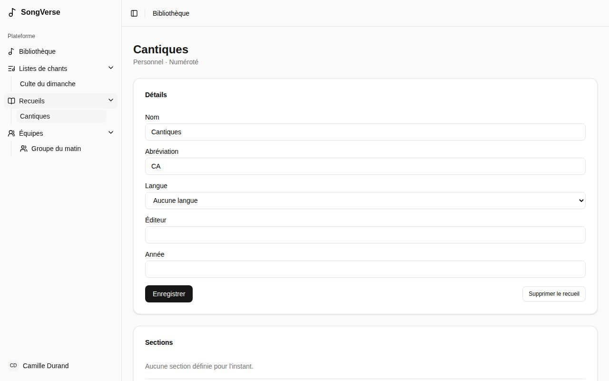

Un **recueil** est une collection de chants. Les vôtres s'affichent sous **Recueils** dans la barre latérale.

## Créer un recueil

Choisissez **Créer un recueil** et son **Type** :

- **Simple** - une collection sans ordre ; les chants n'ont pas de numéro.
- **Numéroté** - les chants sont numérotés comme dans une édition imprimée, et chaque numéro est unique.

Donnez-lui un nom, et si vous voulez une abréviation, une langue, un éditeur et une année. Choisissez à qui il appartient : vous, une équipe, ou tout le monde (administrateurs globaux seulement).

## Les chants d'un recueil

Sous **Chansons**, **Ajouter une chanson** en la cherchant et, dans un recueil numéroté, en indiquant son numéro.

Un recueil numéroté peut avoir des **sections** : des plages de numéros avec un libellé, comme les volumes d'un recueil (1-371 « JEM1 », 372-721 « JEM2 »…). Vous pouvez ensuite filtrer le recueil par section.

## À partir du catalogue d'un recueil publié

Le **Catalogue de recueils** (**Parcourir le catalogue**) est un annuaire de recueils publiés : numéros, titres, crédits, tonalités et plus - mais ni paroles ni accords.

Commencer un recueil à partir d'un catalogue vous donne toutes ses entrées d'un coup. Celles dont le chant n'est pas encore dans votre bibliothèque sont listées dans **Entrées en attente** : **Démarrer** l'une d'elles crée le chant avec les détails du catalogue, puis vous ajoutez paroles et accords.

## Import en masse

Pour remplir vite un recueil numéroté, l'**Import en masse** ajoute de nombreux fichiers ChordPro ou PDF d'un coup. Chaque fichier est associé à un chant par le numéro dans son nom (`0245.cho` ou `JEM_0245.pdf` correspond au numéro 245). Vérifiez les correspondances, puis **Confirmer l'import**.
