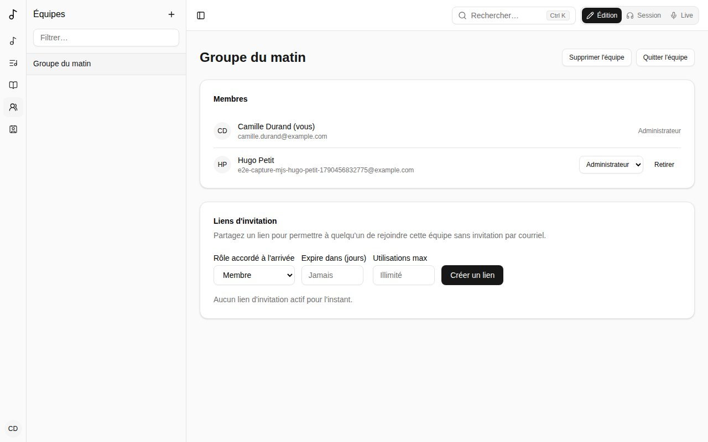

Une **équipe** est un groupe qui partage chants, versions, listes de chants et recueils. Vos équipes s'affichent sous **Équipes** dans la barre latérale.

## Calendrier

La page de l'équipe commence par son **Calendrier** : ses cultes, répétitions et autres événements, les huit semaines à venir (**Voir plus** pour la suite). Tous les membres le voient ; ses administrateurs le gèrent.

- **Nouvel événement** : son **Titre**, sa **Date** et son **Heure de début**, sa durée, son **Fuseau horaire** (le vôtre par défaut) et, si vous voulez, un lieu et une note. **Répétition** : **Chaque semaine**, toutes les 2 semaines, etc., le même jour de la semaine que sa date, **Jusqu'au** une date ou sans fin ; ou **Ne se répète pas**. Les heures restent les mêmes au changement d'heure.
- **Chaque date a sa propre liste**, au nom de l'événement suivi de sa date dans votre langue (« Culte du matin - 12 oct. ») : **Ouvrir la liste** la prépare comme toute liste. Les listes sont créées à l'avance - **Créer les listes à l'avance**, sous le calendrier, dit combien de semaines, de 1 à 52 (4 par défaut ; 13 font environ trois mois). Une date plus lointaine a **Préparer la liste**, qui crée sa liste tout de suite.
- Le menu **…** d'une date : **Annuler cette date** (sa liste est supprimée si elle n'a pas encore de chants) ou **Rétablir cette date**, et **Modifier l'événement**.
- Modifier un événement (son titre, sa date, sa fréquence) met à jour ses listes à venir. Les dates où il n'a plus lieu perdent leur liste si elle est encore vide ; une liste avec des chants reste, comme liste de l'équipe. **Supprimer l'événement** fait de même. Une liste supprimée à la main n'est pas recréée ; **Préparer la liste** la fait revenir.

### Disponibilités

Sous chaque date, dites si vous pouvez jouer : **Disponible**, **Si besoin** (libre si on vous le demande, pas en premier choix) ou **Pas disponible**. Appuyez de nouveau sur votre réponse pour la retirer. Une fois répondu, ajoutez une note pour les administrateurs de l'équipe (« Clavier seulement », « j'arrive en retard ») ; seuls vous et eux la voient. Ne pas répondre n'est jamais compté comme disponible.

**Mon calendrier**, dans la barre latérale, liste les dates à venir de toutes vos équipes, pour y répondre au même endroit. Sous **Absences**, ajoutez les jours où vous êtes absent (**Du**, **Au**, une note) : chaque date de ces jours se lit **Pas disponible**, marquée **Absent**, pour toutes vos équipes - sauf si vous répondez vous-même à cette date.

Les administrateurs de l'équipe voient, à côté de chaque date, combien de membres sont disponibles, si besoin, pas disponibles, et n'ont pas répondu. Un clic ouvre **Qui peut jouer** : la réponse de chacun, avec ses notes et ses absences. Un administrateur peut y répondre pour un membre qui n'utilise pas Songverse ; c'est marqué comme répondu par lui.

## Membres et rôles

- Les **Administrateurs** gèrent l'équipe : ils modifient ses chants, ses versions et ses listes, et invitent des personnes.
- Les **Membres** voient et utilisent tout ce qu'a l'équipe.

À côté de chaque nom, l'équipe montre ce que la personne joue ou fait (voir [Rôles](/fr/account/#rôles)).

## Créer une équipe et inviter

**Créer une équipe** depuis la carte **Équipes** du tableau de bord ; vous en êtes le premier administrateur.

Pour inviter, créez un **lien d'invitation** : choisissez le rôle donné en rejoignant, quand il expire et combien de fois il peut servir, puis **Copier le lien** et envoyez-le. Toute personne qui l'ouvre et se connecte rejoint l'équipe. **Révoquer** un lien l'arrête.

## Couleur et image

Les administrateurs d'une équipe lui donnent une **Couleur** et une image sur sa page, dans **Couleur et image** : l'image (**Ajouter une image**, recadrée en carré) ou les initiales de l'équipe sur sa couleur s'affichent à côté de son nom dans la barre latérale et les listes, pour tous ceux qui la voient. **D'après son nom** choisit une couleur à partir du nom de l'équipe.

## Quitter ou supprimer une équipe

**Quitter l'équipe** vous en retire. Si vous en êtes le seul administrateur, nommez d'abord un autre membre administrateur. Un administrateur peut **Supprimer l'équipe**.

## Ce qui appartient à une équipe

Les versions, les listes de chants et les recueils peuvent appartenir à l'équipe plutôt qu'à vous : choisissez l'équipe en les créant (il faut en être administrateur). Ce qui est à l'équipe y reste quand les personnes vont et viennent.

Un de vos chants devient celui de l'équipe quand vous le lui cédez : voir [Passer une liste à une équipe](/fr/sets/#passer-une-liste-à-une-équipe-ou-linverse).
