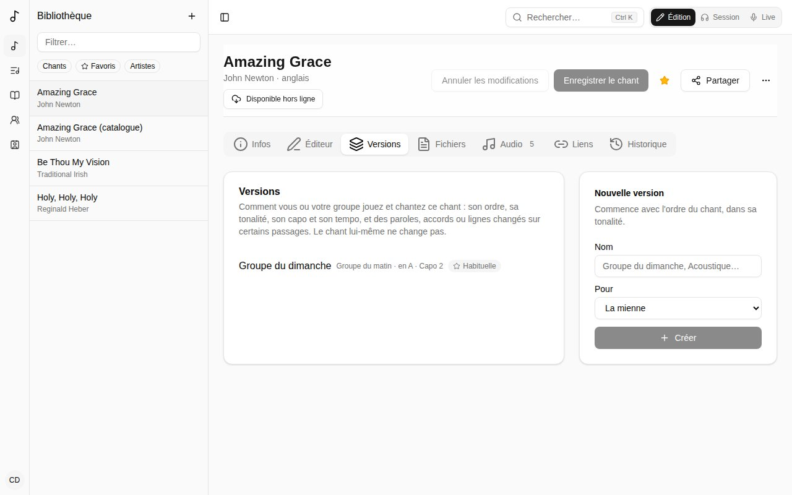
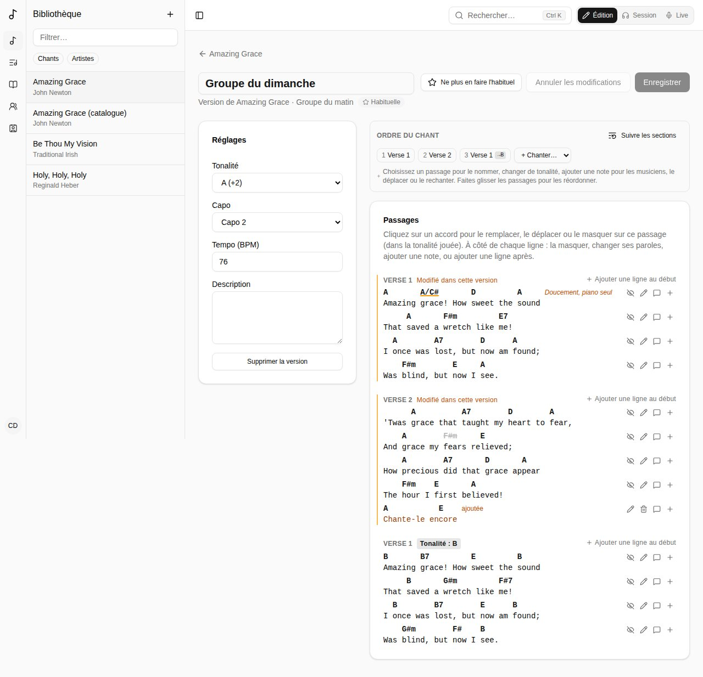
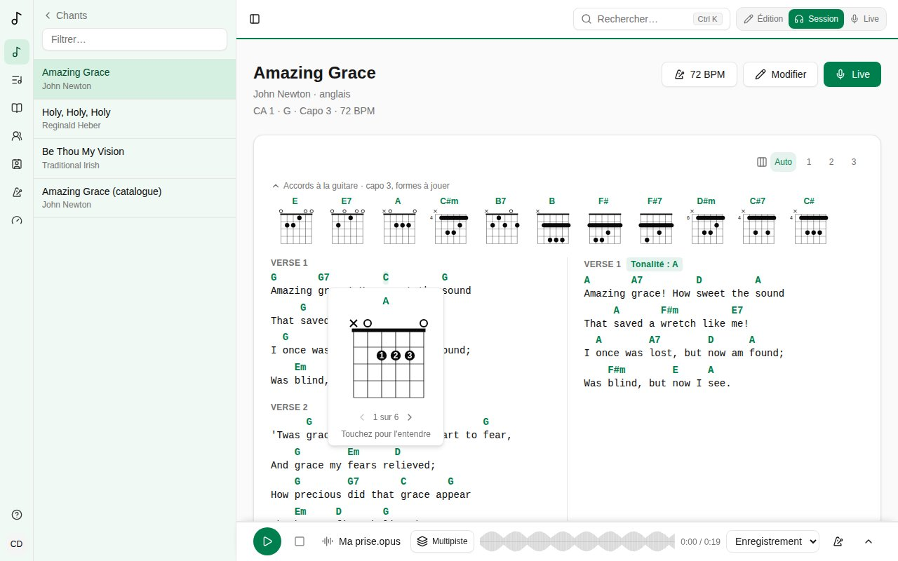

Une **version** est la façon dont vous ou votre groupe jouez et chantez un chant : son ordre, sa tonalité, son capo et son tempo, et des accords, paroles ou lignes changés sur certains passages. **Le chant lui-même ne change jamais** : vous pouvez donc faire votre version de chants que vous ne pouvez pas modifier, comme ceux du catalogue global. (Une traduction, c'est autre chose : un chant à part entière, lié à son original - voir [Chants liés](/fr/library/#chants-liés).)

## En créer une

Dans l'onglet **Versions** d'un chant, donnez-lui un nom (« Groupe du dimanche », « Acoustique ») et choisissez **Pour** qui elle est : vous, ou une équipe dont vous êtes administrateur. Elle commence avec l'ordre du chant, dans sa tonalité.

Les versions d'une équipe sont vues par ses membres et modifiées par ses administrateurs.

## Le modifier

- **Réglages** - sa **Tonalité** (à partir de celle du chant), son **Capo**, son **Tempo** et une description.
- **Ordre du chant** - quels passages sont joués, dans quel ordre, avec changements de tonalité et notes, comme [l'ordre du chant lui-même](/fr/song-editor/#lordre-du-chant).
- **Passages** - la grille telle que cette version la joue, dans la tonalité de chaque passage :
  - **cliquez sur un accord** pour le remplacer sur ce passage (tapez-le dans la tonalité où il se joue), le **Masquer pour le groupe**, ou le remettre **Comme dans le chant**. **Déplacer** le met sur un autre caractère : cliquez sur celui où il va ;
  - à côté de chaque ligne, **masquez la ligne** sur ce passage, ajoutez-lui une **note** (« Doucement, piano seul »), ou **changez les paroles** sur ce passage - une ligne chantée dans une autre langue, « nous » au lieu de « je » au dernier refrain. Les accords restent sur les mêmes caractères (ramenés à la fin d'une ligne plus courte ; **Déplacez**-les au besoin), et la ligne est marquée **paroles changées**. **Revenir aux paroles du chant** l'annule ;
  - **ajoutez une ligne** après n'importe quelle ligne, ou **au début** du passage : une ligne de fin, une intro parlée. Tapez-la avec ses accords entre crochets, devant le mot ou la syllabe où ils tombent : `[G]Chante-le en[D]core`. Elle est marquée **ajoutée** ; ses accords se remplacent, se déplacent ou se masquent comme les autres, et à côté d'elle vous la **modifiez** ou la **supprimez**.

Les passages que vous avez changés sont marqués **Modifié dans cette version**, ici et sur les grilles du groupe. **Enregistrer** quand vous avez fini.

### La version habituelle de l'équipe

Un administrateur peut faire d'une version de l'équipe **la version habituelle** de l'équipe pour un chant. Quand ce chant est ajouté à l'une des listes de l'équipe, c'est cette version qui est jouée.

### Quand le chant change

Si le chant est modifié après votre dernière vérification de la version, l'éditeur de version le signale. La version continue de fonctionner. Les changements qui portent sur quelque chose de retiré du chant depuis (un accord ou une ligne disparus) sont listés sur leur passage : supprimez-les, ou laissez-les - ils sont sans effet. **Marquer comme vérifié** une fois que vous avez relu.

Une version créée quand votre propre copie d'un chant a été intégrée au chant du catalogue (voir [Proposer au catalogue global](/fr/library/#proposer-au-catalogue-global)) joue le chant tel que vous l'aviez, avec ses paroles changées et ses lignes ajoutées de la même façon - et vous les modifiez de la même façon aussi.

## Votre propre affichage d'une grille

Quand vous ouvrez un chant dans une liste, la barre **Mon affichage** change la grille **pour vous seul** :

- **Masquer des accords** - puis touchez un accord pour le masquer (un accord trop rapide pour vous, par exemple). **Afficher les accords masqués** les fait revenir.
- **Accords simplifiés** - Gmaj7 s'affiche G, Bm7b5 Bdim.
- **Sans basses** - D/F# s'affiche D.
- **Noms** - les accords en lettres (**C D E**), en solfège (**Do Ré Mi**) ou en chiffres Nashville (**1 4 5**).
- **Couleurs** - les accords colorés selon leur type.
- **Formes capo** - avec un capo, les accords comme les formes que vous jouez plutôt que tels qu'ils sonnent.
- **Diagrammes** - **Aucun**, **Guitare**, **Ukulélé** ou **Piano** : voir [Diagrammes d'accords](/fr/versions/#diagrammes-daccords) ci-dessous.

Les accords masqués et simplifiés sont gardés par chant (et par version). Les noms, les couleurs, les formes de capo et les diagrammes s'appliquent à toutes les grilles ; vous pouvez aussi les régler dans [votre compte](/fr/account/#affichage-des-grilles).

## Chiffres Nashville et couleurs des accords

Avec **Chiffres Nashville (1 4 5)** sous **Noms des accords**, chaque accord s'affiche selon sa place dans la tonalité : en Ré, D est **1**, Em7 **2m7**, D/F# **1/3**, G **4** et A7 **57** ; un accord hors de la tonalité prend un bémol ou un dièse (Bb en Do est **b7**). Le reste de l'accord s'écrit comme d'habitude. Les chiffres comptent depuis la tonalité où chaque partie est chantée : après un changement de tonalité ils restent les mêmes, et un capo ne les change pas non plus. Dans une tonalité mineure, ils comptent depuis sa propre tonique : en Mi mineur, Em est **1m** et G **b3**. Un chant sans tonalité garde ses lettres. Les diagrammes aussi : ils montrent un vrai accord à jouer.

Avec **Couleurs des accords** sur **Selon le type d'accord**, chaque accord de la grille est coloré selon ce qu'il évoque : majeurs en vert, mineurs en bleu, sus en jaune, diminués (et m7b5) en violet, augmentés en orange, septièmes de dominante (G7, G9, G13) en rouge. Les power chords (G5) gardent la couleur habituelle.

## Diagrammes d'accords

Choisissez **Guitare**, **Ukulélé** ou **Piano** sous **Diagrammes d'accords** dans [Affichage des grilles](/fr/account/#affichage-des-grilles) (ou **Diagrammes** dans **Mon affichage**), et les grilles que vous lisez - en Session, dans les chants d'une liste, en Live et hors ligne - montrent comment jouer leurs accords. Ils sont désactivés tant que vous ne les choisissez pas ; rien ne cache jamais les paroles, et la grille elle-même ne bouge pas.

- En haut de la grille, les accords du chant en petits diagrammes, chacun une fois, dans l'ordre où ils viennent. Touchez-en un pour l'entendre gratté (vers le bas, puis vers le haut au toucher suivant). La flèche à côté de **Accords à la guitare** les replie en une seule ligne de noms, retenue sur l'appareil.
- Touchez un accord de la grille pour voir son diagramme, plus grand, avec les doigts à utiliser. **‹ ›** passent aux autres façons de le jouer ; touchez le diagramme pour l'entendre. **Utiliser cette forme pour ce chant** garde celle affichée pour cet accord dans ce chant, pour vous seul, sur tous vos appareils : le bandeau et la fiche la montrent d'abord. **Revenir à l'habituelle** l'annule. Les autres chants gardent la forme habituelle.
- Un diagramme montre les cordes de haut en bas et les cases en travers : × est une corde qu'on ne joue pas, ○ une corde à vide, chaque point un doigt (son numéro dans le grand diagramme), et une barre un doigt posé sur plusieurs cordes. Près du sillet, celui-ci est dessiné épais ; plus haut sur le manche, le nombre à gauche est la case où il commence.
- Avec un capo, les diagrammes de guitare sont les formes que vous jouez capo posé (**capo 2, formes à jouer**), quel que soit votre réglage **Avec un capo** sur la grille. Les diagrammes de ukulélé sont les accords tels qu'ils sonnent.
- Ils suivent tout le reste : la tonalité de la liste, une transposition de dernière minute en Live, un changement de tonalité, **Accords simplifiés** et **Sans basses**. Chaque accord que Songverse sait lire a un diagramme, calculé sur l'appareil : ils marchent aussi hors ligne.

Sous **Diagrammes d'accords** dans [Affichage des grilles](/fr/account/#affichage-des-grilles), une fois un instrument choisi : son **accordage** (guitare : EADGBE, drop D, DADGAD, open G, un demi-ton plus bas ; ukulélé : sol aigu, sol grave, baryton) - les formes sont calculées pour ses cordes - et **Diagrammes pour gaucher**, dessinés en miroir, la corde la plus grave à droite.

### Piano

Avec **Piano**, chaque accord est un petit clavier : les touches de la main droite en points pleins, près du do central, et la basse à la main gauche en anneau (la fondamentale, ou la basse d'un accord à basse : D/F# met F# à la main gauche). Touchez-en un pour l'entendre, la basse d'abord. Dans le grand diagramme, **‹ ›** passent d'un renversement à l'autre, et **Utiliser ce voicing pour ce chant** en garde un pour cet accord dans ce chant, comme à la guitare. Le capo ne change pas les accords au piano : ils s'affichent tels qu'ils sonnent. Ses réglages, sous **Diagrammes d'accords** dans [Affichage des grilles](/fr/account/#affichage-des-grilles) :

- **Voicings au piano** - **Fluides** (par défaut) : chaque accord dans le renversement le plus proche du précédent, la main bouge à peine, comme le font les claviéristes ; ou **État fondamental** : chaque accord depuis sa fondamentale, plus facile à lire.
- **Mains** - **Les deux mains (la basse à gauche)**, ou **Main droite seule** - quand un bassiste joue la basse.
- **Noms des notes sur les touches** - **Dans le grand diagramme seulement**, **Partout** ou **Jamais**.

En mode **Masquer des accords** d'une liste, toucher un accord le masque toujours.

