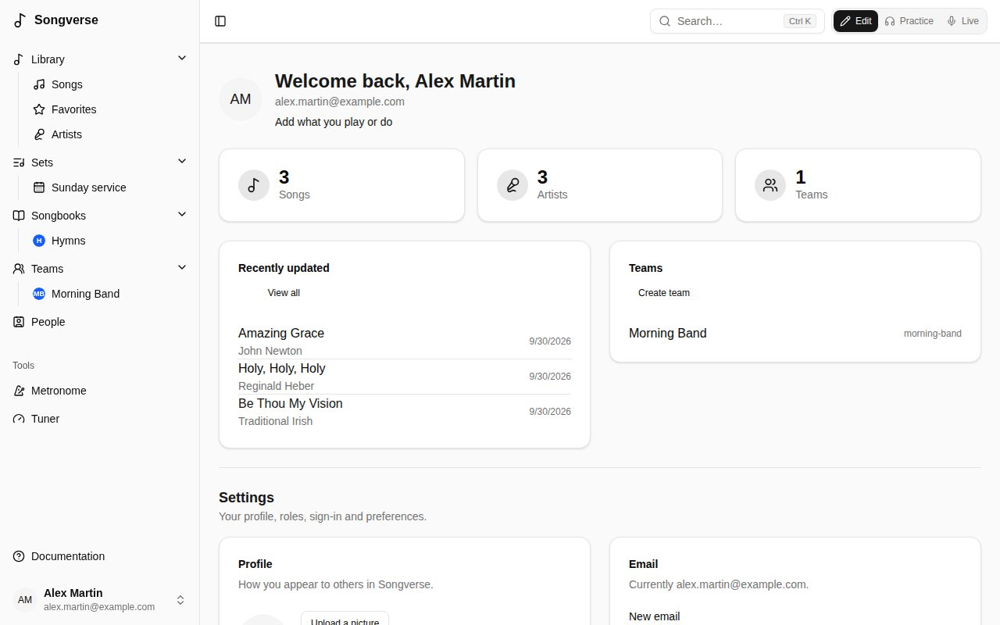
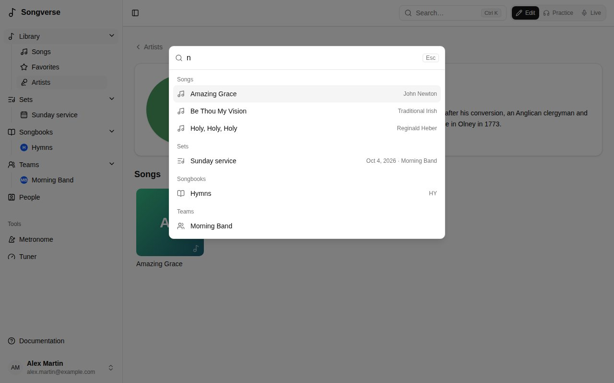

## Create your account

1. Open [Songverse](https://app.songverse.one) and choose **Sign up**.
2. Enter your display name, email and a password, then **Create account**.
3. Open the link in the verification email we send you. You can sign in once your email is verified.

If your Songverse offers it, you can also use **Continue with Google** instead of a password.

Some servers only let invited people sign up: **Sign up** then says so. Open the invitation link you were sent (it fills in your email), or a team's invite link or a set's share link someone gave you, and create your account from there.

## Signing in

- With your **email and password**. Forgot it? **Forgot password?** sends you a link to set a new one.
- With a **passkey**, once you've added one (your device's fingerprint, face or screen lock - see [Your account](/account/#passkeys)).
- With **Google**, if it's offered.

## Finding your way around

The sidebar on the left takes you everywhere:

- **Library** - every song you can see: yours, your teams' and the global catalogue's. See [The library](/library/).
- **Sets** - your song lists, with the upcoming ones listed underneath. See [Sets](/sets/).
- **Songbooks** - collections of songs, numbered or not. See [Songbooks](/songbooks/).
- **Teams** - the bands and groups you're part of. See [Teams](/teams/).
- **People** - the people you share songs with. See [People](/people/).
- **Tools** - the **Metronome** (see [Metronome](/metronome/)), and soon a **Tuner**.
- **Documentation**, at the bottom - these pages, opened at the one about where you are.
- **Admin**, just above it, for reviewers and admins - **Review** and the admin **Dashboard**. See [For admins](/admin/).

On a section's pages and lists (the library's home, **Songs**, **Favorites**, **Artists**, Sets, Songbooks…), the sidebar shows every section with its lists underneath: your smart lists, your upcoming sets, your songbooks, your teams. Once you open one thing - a song, a set, a songbook, a team - on a computer or a tablet it becomes two parts: a rail of icons for the sections, and beside it a panel listing where you opened it from, with a **Filter…** box on top. A song opened from your **Favorites** has your favorites beside it; from **Songs**, the songs as you'd searched, filtered and sorted them; from a [smart list](/library/), that list. What you're viewing is marked, so the next one is one click away, and the list's name at the top takes you back to it. In a set, the panel lists that set's songs, in order, with the version and key each is played in: go from one to the next, or to the set itself from its name; **Sets**, at the top, lists your sets again. A songbook works the same way: its songs by number (type a number in **Filter…** to find it), and a song opened from the songbook keeps the songbook's list beside it.

The button at the top left, the sidebar's edge, or **Ctrl B** (**⌘ B** on a Mac) collapse it: the full sidebar to its icons, the panel out of the way, leaving just the rail. Clicking an icon on the rail opens it again, and Songverse remembers whether it's open. On a phone, the sidebar opens over the page from the top-left button instead: with every section and its lists on a list page, and on a song, set or songbook with the list you opened it from, full width - tap another to open it. **Menu**, at the top, switches to every section.

Your name at the bottom of the sidebar opens a menu with the **Dashboard** (your songs and teams), **Account settings** and **Sign out**.

## Search

The search box at the top of every page - a magnifying glass on a phone - finds anything: **Songs** (by title, subtitle, version, artist or CCLI number), **Sets**, **Songbooks** and **Teams**, grouped by kind, ignoring case and accents ("elevation" finds "Élévation"). **Ctrl K** (**⌘ K** on a Mac) opens it from anywhere. The arrow keys move through the results, **Enter** opens one and **Esc** closes it. Empty, it lists the sets coming up.

A songbook number finds its entry: type the songbook's abbreviation or part of its name and the number - **HY 42**, **HY42**, **Hymns 42** - or just **42** for that number in every songbook. Entries come first, under **In songbooks**; **Enter** opens the first. From two digits, two more groups follow: **Numbers starting with 58** (580, 581… 589, then 5800…) and **Numbers containing 58** (158, 258… 1580…), each in number order; with a songbook (**JEM 58**) they stay within it. A number with letters (12a, A-17) counts by its digits. **Show more** below them lists the rest. Songs found by their title show, on the right, the songbooks they're in (**JEM 58 · HY 12**, abbreviations first, and **+2** when there are more). It's the same offline, in the songbooks kept on the device.

## Edit, Practice and Live

The switch at the top right of every page changes Songverse's mode. Each mode has its own look, so you always know which one you're in:

- **Edit** - to write songs, prepare versions and sets. Neutral greys.
- **Practice** - to learn and rehearse, alone or with the band. Green. A song's stems play here (see [Stems](/library/#stems)).
- **Live** - on stage. Always dark, near black with blue chords, and a set's songs open full screen (see [Playing a set live](/sets/#playing-a-set-live)).

Edit and Practice follow your device's light or dark setting. The moon button in your account menu (your name, at the bottom of the sidebar) makes them dark, and the sun makes them light again; choose your device's own setting and Songverse follows the device again. Live has no such button: it's always dark.

Songverse remembers the mode on each device, so the tablet on your music stand can stay Live while your computer stays in Edit.

## Working offline

Songverse works without a network too: your sets for the next two weeks, your own songs, and anything you choose are kept on the device. See [Working offline](/offline/).

## Language

Songverse is in English and French. Pick yours under **Account settings** > **Language**. These docs are in both languages too: use the language menu at the top of any page.

## Who sees what

Everything in Songverse belongs to someone:

- **Personal** things are yours alone, unless you share them.
- **Team** things are seen by the team's members and changed by its admins.
- **Global** songs are in the shared catalogue, for everyone. They're checked by a reviewer before they're added (see [Submitting to the global catalogue](/library/#submitting-to-the-global-catalogue)).
