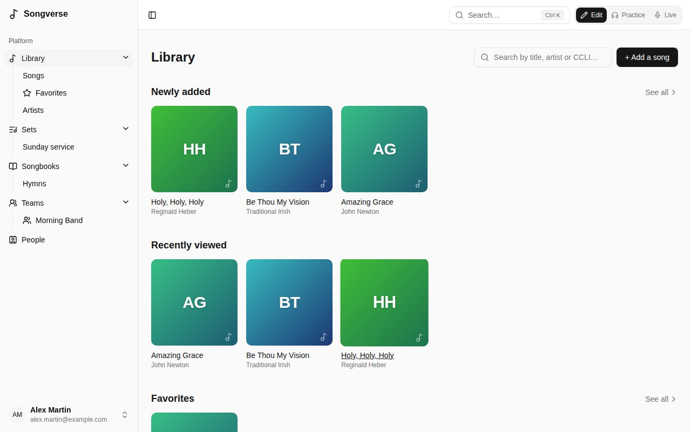
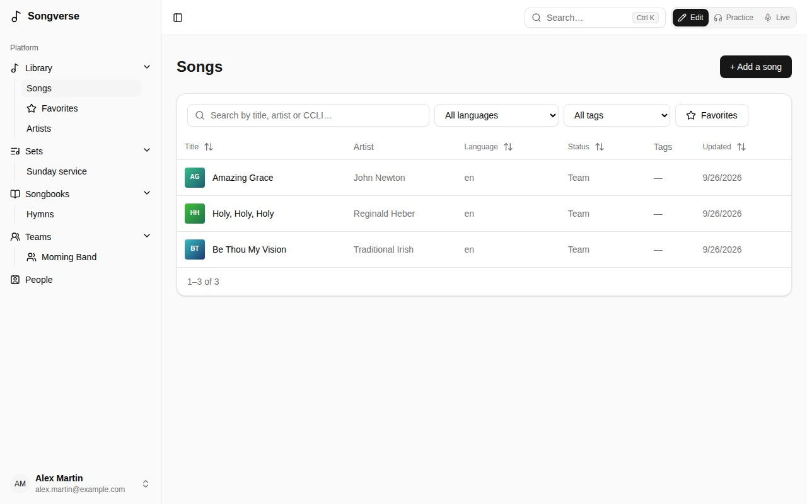
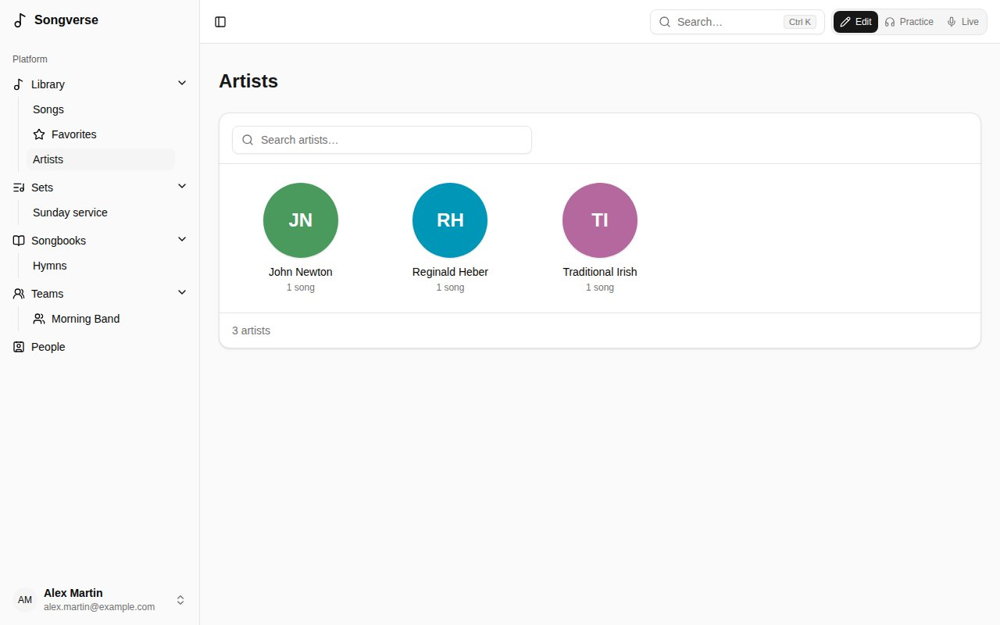
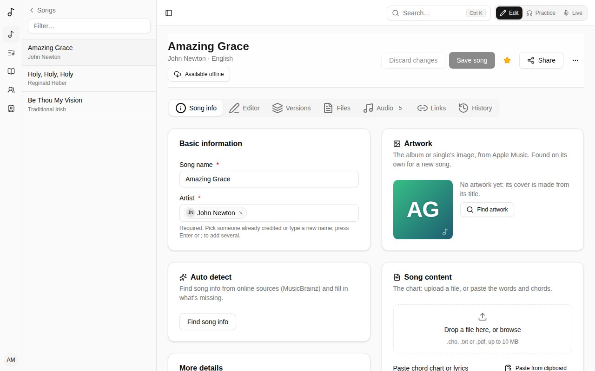
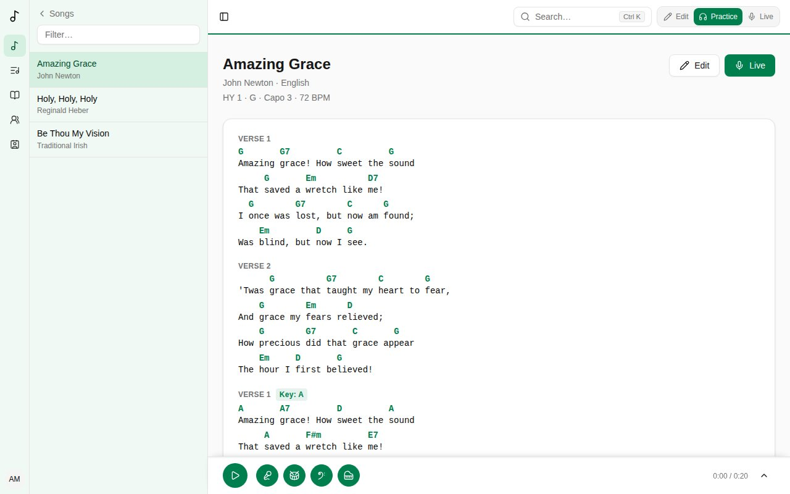
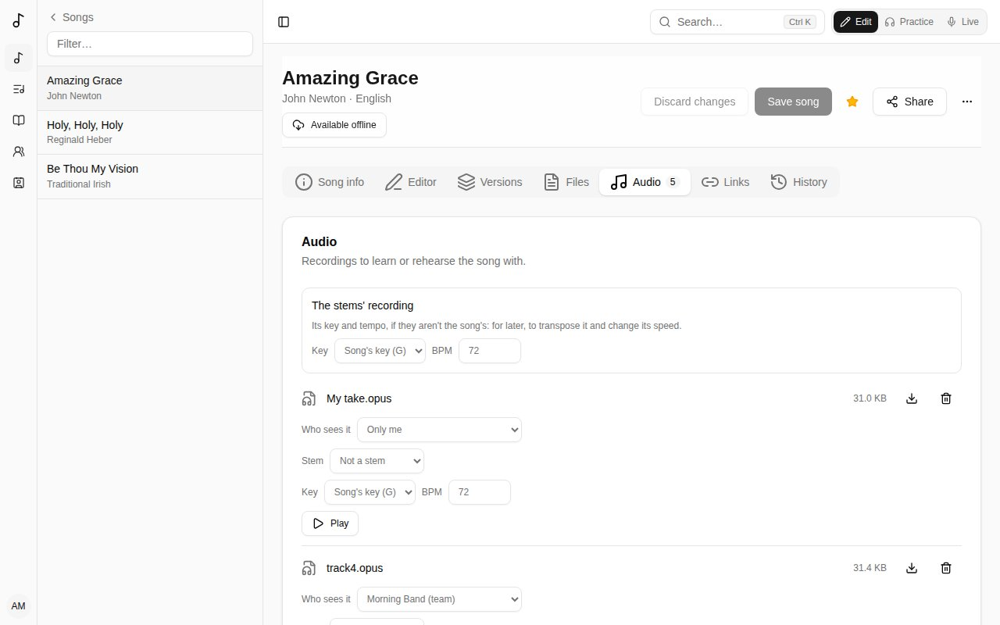
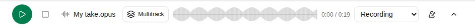
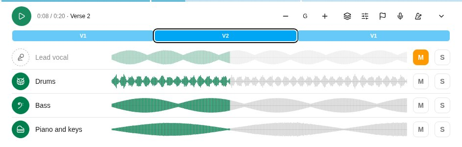
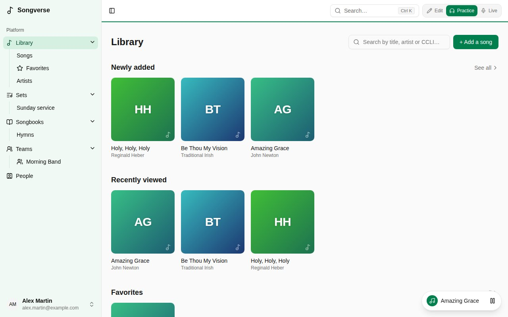

The **Library** holds every song you can see: your own, your teams', and the global catalogue's. **Library** opens on its home; **Songs**, under it in the sidebar, is the whole list, with **Favorites**, **Artists** and your smart lists beside it.

## The library's home

**Library** opens on its home: rows of songs, then the songs changed last.

- **Newly added** - the latest songs you can see; **See all** lists them all on **Songs**, newest first.
- **Recently viewed** - the songs you opened last (on their page, in a set or in Live). Only you see yours.
- **Favorites** - the songs you starred: the star beside **Share** on a song's page (**Add to favorites**, **Remove from favorites**). It shows once you have one. **See all** lists them, as the **Favorites** filter above the list and in the sidebar's panel do. Your favorites are your own.
- **Popular in your teams** - what your teams play and look at most: songs in your teams' sets and opened by their members over the last 90 days.

A song without an image of its own gets a cover from its title's colour and initials. Below the rows, **Recently updated** shows the songs changed last, and its link opens **Songs**. The search box at the top of the home searches **Songs**.

## Searching and filtering

**Songs** is the whole list, and nothing else:

- **Search** by title, artist or CCLI number.
- **Filter** by language (**All languages**) and tag (**All tags**), or show only your **Favorites**.
- **Sort** by a column by clicking its heading.
- The **Status** column says where a song stands: **Personal** or **Team** for one never offered to the global catalogue, then where its submission is (**Waiting for review**, **Published**...).

## Artists

**Artists** shows everyone credited as an artist on the songs you can see, as a grid: a round picture (their initials, for now), their name and how many songs they have; the search box narrows them. Names written differently (with or without capitals or accents) count as one artist. Choose one to see their songs: the **Songs** list shows **By** and the name, and the **×** beside it shows everyone again.

## Smart lists

A search, filters and sort you use often can be kept as a smart list: set them up on **Songs**, then **Save as a smart list** and give it a name. It appears at the top of the library's panel in the sidebar (under **Library** on a phone). A smart list keeps the filters, not the songs, so a new song that matches shows up in it by itself.

On a smart list, change the filters and **Save changes to the list** keeps the new ones; **Rename** and **Delete list** do what they say. Smart lists are your own: no one else sees them.

## Adding a song

Choose **+ Add a song**. A **song name** and at least one **artist** are all it needs; everything else can come later.

- **Already in your library?** As you type the name, Songverse shows songs you already have with that title. You can open the existing one, **Use as base** (start from its details), or **Link it to this song** - when yours is a translation or adaptation of it (see [Linked songs](/library/#linked-songs)). An acoustic or youth-band take isn't a new song: that's a [version](/versions/).
- **Auto detect** looks the song up online (MusicBrainz) and fills in what's missing, like credits and the album. Choose **Find song info**, then **Use this** on the right match.
- **The chart**: paste the words and chords, or upload a file (`.cho`, `.txt` or `.pdf`). Songverse recognises ChordPro, chords written above the lyrics, and plain lyrics. You can then work on it in the [song editor](/song-editor/). A PDF is kept under **Files**, but its text isn't read, so paste the words too.

Then **Save song**.

## A song's page

Opened from a list - **Songs** as you searched and sorted it, your **Favorites**, a smart list, an artist's songs or a [songbook](/songbooks/) - a song's page shows where it is in it ("2 of 12 · Favorites"), with the songs before and after it on either side: one tap goes to the next, still in the same list.

A song has tabs:

- **Song info** - its name and artists, and under **More details**: composers, lyricists and other credits, album, year, key, tempo, time signature, suggested capo, duration, copyright, CCLI and ISRC numbers, a reference (e.g. the scripture it draws on), notes and tags. It also lists the songbooks it's in.
- **Editor** - the chart itself. See [The song editor](/song-editor/).
- **Versions** - how you and your teams play it. See [Versions](/versions/).
- **Files** - sheet music, the original chart file, images (up to 25 MB each).
- **Audio** - recordings to learn or rehearse with (MP3, Opus, M4A, WAV, OGG… up to 50 MB each), and the song's stems (see below).
- **Links** - the song on Spotify, Apple Music and YouTube.

Edits on **Song info** and **Editor** are saved together by **Save song**; files, audio and links are saved as you add them. **Discard changes** takes back what you haven't saved. The **⋯** menu can **Export as ChordPro** or **Delete song**.

### Artwork

A song's image is the artwork of the album or single it's on, from Apple Music, kept on Songverse's own storage. A new song gets it on its own, from its title and first artist, when Apple Music has a close enough match; until then its cover is made from its title. It shows on the library's home, in **Songs** and on the song's page, to everyone who can see the song.

On **Song info**, **Artwork** shows it. If you can edit the song, **Find artwork** lists Apple Music's matches - choose the album or single it's from - and **Remove** takes it off.

That's the song in **Edit** mode. In **Practice** its page is the chart itself, read with your chord settings, with its key, capo and tempo, and the song's recording or stems at the bottom (see [Stems](/library/#stems)); **Edit** takes you back to editing. In **Live** it opens full screen, as a set's songs do; **×** goes back to the library.

The **Suggested capo** is only a suggestion (for example, the capo used on the recording): it's used when a version doesn't set its own.

A song can also be shared with you by one of your [people](/people/): it's marked **Shared by** them, and you can view it, or edit it too if they chose **Can edit**.

If a song isn't yours to change (a global song, or a team song when you're not one of the team's admins), you can read it, make your own version of it and add files of your own to it (see [Who sees a file](/library/#who-sees-a-file)), but not edit it.

## Linked songs

A translation or an adaptation (simpler words, kids' words) is a song of its own - its own title, language, owner, [versions](/versions/) and files - linked to the song it comes from. Its page says so ("Translation of Amazing Grace"), and **Linked songs** on **Song info** lists the songs linked to this one. **Add a translation** starts a new song linked to it. You can translate a catalogue song and keep your translation to yourself, or put it in the catalogue too.

In a set, a song with linked songs can switch to one of them (its **Translation**).

## Who sees a file

Each file on the **Files** and **Audio** tabs has its own **Who sees it**, set by whoever added it:

- **Only me** - just you. New files start this way: recordings and stems are often someone else's copyright.
- **Morning Band (team)** - you and that team's members (one of your teams).
- **The people I share it with** - you and the [people the song is shared with](/people/#sharing-a-song), for whoever shares it (a personal or team song).
- **Everyone who can see this song** - for those who can edit the song.

Choose it before adding files, under the drop area, or change it under a file afterwards. Others see who shared a file ("Shared by Sam with Morning Band"); a file you can't see doesn't show at all, in the song, its sets, Practice or offline.

Anyone who can see a song can add files of their own to it, even a song they can't edit: they're yours, and only you see them unless you share them with one of your teams. The song's editors can remove the files they see, but only a file's owner decides who sees it.

## Stems

Stems are the song's parts as separate recordings: vocals, drums, bass and so on. Upload them on the **Audio** tab. A file named after its part ("Vocals.mp3", "03 drums.opus", "Basse.mp3") becomes that stem on its own. For any other file, choose the part in the **Stem** list under it: **Vocals**, **Backing vocals**, **Drums**, **Bass**, **Guitar**, **Piano and keys**, **Other** or **Click and cues**, or **Not a stem** for a full recording.

If the stems (or any recording) aren't in the song's key or at its tempo, a live version a tone up for example, set the recording's own under **The stems' recording** (or under the file): **Key** and **BPM**. Left as **Song's key**, and empty, they're the song's. Songverse keeps them for transposing and changing the speed later.

In **Practice** mode (see [Edit, Practice and Live](/getting-started/#edit-practice-and-live)), a song with stems has the stem player docked at the bottom of its page, and of its page in a set. It starts as one row: **Play**, then a round button per part, showing its instrument (a microphone for the vocals, a drum, a bass clef, a guitar, a piano...). Tap one to mute that part and play along with the rest; tap it again to bring it back. Hold the pointer over one to see its name.

The arrow at the end expands it: a row per part with the same round button, its waveform and a solo button (solo plays only the parts soloed), and a position bar. While a solo is on, a round button, in either view, takes its part out of the solo or adds it; take the last one out to hear every part again. Click a waveform to jump there. The arrow at the top minimizes it again, and Songverse remembers which you prefer. The files start downloading as soon as the song's page opens in Practice (the line along the top shows how far), so **Play** is usually instant. Once downloaded, they aren't downloaded again.

The song keeps playing while you go to another page or leave Practice, and on a phone with the screen locked, where the lock screen can pause it too. A small button at the bottom right shows what's playing: tap the song's name to go back to it, or pause it from there.

A song without stems plays its latest recording in the same player, as one part. A song with no audio at all but a YouTube link (on the **Links** tab) plays its YouTube video there instead: the video shows beside the controls, as YouTube requires, and the parts can't be separated. It keeps playing in a small window at the bottom right while you go to other pages; the song's name there takes you back. YouTube stops when the phone locks and doesn't play offline, so for those, add the recording to the **Audio** tab.

Stems kept on your device for offline use (**Include audio**, see [Working offline](/offline/)) play offline too.

## Submitting to the global catalogue

The **Global catalogue** card on your own song (or a team song you administer) offers it to everyone. **Submit for review**, optionally with a note for the reviewer; copyright and CCLI details help but aren't required. A reviewer then publishes it, asks for changes, or declines it, and you see where it stands on the same card.

Once published, the song itself moves to the catalogue - there's no second copy. Your library lists it once, marked **Published by you**, and its page says who it came from. Its chart and details (its notes too) are now everyone's, and only admins change them; its [history](/song-editor/#history) goes on. What was yours stays yours: your files keep to you (or the team you shared them with - see [Who sees a file](/library/#who-sees-a-file)), your versions stay yours, and so do your own tags.

If a reviewer finds the song is already in the catalogue, they merge it into that one, and yours is folded into it - there's still only one song. Your [versions](/versions/) move to the catalogue song (check them: each says what to review), and so do your files (still only yours), tags and places in sets and songbooks. The way you had the song - your words, chords, order and key - becomes one of your versions of it, named after you, with your notes; your sets play it that way. Details you'd changed (title, credits, rights) are suggested to the reviewers.

Songs published before Songverse worked this way were copied into the catalogue; they've been folded into their catalogue song the same way.

## Suggesting a change

Only admins change a song in the global catalogue, but anyone can suggest a change - including whoever contributed it. On the song's page, **Suggest a change**: its **Song info** and **Editor** tabs open as for your own song. Make your change, then **Send suggestion**, with a word for the reviewer if you like. The song itself isn't changed yet.

A reviewer reads what it changes - details and credits struck out and new, the chart's lines removed and added - and accepts or declines it. An accepted suggestion is saved to the song in your name, in its [history](/song-editor/#history), on top of anything changed since. If the same part (the chart, a detail, the credits) was changed since in another way, it can't be accepted as it is.

**Your suggestions**, on the song's page, shows where each one stands and the reviewer's note; **Withdraw** takes back one that's still waiting.
