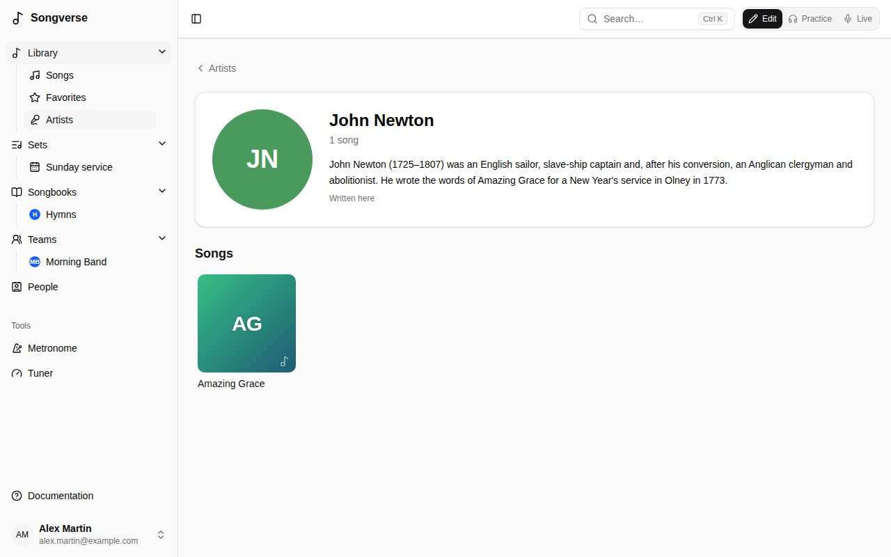
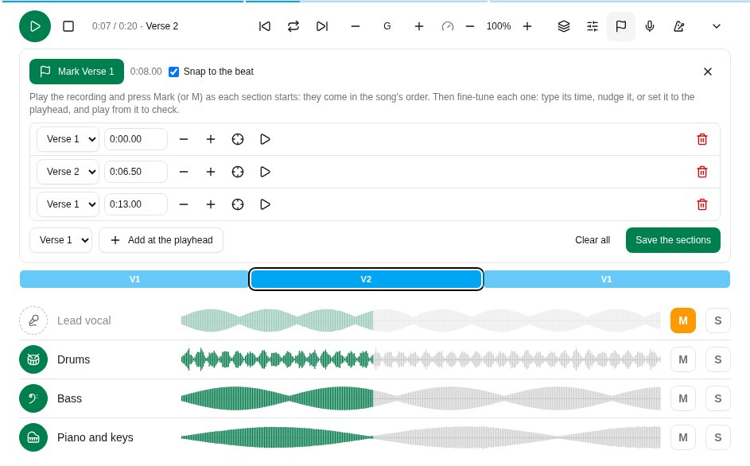
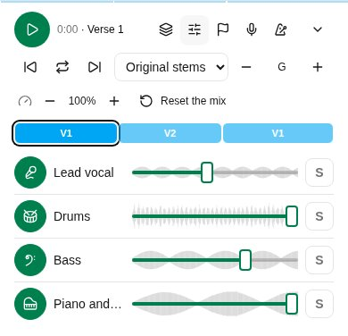
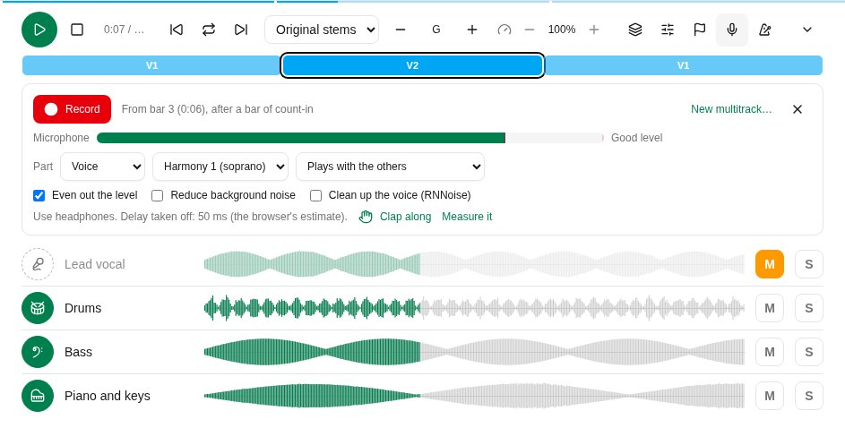
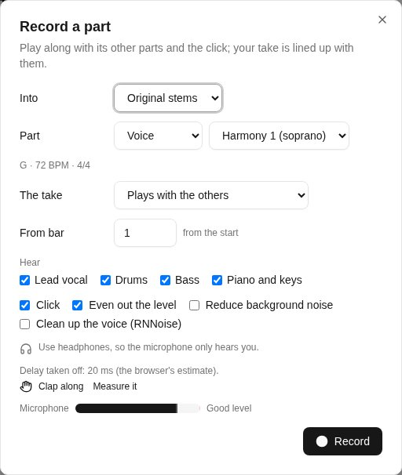

The **Library** holds every song you can see: your own, your teams', and the global catalogue's. **Library** opens on its home; **Songs**, under it in the sidebar, is the whole list, with **Favorites**, **Artists** and your smart lists beside it.

## The library's home

**Library** opens on its home: rows of songs, then the songs changed last.

- **Newly added** - the latest songs you can see; **See all** lists them all on **Songs**, newest first.
- **Recently viewed** - the songs you opened last (on their page, in a set or in Live). Only you see yours.
- **Favorites** - the songs you starred: the star beside **Share** on a song's page (**Add to favorites**, **Remove from favorites**). It shows once you have one. **See all** lists them, as the **Favorites** filter above the list and in the sidebar's panel do. Your favorites are your own.
- **Popular in your teams** - what your teams play and look at most: songs in your teams' sets and opened by their members over the last 90 days.

When a row has more songs than fit, swipe it, or use the arrows beside its title with a mouse.

A song without an image of its own gets a cover from its title's colour and initials. Below the rows, **Recently updated** shows the songs changed last, and its link opens **Songs**. The search box at the top of the home searches **Songs**.

## Searching and filtering

**Songs** is the whole list, and nothing else:

- **Search** by title, artist or CCLI number.
- **Filter** by language (**All languages**) and tag (**All tags**), or show only your **Favorites**.
- **Sort** by a column by clicking its heading.
- The **Status** column says where a song stands: **Personal** or **Team** for one never offered to the global catalogue, then where its submission is (**Waiting for review**, **Published**...).

## Artists

**Artists** shows everyone credited as an artist on the songs you can see, as a grid: their picture (or their initials), their name and how many songs they have; the search box narrows them. Names written differently (with or without capitals or accents) count as one artist.

Choose one for their page: their picture, a short bio and their songs. The picture comes from Deezer, Spotify or Apple Music (as your admin set them up) and the bio from Wikipedia (**From Wikipedia** opens the article), in English or French as you read Songverse; an artist is looked up when a song first credits them, or the first time their page opens. Their song count opens the **Songs** list with **By** and the name; the **×** beside it shows everyone again.

A global admin can **Upload a picture** (dragged and zoomed into the circle), **Remove the picture**, **Edit the bio** - written here, it replaces Wikipedia's in that language; left empty, Wikipedia's comes back - and **Look them up again**. An artist is the same for everyone, so these show to everyone who can see a song by them.

## Smart lists

**Songs** shows 50 songs at first; more come as you scroll to the end (or with **Show more**), and a reload or going back brings back as many as you'd reached. **Columns** chooses which columns show - Artist and Tags at first, with Title; Language, Status, Updated, Added and CCLI too if you want them - and their order (Title stays first), remembered on this device.

A search, filters and sort you use often can be kept as a smart list: set them up on **Songs**, then **Save as a smart list** and give it a name. It appears at the top of the library's panel in the sidebar (under **Library** on a phone). A smart list keeps the filters, not the songs, so a new song that matches shows up in it by itself.

On a smart list, change the filters and **Save changes to the list** keeps the new ones; **Rename** and **Delete list** do what they say. Smart lists are your own: no one else sees them.

## Adding a song

Choose **+ Add a song**. A **song name** and at least one **artist** are all it needs; everything else can come later.

- **Already in your library?** As you type the name, Songverse shows songs you already have with that title. You can open the existing one, **Use as base** (start from its details), or **Link it to this song** - when yours is a translation or adaptation of it (see [Linked songs](/library/#linked-songs)). An acoustic or youth-band take isn't a new song: that's a [version](/versions/).
- **Auto detect** looks the song up online - on MusicBrainz, Apple Music, Deezer and Spotify, as your admin set them up - and fills in what's missing, like the artist, the album and the year. Choose **Find song info**, then **Use this** on the right match. The same release found on several of them is one match, naming them all. The closest to the title and artist come first; among those, the song's first release before later ones (a compilation, a live album) and before versions like karaoke. Once the song is saved, the match's Apple Music, Deezer and Spotify links are added to **Links** (unless it has them already), and its release's artwork becomes the song's image. Matches from Spotify, and from Apple Music when your admin has set up its API, also bring the song's ISRC - and Apple Music's who wrote it (as **Writer**) - where those are still empty.
- **The chart**: paste the words and chords, or upload a file (`.cho`, `.txt` or `.pdf`). Songverse recognises ChordPro, chords written above the lyrics, and plain lyrics. You can then work on it in the [song editor](/song-editor/). A PDF is kept under **Files**, and when it has text (not a scan), its words and chords fill the text box: each chord goes on the syllable it's printed over, so check a few before saving. A scanned PDF has no text to read: paste the words.

Then **Save song**.

## A song's page

Opened from a list - **Songs** as you searched and sorted it, your **Favorites**, a smart list, an artist's songs or a [songbook](/songbooks/) - a song's page shows where it is in it ("2 of 12 · Favorites"), with the songs before and after it on either side: one tap goes to the next, still in the same list.

A song has tabs:

- **Song info** - its name and artists, and under **More details**: composers, lyricists and other credits, album, year, key, tempo, time signature, suggested capo, duration, copyright, CCLI and ISRC numbers, a reference (e.g. the scripture it draws on), notes and tags. It also lists the songbooks it's in.
- **Editor** - the chart itself. See [The song editor](/song-editor/).
- **Versions** - how you and your teams play it. See [Versions](/versions/).
- **Files** - sheet music, the original chart file, images (up to 25 MB each unless your admin set other limits; the tab says). PDFs, images, audio, video and plain text open in the browser; anything else (a web page, say) is downloaded, so it can never run inside Songverse.
- **Audio** - recordings to learn or rehearse with (MP3, Opus, M4A, WAV, OGG… up to 50 MB each unless your admin set another limit), and the song's stems (see below). Uploading audio files needs a role that allows it (see [Roles](/admin/#roles)); without one, the tab says so, and you can still [record a part](/library/#recording-a-part) in Songverse.
- **Links** - the song on Spotify, Apple Music, Deezer and YouTube. Paste a link, or find it: the magnifying glass beside a service (**Search Spotify**…) looks the song up there by its title and first artist and lists a few results, with their artwork, artist and album (a video's channel, on YouTube); pick one and it's saved as the link. Apple Music and Deezer can always be searched; Spotify and YouTube once your admin has set them up.

Edits on **Song info** and **Editor** are saved together by **Save song**; files, audio and links are saved as you add them. **Discard changes** takes back what you haven't saved. The **⋯** menu can **Export as ChordPro** or **Delete song**.

### Artwork

A song's image is the artwork of the album or single it's on, from Apple Music, Deezer or Spotify (as your admin set them up), kept on Songverse's own storage. A new song gets it on its own, from its title and first artist, when one of them has a close enough match; until then its cover is made from its title. It shows on the library's home, in **Songs** and on the song's page - beside its title, in Edit and in Practice - to everyone who can see the song.

On **Song info**, **Artwork** shows it. If you can edit the song, **Find artwork** lists their matches, each with where it's from - choose the album or single it's from; on a computer, hovering one shows its full name. If it isn't there, **Upload an image** takes one of your own: drag and zoom to choose the square that shows, then **Use this image**. **Remove** takes it off. Images are kept square, at up to 800×800.

That's the song in **Edit** mode. In **Practice** its page is the chart itself, read with your chord settings, with its key, capo and tempo, and the song's recording or stems at the bottom (see [Stems](/library/#stems)). On a wide screen the chart flows into columns, a section never split between two; the columns button above it chooses **Auto** (as many as fit), **1**, **2** or **3**, remembered on this device; **Edit** takes you back to editing. When the song has a PDF (sheet music, the chart it came from), **Chart** / **PDF** above it switches to the PDF's pages - with several, choose which; a long one shows its first page while the rest is still arriving - here, on its page in a set and in Live. Songverse remembers your choice for the song on your account, so every device you sign in on - the tablet on stage too - shows it the same way; for songs you haven't chosen for, your **Songs read as** setting decides (see [Chart display](/account/#chart-display)). In **Live** it opens as a set's songs do.

The **Suggested capo** is only a suggestion (for example, the capo used on the recording): it's used when a version doesn't set its own.

A song can also be shared with you by one of your [people](/people/): it's marked **Shared by** them, and you can view it, or edit it too if they chose **Can edit**.

If a song isn't yours to change (a global song, or a team song when you're not one of the team's admins), you can read it, make your own version of it and add files of your own to it (see [Who sees a file](/library/#who-sees-a-file)), but not edit it.

## Linked songs

A translation or an adaptation (simpler words, kids' words) is a song of its own - its own title, language, owner, [versions](/versions/) and files - linked to the song it comes from. Its page says so ("Translation of Amazing Grace"), and **Linked songs** on **Song info** lists the songs linked to this one. **Add a translation** starts a new song linked to it. You can translate a catalogue song and keep your translation to yourself, or put it in the catalogue too.

In a set, a song with linked songs can switch to one of them (its **Translation**).

## Who sees a file

Each file on the **Files** and **Audio** tabs has its own **Who sees it**, set by whoever added it:

- **Only me** - just you. New files start this way: recordings and stems are often someone else's copyright.
- **Morning Band (team)** - you and that team's members (one of your teams).
- **The people I share it with** - you and the [people the song is shared with](/people/#sharing-a-song), for whoever shares it (a personal or team song).
- **Everyone who can see this song** - for those who can edit the song.

Choose it before adding files, under the drop area, or change it under a file afterwards. Others see who shared a file ("Shared by Sam with Morning Band"); a file you can't see doesn't show at all, in the song, its sets, Practice or offline.

Anyone who can see a song can add files of their own to it, even a song they can't edit: they're yours, and only you see them unless you share them with one of your teams. The song's editors can remove the files they see, but only a file's owner decides who sees it.

## Audio files and their originals

An audio file above 320 kbps - its size for its length: a WAV, FLAC or AIFF - is turned into Opus in the background after it's uploaded, a fraction of the size, as it is: nothing trimmed, still in time with its multitrack. **Being processed…** shows under it until then. MP3, AAC or Opus files are kept as uploaded.

With a role that keeps lossless originals (see [Roles](/admin/#roles)), the original is kept too, as FLAC - a WAV at its own sample rate and bit depth, a FLAC file as it was - beside the Opus copy that's played. **FLAC**, beside the file's download button, downloads it; stems are separated from it rather than from the copy. Both count toward your storage.

## Stems

Stems are the song's parts as separate recordings: vocals, drums, bass and so on. Upload them on the **Audio** tab. A file named after its part ("Vocals.mp3", "03 drums.opus", "Basse.mp3", "Alto.wav") becomes that stem on its own. For any other file, choose its part under it, in two steps:

- **Voice**: **Lead vocal**, a harmony - **Harmony 1 (soprano)**, **Harmony 2 (alto)**, **Harmony 3 (tenor)**, **Harmony 4 (bass)** - **Backing vocals**, or **Another name…** of your own ("Descant").
- **Instrument**: **Drums**, **Bass**, **Guitar**, **Piano and keys** or **Other**, with a name if you like ("Acoustic guitar", "Violin").
- **Cues**: the click, count-ins and spoken cues, with a name ("Click", "Guide").

**Not a stem** is for a full recording. A part someone else recorded says who, in the stem player (**Recorded by** under its name) and under the file. On a part recorded into a multitrack, or when a song's parts come from more than one person, the round button in the player carries the picture of whoever recorded it (or their initials).

If the stems (or any recording) aren't in the song's key or at its tempo, a live version a tone up for example, set the recording's own in the stems' box above the files (or under the file): **Key** and **BPM**, and **Time** for its time signature. Left as **Song's key**, empty and **Song's**, they're the song's. **First beat at (s)** is where its first beat falls, in seconds from its start (empty: at 0:00): with the tempo, it places the metronome on the recording. Tick **Free intro** when what comes before that first beat is played freely, off the beat: the metronome then waits for it.

In **Practice** mode (see [Edit, Practice and Live](/getting-started/#edit-practice-and-live)), a song with a recording or stems has the stem player docked at the bottom of its page, and of its page in a set. It opens minimized, one row: **Play**, and what it plays - the recording's name, or the multitrack's and its number of parts. When the song has a recording, that's what loads first: one file, quick to load. If it has stems too, **Multitrack** switches to them, and only then are they downloaded. A song with only stems loads them. The parts' own controls - muting, solo, the mixer - are in the expanded player.

Beside **Play**, **Stop, back to the start** (the square) stops the stems and takes them back to the beginning. Where the screen is wide enough, the minimized player also shows the waveform of what's heard, the parts combined, beside what it plays: click it to go there.

The arrow at the end expands it: a row per part with a round button showing its instrument (a microphone for the vocals, a drum, a bass clef, a guitar, a piano...) - tap it to mute that part and play along with the rest, again to bring it back - its waveform and **S** (solo: plays only the parts soloed, green while on). On a wider screen, **M** (mute) sits beside **S**, as on a mixing desk. The line along the player's top edge shows how far it's played, in either view: click or drag it to go elsewhere in the song (or use the arrow keys). While a solo is on, a round button takes its part out of the solo or adds it; take the last one out to hear every part again. Click a waveform to jump there. Each part's waveform is as long as the part: a take that stops before the end of the song stops there too. **Combine the parts** (the layers button) shows the parts' round buttons and a single waveform of what's heard instead of a row per part, to leave more of the screen to the chart; Songverse remembers it. With the **Mixer** on too, each part's button and fader are listed compactly under it. Beside the time are the player's tools: **Combine the parts**, **Mixer**, **Place the sections**, **Record a part** and **Click with the recording**. On a phone, the multitrack, the transposition and the speed go on a second line. The arrow at the top minimizes it again, which turns the **Mixer** off; it opens minimized on each song's page. The files start downloading as soon as the song's page opens in Practice (the line along the top shows how far), so **Play** is usually instant. Once downloaded, they aren't downloaded again. On an iPhone, iPad or Mac with a Safari older than 18.4, which can't read the Opus files Songverse records and separates, Songverse decodes them itself: they take a few seconds longer to load, then play as anywhere else.

**Mixer** gives each part a volume fader: on a phone it lies over the part's waveform, on a wider screen it sits beside it. Each waveform grows or shrinks with its volume, so the balance shows at a glance, and the combined waveform follows it too. Songverse remembers the volumes for each song on the device; **Reset the mix** puts every part back to full.

#### The sections of a recording

Once the sections are placed on a multitrack (see below), the player shows them as a strip above the parts: each section where it is, as long as it lasts, in the colours of Live's structure bar (V1, C, B…), the one playing ringed. Tap one to go there. The one playing is named beside the time ("0:41 / 3:52 · Chorus"), and the line along the player's top edge takes the sections' colours, bright where it's played, faint ahead, so the song's shape shows even with the player minimized.

With the sections placed, the player has three more buttons, beside **Play** (in the minimized player too, where the screen is wide enough): **Previous section** (back to the start of the one playing, or to the one before within its first two seconds), **Next section**, and **Loop this section** (the looping arrows), which plays the section at the playhead over and over, to work on a passage; while it's on, the section buttons move the loop, and **Stop, back to the start** goes back to the start of the loop. Tap it again to play on. On a keyboard: **0** stops, **[** and **]** go to the previous and next section, **L** loops.

**Place the sections** (the flag button), for whoever can change the multitrack's files, places them:

- Play the recording and press **Mark** (or the **M** key) as each section starts: they come in the song's order ("Mark Verse 1", "Mark Chorus"…), so singing the order through places them all.
- Then fine-tune each one in the list: type its time ("1:02.35"), move it **Earlier** or **Later** (a beat, when the recording has a tempo), **Set to the playhead**, or **Play from just before it** to check by ear. **Snap to the beat** keeps them on the recording's beats.
- Or move them on the strip itself, as in a video editor: while placing them, each section's start has a handle, shown when the pointer is over the strip (always, on a touch screen). Drag it to move the section, snapped to the beat - hold **Alt** to place it anywhere - or focus it and use the arrow keys: a beat at a time, or 10 ms with **Shift**. A section can't be dragged past its neighbours, and the time shows under the handle as it moves. The strip and the list stay in step.
- **Add at the playhead** places any section, sung more often than the song's order says, say; **Remove** takes one out.
- **Save the sections** keeps them on every file of the multitrack, its other takes too. They point at the song's sections, so they survive edits to the song.

**Transpose** moves the stems up or down, a semitone at a time (**Up a semitone**, **Down a semitone**), as they play: to a singer's range, or another key. Between the two buttons is the key they're heard in, "B (+2)" for stems in A. Each part's row then has its own arrows button, **Transpose** (the part's name): pressed, the part is moved; not pressed, it plays as recorded. The drums and the click and cues start unpressed, every other part pressed. Songverse remembers the transposition, and which parts are moved, for each song on the device. Playing in sync, the leader's are everyone's.

A take recorded while the stems were transposed is sung in that key, and its row says so ("sung at +2"). The player moves it by the difference: at +2 it plays as sung, at 0 it's moved down 2 to fit with the rest. On a set's song page, the stems are transposed to the key the set plays the song in unless you choose otherwise: stems in A, for a set in C, play in C (+3).

**Speed** plays the stems slower or faster in the same key, from 50% to 150% in steps of 5% (**Slower**, **Faster**), to learn a hard passage slowly or take the song at another tempo. The percentage between the two buttons takes it back to 100%. The playhead, the waveforms and the sections stay in the recording's own time. While the speed isn't 100%, the click and cues part is silent, because a stretched click smears, and the metronome plays its beat at the new tempo instead. Recording waits until the speed is back to 100%: a take sung to slowed stems wouldn't fit them at full speed. Songverse remembers the speed for each song on the device, and the minimized player shows it ("80%"). Playing in sync, the leader's speed is everyone's. A YouTube video has the same **Speed** control.

The metronome button beside it, **Click with the recording**, plays the [metronome](/metronome/) with the stems: at the recording's tempo (or the song's), its first beat where the recording's falls, with your pattern and sound. It clicks from 0:00, on the recording's beat, even when its first beat comes later: a count-in is for recording. With **Free intro** ticked for the recording, or **Count-in only** on the Metronome page, it waits for the first beat instead, with your count-in before it. It follows **Play**, pause and the playhead. Playing in sync, the leader's is everyone's (see [Playing in sync](/sets/#playing-in-sync)).

The song keeps playing while you go to another page or leave Practice, and on a phone with the screen locked, where the lock screen can pause it too. A small button at the bottom right shows what's playing: tap the song's name to go back to it, or pause it from there.

A song without stems plays its latest recording in the same player, as one part. A song with no audio at all but a YouTube link (on the **Links** tab) plays its YouTube video there instead, and the parts can't be separated. The player opens minimized, one row: **Play** expands it and plays, since YouTube only plays a video that's shown - beside the controls, or above them as wide as a phone's screen. **Minimize the player** (the arrow) pauses the video for the same reason. **Speed** works as for the stems, but a YouTube video can't be transposed: YouTube's player doesn't let its sound be changed. To play the song in another key, add its recording to the **Audio** tab. The line along the top edge is its playhead too: click or drag it to go elsewhere in the video. It keeps playing in a small window at the bottom right while you go to other pages; the song's name there takes you back. YouTube stops when the phone locks and doesn't play offline, so for those, add the recording to the **Audio** tab.

Stems kept on your device for offline use (**Include audio**, see [Working offline](/offline/)) play offline too.

### Multitracks

A song can have more than one set of stems: its **Original stems**, and multitracks - parts recorded together, another version or your own layers (see [Recording a part](/library/#recording-a-part)). Each has its box on the **Audio** tab, with its **Name**, its number of parts (and of other takes), the set it was recorded for if any (**Not for a set** takes it off), and what its parts were recorded in: its key, tempo, time signature and first beat, which they share. Its files are listed in its box: its stems first - uploaded or separated - then **Recordings**, the parts people recorded into it in Songverse, each saying who and when, so they're never mixed up with the stems. They still play with that multitrack's stems. Under a stem, the **Multitrack** list moves it into another one, or into a **New multitrack** of its own: upload the files of another version, then put them together that way.

In **Practice**, the stem player plays one multitrack at a time: when a song has more than one, the list beside the time switches between them (**Recording**, when the song has one, **Original stems**, then the others by name, or **Multitrack 2**...). Songverse remembers your choice for each song on the device, and for each set's song page. Playing in sync, everyone plays the leader's multitrack, with their own files of it.

### Separating a recording into stems

When an admin has set up stem separation and allowed you (or your team), **Separate into stems** under a recording on the **Audio** tab splits it into its parts on a separation server: **4 parts: vocals, drums, bass, other** (the default), **6 parts: and guitar, piano**, or **2 parts: vocals and instrumental**. Only separate a recording you have the rights to use this way.

The first stems arrive within a few minutes as a new multitrack named by its parts, **Separated (4 parts)**, locked, in the recording's key and tempo and with its sections, and with the same visibility as the recording. The **Stem separations** list under the files says where each one is: **Waiting to start**, **Separating…**, **Ready - a finer version is on its way** - a slower, better separation that replaces the stems in place when the server has time, often overnight - then **Ready**, with **High quality** once the finer version is in. 6 parts get no finer version: there's no finer model for 6. The list, and the multitrack's box, also name the models used (**Models: htdemucs → htdemucs_ft**), and the list keeps the recording's name after it's deleted - deleting it doesn't stop the finer version, which the server already has. A failed one says why, with **Try again**. The page keeps checking by itself; the stems count towards your storage.

Where the recording has no key, tempo, time signature, first beat or sections, the server may have found them: its box says **Found by the analysis: …** (Em, 72 BPM, 3/4, sections…). Check them: **Looks right** keeps them, and changing one confirms it. Found sections are placed on the song's, in order - check them in **Place the sections**. What the recording already says is never replaced.

To separate it again - 6 parts after 4, say - use **Separate into stems** once more. **Replace the earlier stems** (ticked) puts the new ones in place of the last separation's: its sections and name carry over, and recordings made into it move to the new stems. Untick it to keep both.

### Recording a part

You can record a part straight into Songverse, on a computer, phone or tablet with a microphone:

- **Record a new multitrack**, at the bottom of the **Audio** tab: the first layer of a song, or another version of it, with the metronome only. Give it a **Name**, a **Tempo (BPM)** and a **Time signature** (the song's to start with). It starts with a bar of count-in, which is kept: the multitrack's first beat is one bar in.
- **Record a part**, in a multitrack's box: another part of that multitrack, hearing its other parts (untick one under **Hear** to leave it out) and the click, at its tempo, with a bar of count-in before its first beat.

#### In the stem player

In **Practice**, the microphone button in the stem player, **Record a part**, records into the multitrack playing without leaving it. A small recorder opens above the parts, with the same **Part**, **The take** and clean-up options, and the delay (**Clap along**, **Measure it**):

- You hear the player as it is: your mutes, solos and transposition, and the metronome if **Click with the recording** is on. Recorded while transposed, the take is kept as sung in that key (see above).
- As soon as the microphone is open, **Microphone** shows its level on a meter, the peak held a moment, and says whether that's **Too quiet**, a **Good level** or **Too loud** (it clips): check before you record.
- It records from the playhead: move it anywhere in the song, and the take starts at the beginning of that bar ("From bar 17 (0:42)"), after a bar of count-in. It replaces only the time it covers: the part it replaces is kept either side (a punch-in and out), or it's silent.
- While you record, the take draws itself where it's being recorded. **Stop** ends it.
- The take is then a track like the others, **New take**: play it, mute or solo it, and move **Line up** to nudge it. **Keep** adds it to the multitrack; **Discard** drops it; **Record again** tries again.
- To record a part in sections (the verses, then the chorus), press **Add another section** after a take: move the playhead to where the next section starts and **Record** again. Each section goes into the same take, with a short crossfade at each end, and the player counts them ("2 sections"). **Discard** drops only the last one, **Discard all** every one, and **Keep** saves them all as one file.
- Tap the name of a part you recorded or uploaded, unless it's locked (see [Locked files](/library/#locked-files)) - the small arrow after it - to see what can be done with it: **Record into it** opens the recorder on that part, what you record replacing only the time it covers; **Merge with…** mixes another of your parts sung in the same key into it, as one file that plays in their place (both are kept as other takes); **Delete** deletes it, once you've confirmed.
- **New multitrack…** records the first layer of another multitrack instead, as below.

#### From the Audio tab

**Into** switches between the song's multitracks and **New multitrack**. On a set's song page, a new multitrack can be that set's (**For this set**): there, it's the one the stem player plays, unless you choose another.

Choose the **Part** you're recording (a voice, an instrument or cues, as above), check **Microphone** says it hears you at a **Good level**, untick **Click** to record without the metronome, and press **Record**; **Stop** ends the take. Use headphones, so the microphone only hears you, not the click and the other parts.

**The take** says what it does once kept, when the multitrack already has that part:

- **Plays instead of** the one there, which is kept as an **Other take**: not played, but there to go back to.
- **Plays with the others**: a second part of the same kind (two guitars).
- **Kept as another take, not played**.

On the **Audio** tab, **Use this take** under an other take plays it instead of the one of its part playing, which becomes the other take.

#### Locked files

Audio you upload is locked to start with (the lock button beside the file, pressed): it's kept as uploaded. A locked file can't be deleted, replaced by another take, merged with one or cleaned up, and the stem player shows neither whose it is nor any actions on it; its part, key, tempo and sections can still change. A take recorded beside a locked part plays with it rather than instead. Only whoever uploaded it can unlock it (**Unlock**, the same button) - to replace a stem, say - and lock it again. What you record in Songverse isn't locked.

**From bar** records from a bar on rather than from the start - a punch-in: the count-in is the bar before it, and the take it replaces is heard up to there. What's before it stays as it was, and what you record replaces the rest, with a short crossfade at the seam.

What you play is lined up with what you heard: Songverse takes off the delay between a sound leaving the device and the microphone hearing it. The dialog shows it - the browser's estimate to start with. For a closer one:

- **Clap along**, with your headphones on: listen to two clicks, then clap on each of the next eight, near the microphone. It measures the whole way round - Bluetooth headphones included.
- **Measure it**, with the sound on the speakers (headphones off, sound up): Songverse plays a few clicks and listens for them.

Songverse remembers what it measured on this device. Wired headphones are best: Bluetooth adds a delay that's large and can change, so the dialog warns when the sound seems to go to Bluetooth. Clap along again if a take sounds late.

**Listen** plays the take back with the rest. If it's still a little early or late, move **Line up** (in milliseconds) and listen again. **Keep** adds it to the multitrack as that part, only you see it until you choose who else does (see [Who sees a file](/library/#who-sees-a-file)); **Record again** tries again. A take can be up to about nine minutes long.

A kept take is recorded as a WAV file, then turned into Opus in the background (mono, 96 kbps: about an eighth of the size) - **Being processed…** shows under it until then. The silence after its end is trimmed, never before it, so it stays in time. **Even out the level** (on to start with) brings it to a standard loudness; **Reduce background noise** takes out steady noise - hiss, hum, a fan - learning it from the count-in when it can, gently so the music is left alone. For a voice, **Clean up the voice (RNNoise)** goes further: a neural network trained on voices keeps the singing and removes what isn't - the room, the street, a fan - but it isn't for instruments, which it can cut into.

To do the same afterwards, **Clean up** under an audio file you can change offers **Clean up the voice (RNNoise)** for a voice, **Even out the level** and **Reduce background noise**: it's done in the background, and the file comes back as Opus, in time as before.

## Submitting to the global catalogue

The **Global catalogue** card on your own song (or a team song you administer) offers it to everyone. **Submit for review**, optionally with a note for the reviewer; copyright and CCLI details help but aren't required. A reviewer then publishes it, asks for changes, or declines it, and you see where it stands on the same card.

Once published, the song itself moves to the catalogue - there's no second copy. Your library lists it once, marked **Published by you**, and its page says who it came from. Its chart and details (its notes too) are now everyone's, and only admins change them; its [history](/song-editor/#history) goes on. What was yours stays yours: your files keep to you (or the team you shared them with - see [Who sees a file](/library/#who-sees-a-file)), your versions stay yours, and so do your own tags.

If a reviewer finds the song is already in the catalogue, they merge it into that one, and yours is folded into it - there's still only one song. Your [versions](/versions/) move to the catalogue song (check them: each says what to review), and so do your files (still only yours), tags and places in sets and songbooks. The way you had the song - your words, chords, order and key - becomes one of your versions of it, named after you, with your notes; your sets play it that way. Details you'd changed (title, credits, rights) are suggested to the reviewers.

Songs published before Songverse worked this way were copied into the catalogue; they've been folded into their catalogue song the same way.

## Suggesting a change

Only admins change a song in the global catalogue, but anyone can suggest a change - including whoever contributed it. On the song's page, **Suggest a change**: its **Song info** and **Editor** tabs open as for your own song. Make your change, then **Send suggestion**, with a word for the reviewer if you like. The song itself isn't changed yet.

A reviewer reads what it changes - details and credits struck out and new, the chart's lines removed and added - and accepts or declines it. An accepted suggestion is saved to the song in your name, in its [history](/song-editor/#history), on top of anything changed since. If the same part (the chart, a detail, the credits) was changed since in another way, it can't be accepted as it is.

**Your suggestions**, on the song's page, shows where each one stands and the reviewer's note; **Withdraw** takes back one that's still waiting.
