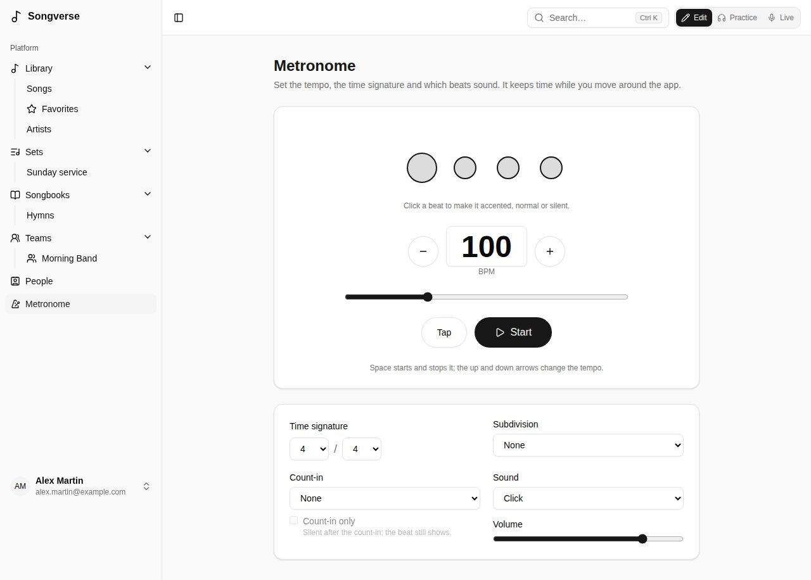

**Metronome**, in the sidebar, opens its page: everything it can do, set once and remembered on this device. It keeps time while you move around Songverse; a small button at the bottom of the screen shows its tempo and beat, takes you back to its page and stops it.

## Tempo

- **−** and **+** change the tempo a beat per minute at a time; type it in, or drag the slider (20 to 300 BPM).
- **Tap**: tap it in time with the music, and the metronome takes that tempo.
- **Start** and **Stop**. With a keyboard, **Space** starts and stops it, and **↑** **↓** change the tempo (by 5 with **Shift**).

A new tempo takes over on the next beat, without stopping.

## Time signature and pattern

- **Time signature**: the beats per bar and the beat's value - **4 / 4**, **3 / 4**, **6 / 8**... The tempo counts those beats: in 6/8, eighth notes.
- The circles are the bar's beats: the one you hear lights up, the first of the bar is bigger. Click a beat to make it **accented**, **normal** or **silent** - for example, only beats 2 and 4, or a bar with its last beat left out.
- **Subdivision** adds clicks between the beats: **2 per beat**, **Triplets** or **4 per beat**, softer than the beats.

## Count-in

**Count-in** plays one or two bars before the song, every beat heard. With **Count-in only**, it goes silent after them: the circles keep showing the beat, for a band that only needs to be counted in.

## Sound and volume

**Sound**: **Click**, **Wood block** or **Beep**; and its **Volume**. The sound is made on your device, so the metronome works offline.

Use wired headphones or the device's speaker: Bluetooth headphones hear it a fraction of a second late.

## At a song's tempo

In [Live](/sets/#playing-a-set-live), on a song's page in a set and on a song's page in Practice, the metronome button (on a song's page, it shows the song's tempo: **76 BPM**) starts it at the song's tempo and time signature (its version's, when the set plays one) in one press; press it again to stop. It uses your pattern, sound and count-in from the Metronome page, and flashes with the beat. A song without a tempo can't start it: add one on its **Song info**.
