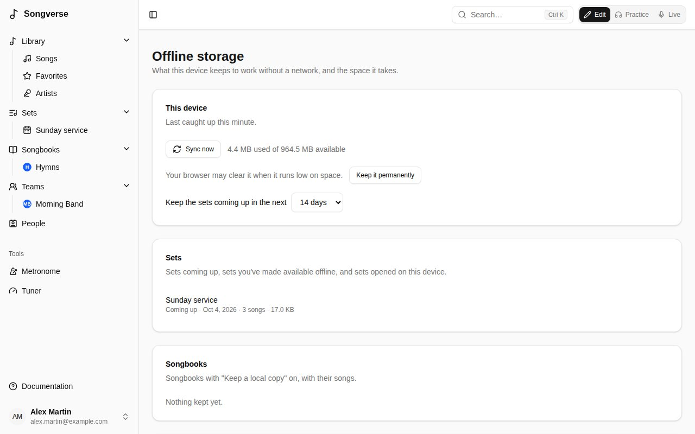

Once you've used Songverse on a device, it opens there even with no network (on stage with no Wi-Fi, say). You stay signed in, and a banner says you're offline and when the device last caught up. Changes can't be saved until you're back online.

Before a gig, open Songverse once while you still have a connection: it catches up on its own.

## What's kept

Kept on the device automatically, with their songs:

- **Your sets for the next two weeks** (the days are a [setting](#offline-storage)), whether you've opened them or not;
- **any other set you open** while online;
- **your own songs**.

You can keep more:

- **Available offline**, on a set or a song, keeps it on every device you sign in on.
- **Keep a local copy**, on a songbook, keeps it and all its songs.
- **Include audio**, next to either, downloads its audio files too. They're large, so they never come otherwise.

A song's PDFs, images and ChordPro files come with it.

Whenever Songverse is open with a connection, it catches up every few minutes: changed songs and sets are updated. A set is removed once it's deleted, once you can no longer open it, or a day after its date. A song or songbook is removed once you can no longer open it or stop keeping it.

## Offline

- **Sets** open read-only. Their songs open with their chords, and a set plays in **Live** from start to finish.
- **Songs** open read-only: their chart, the files kept with them (**Open**), and **Live**.
- **Songbooks** you keep a copy of open with their entries.
- **The search** finds every song kept on the device, and the entries of songbooks you keep a copy of by their number, so a song the leader calls can still come up full screen.
- Anything else says **Not available offline**.

## Offline storage

**Offline storage**, in the menu under your name, shows what this device keeps and the space it takes:

- when it last caught up, and **Sync now**;
- whether the browser may clear it when it runs low on space, and **Keep it permanently**;
- how far ahead sets are kept (**Keep the sets coming up in the next** 3 to 60 days);
- the sets, songbooks and songs kept, each with **Remove**. Removing something you made available offline stops keeping it on every device. Sets coming up come back on their own;
- **Remove everything from this device**.

## Privacy

What's kept on a device can be read by anyone using it while it's unlocked. **Sign out** deletes it.
