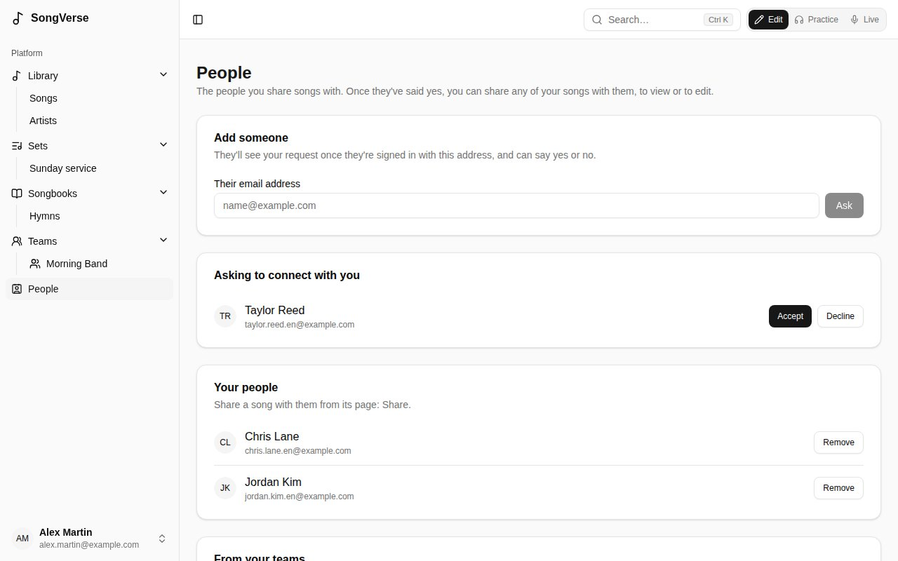
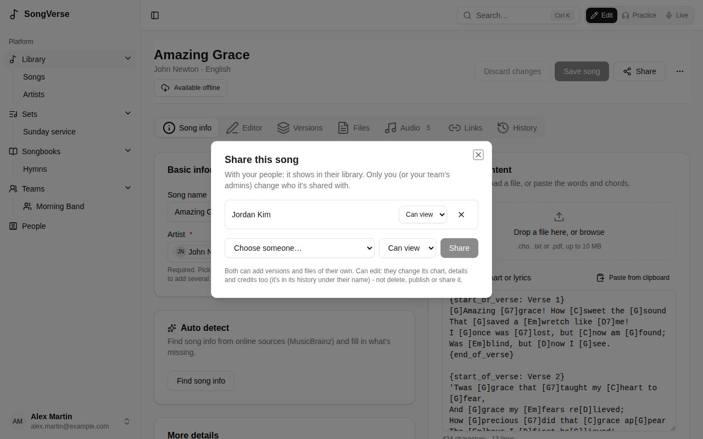

**People**, in the sidebar, lists who you're connected to: the people you can share songs with. A team shares everything with everyone in it; People is for one song at a time, with one person - a guest musician, a friend from another church.

## Adding someone

Under **Add someone**, type **Their email address** and **Ask**. They see your request under **Asking to connect with you** once they're signed in with that address, and **Accept** or **Decline** it. Until then it's listed under **Waiting for an answer**, where **Cancel** takes it back.

SongVerse never tells whether an address has an account, or whether someone declined: a request just stays waiting.

People you're in a team with are listed under **From your teams**: **Ask** sends them a request in one click. If someone asks you while you're asking them, you're connected straight away.

**Remove** disconnects you from someone: what either of you had shared with the other stops being shared.

## Sharing a song

On your song's page, **Share** lists who it's shared with, and adds one of your people:

- **Can view** - it shows in their library, marked **Shared by** you. They can make [versions](/versions/) of their own of it, add their own files (see [Who sees a file](/library/#who-sees-a-file)) and put it in their sets.
- **Can edit** - they also change its chart, details and credits. Their changes are in its [history](/song-editor/#history) under their name. They can't delete it, publish it or share it further.

Change what someone can do, or stop sharing with them (**×**), in the same place. A team's admins share the team's songs the same way. A song in the [global catalogue](/library/#submitting-to-the-global-catalogue) is everyone's already: publishing it ends its sharing.

Someone a song is shared with can take it out of their library: **Remove from my library** in the song's **⋯** menu.
