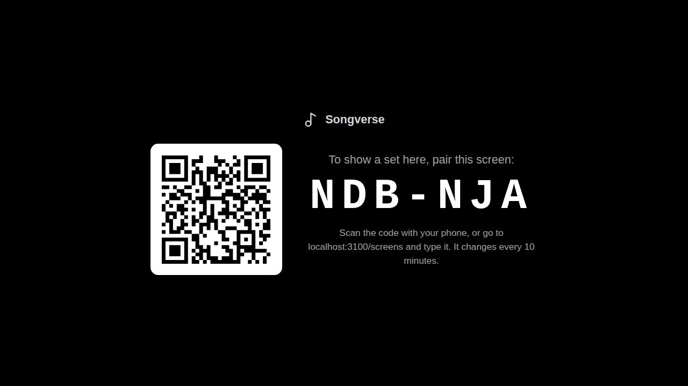
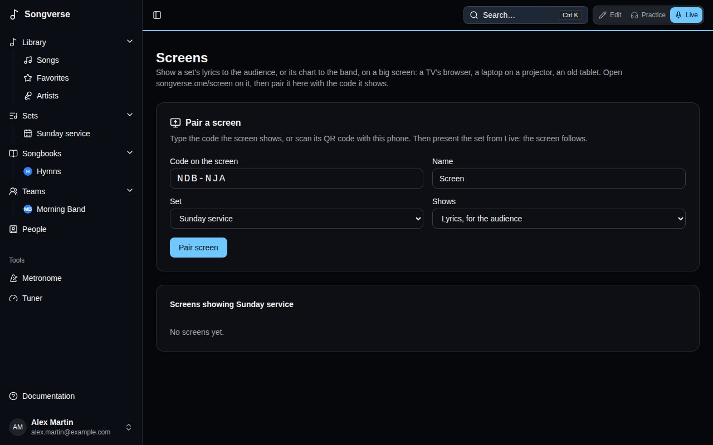
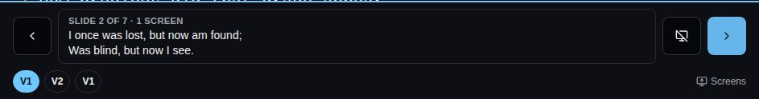
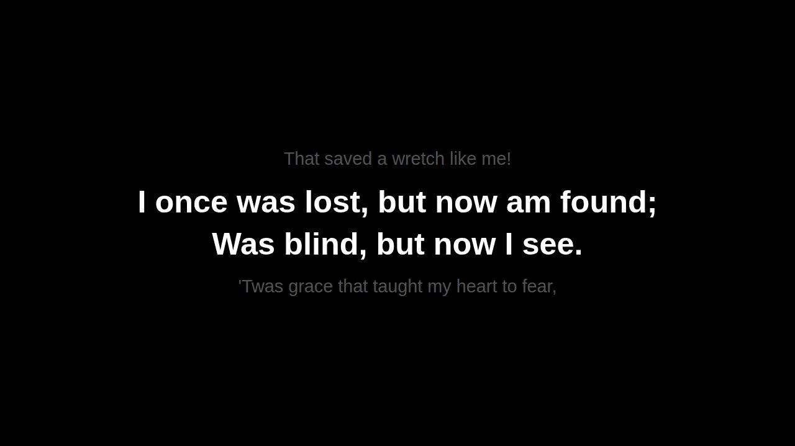

A **screen** shows a set on a big screen: the lyrics for the audience, two lines at a time, or the chart for the band. It can be a TV's browser, a laptop or a small computer plugged into a projector, or an old tablet. Whoever leads the set presents it from [Live](/sets/#playing-a-set-live), and every screen follows.

## Pairing a screen

1. On the screen, open **songverse.one/screen**. Nobody signs in there: it shows a code and a QR code. The code changes every 10 minutes until it's used.

   

2. On your phone or tablet, scan the QR code, or open **Screens** from the Sync menu in Live (**Screens…**) and type the code.
3. Give the screen a **Name** ("Church TV"), pick the **Set** it shows and what it **Shows**: **Lyrics, for the audience** or **The chart, for the band**. Then **Pair screen**.

   

The screen remembers it's paired: next time, open the same page and it reconnects by itself. Only someone who can edit the set (its owner, or an admin of its team) can pair a screen to it, because they're the ones who lead it.

On **Screens**, each screen of the set can be renamed, moved to another set or switched between lyrics and chart; the screen changes at once. **Disconnect** stops it: it goes back to showing a new code.

## Presenting from Live

Presenting uses [Sync](/sets/#playing-in-sync): the screens are members of the set's session.

1. In Live, open the Sync menu, **Turn sync on**, then **Lead the set**. Paired screens are listed there with the other members, marked "(screen)".
2. Choose **Present on screens**. A panel opens at the bottom of Live, showing what the screens show.

- **Next slide** and **Previous slide** (the arrows on each side) move two lines at a time. On a keyboard or a Bluetooth page-turner pedal, the down arrow or Page Down goes on, and the up arrow or Page Up goes back. Past a song's last slide, Live moves to the next song of the set and the screens follow; back past its first, to the previous song's last slide.
- The song's sections (V1, C, V2…) under the slide jump straight to one, for a chorus sung again or a verse dropped.
- **Black screen** blanks every screen, for prayer, talking or between songs. Press it again to bring the words back.
- **Stop presenting**, in the Sync menu, leaves the screens showing the set's name.

## What the screens show

With **Lyrics, for the audience**, each slide's two lines are big and centred. The line before is faint above, the line after faint below, and each slide fades in. A section without words, like an instrumental, is an empty slide, so you step through the song as the band plays it. A song's first slide shows its title, and its first and last show its credits at the bottom: who wrote it, its copyright and its CCLI song number, from the song's details.

With **The chart, for the band**, the screen shows the song's chart with chords, in the set's key, and keeps the section being sung highlighted and in view.

The words come from the version and key the set plays. Song notes and chords are never shown to the audience. If the screen loses its connection, it says so in a corner and reconnects by itself.
