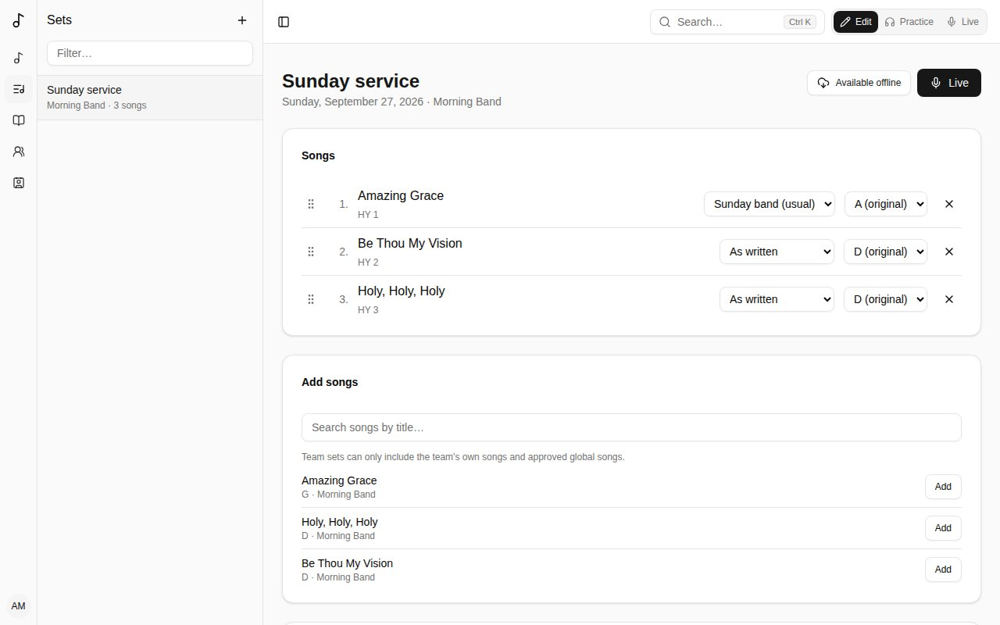
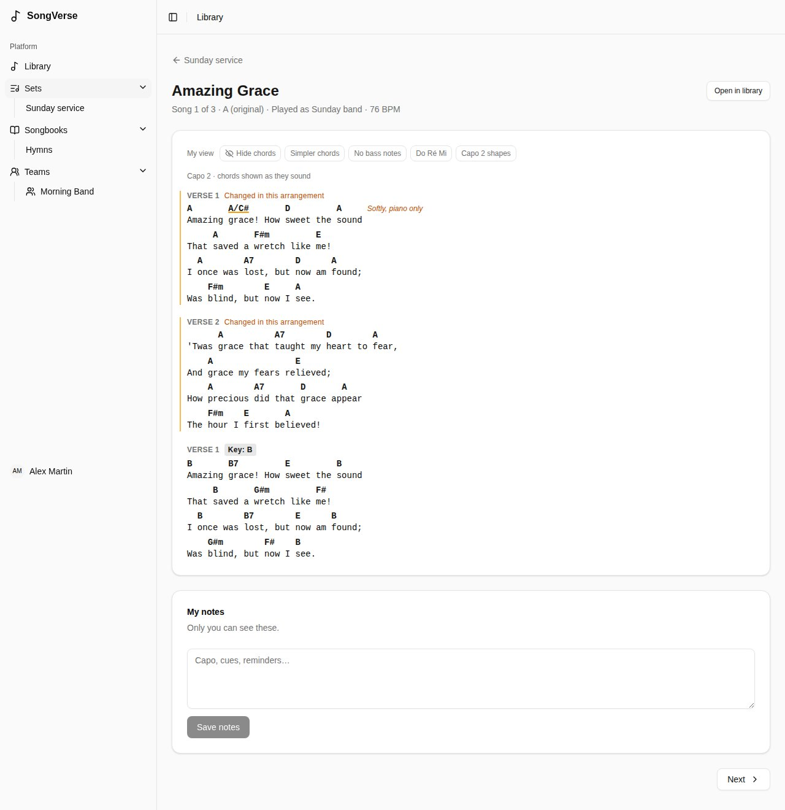
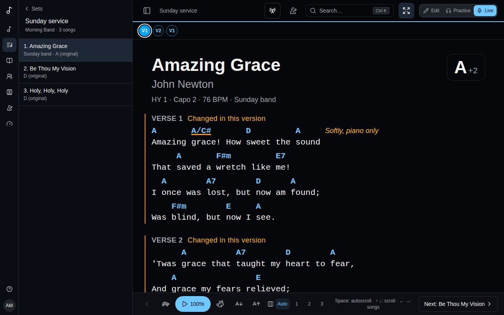

A **set** is a list of songs for a service, a rehearsal or a gig. Your sets are listed under **Sets** in the sidebar.

## Creating a set

Choose **Sets** > **New set**:

- **Date** (optional) - unless you give it a name, the set is called by its date.
- **Name** (optional) - "Sunday service", "Youth night".
- **Owner** - **Just me**, or a team you're an admin of. A team set is seen by the team's members and changed by its admins.

## Songs in a set

- **Add songs** by searching for them by title. A team set can only include the team's own songs and approved global songs, so everyone in the team can open them.
- **Reorder** by dragging a song's handle (or focus the handle and use Space and the arrow keys).
- For each song, choose:
  - its **Translation**, when the song has [linked songs](/library/#linked-songs) (the same song in another language, say);
  - its **Version** - **As written**, or one of your or your team's [versions](/versions/). In a team set, the team's usual version is picked for you;
  - its **Key** - moves the song from the version's key ("a tone lower this Sunday") without changing the version.
- **×** removes a song from the set (the song itself isn't affected).

### Just for this set

To reorder, skip or repeat sections for one set only, choose **Just for this set…** in the song's **Version** menu. It copies the version the set played (or the song's order) and opens it in the [version editor](/versions/#editing-it). It's used only in this set, isn't listed with the song's versions, and goes when the song leaves the set. The ✎ button next to the menu reopens it.

## Playing from a set

Click a song in the set to open its chart, as the set plays it: its version, in the set's key.

- **Previous** and **Next** go through the set in order.
- **My view** changes the chart for you only - hide chords, simpler chords, solfège, capo shapes. See [Your own view of a chart](/versions/#your-own-view-of-a-chart).
- **My notes** are private: capo, cues, reminders. Only you see them.

## Playing a set live

On stage, switch to **Live** - the button on the set's page, or the mode switch at the top right of every page. Songverse turns dark (easy on the eyes in a dim room) and each song of the set opens full screen, big, as you read it with [My view](/versions/#your-own-view-of-a-chart).

- The header shows the set's name; **×** goes back to the set.
- Under it, the song's structure: its parts in the order they're sung, as small circles - **V1** **C** **V2** **C** **B** **C** (verse, chorus, bridge...) - coloured by kind: intros and outros, verses and pre-choruses, choruses, bridges and instrumentals each have their own colour. The part being sung is ringed and the ones sung are filled, as the song scrolls; tap one to go there.
- The song starts with its title and artist, its songbook number (**JEM 855 · JEM3**), capo and tempo, and scrolls with the chords and words.
- Its key is at the top right: **G**, with a small **+2** when the set plays it higher or lower than written. Tap it to transpose at the last moment, with **−** and **+**: only on your screen, for this song, until you leave it. **Back to the set's key** undoes it.
- The bottom shows what's next - **Next: …** takes you there - and the previous song's arrow.
- **Autoscroll** (the play button) scrolls the chart at the song's pace: over its duration when it has one, or else two bars a line at its tempo. The tortoise and hare slow it down or speed it up, a step at a time.
- The **A** buttons make the text smaller or bigger; Songverse remembers your size on this device.
- The expand button goes full screen, hiding the browser's own bars.
- The screen stays on while a song is open.

With a keyboard or a page-turner pedal: **Space** starts and pauses autoscroll, **↑** **↓** (or Page Up and Page Down) scroll, **←** **→** go to the previous or next song.

On a phone or tablet, swipe left for the next song and right for the previous one.

### A song that isn't in the set

When the leader calls a song that wasn't planned, use the search (the magnifying glass at the top): by its title, or by its number when it's called that way ("Hymn 42!": **HY 42**). In Live, a song you pick opens full screen too, with autoscroll and your text size. **Back** (**×**) returns to the set's song you were on.

## Sharing a set with guests

Under **Share**, **Create a share link** and send it to whoever should see the set - a guest musician, say. Anyone signed in who opens it can read every song in the set, even ones not in their library, and keep their own notes. They can't change it.

- **Reset link** stops the old link from working; people who already joined keep access.
- **Turn off link** stops anyone new from joining.
- **Guests** lists who joined; you can remove them.

A guest can **Leave set** at any time.

## Moving a set to a team, or back

Change the **Owner** under **Details**. When a personal set moves to a team, your personal songs in it stay: they're shared read-only with the team and labelled as yours. A team admin can **Ask for this song**, and you can **Give to team** - the song then becomes the team's.
