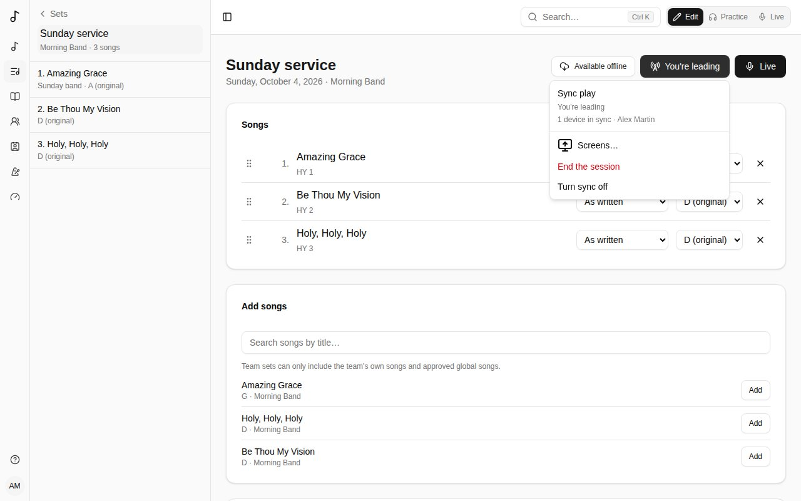

A **set** is a list of songs for a service, a rehearsal or a gig. Your sets are listed under **Sets** in the sidebar.

## Creating a set

Choose **Sets** > **New set**:

- **Date** (optional) - unless you give it a name, the set is called by its date.
- **Name** (optional) - "Sunday service", "Youth night".
- **Owner** - **Just me**, or a team you're an admin of. A team set is seen by the team's members and changed by its admins.

## Songs in a set

- **Add songs** by searching for them by title. A team set can only include the team's own songs and approved global songs, so everyone in the team can open them.
- **Reorder** by dragging a song's handle (or focus the handle and use Space and the arrow keys).
- For each song, choose:
  - its **Translation**, when the song has [linked songs](/library/#linked-songs) (the same song in another language, say);
  - its **Version** - **As written**, or one of your or your team's [versions](/versions/). In a team set, the team's usual version is picked for you;
  - its **Key** - moves the song from the version's key ("a tone lower this Sunday") without changing the version;
  - **After this song** - what happens next: **Stop** (the end, wait for the leader), **Go to next** (straight into the next song), **Segue (no pause)** (the next song's count-in on the last bar) or **Transition**, a bridge into the next song with a note beside it ("Pad under the prayer") and [chords to play into it](/sets/#chords-into-the-next-song). Live says it before the song ends, with the change of key and tempo when the next song has another one.
- **×** removes a song from the set (the song itself isn't affected).

### Chords into the next song

For a **Transition**, the **Chords** button beside its note suggests chords to play into the next song: from the last chord of this song to the first chord of the next, as the set plays them (with each song's version and **Key**). The two frame the list - **From G → … → into D** - and the suggestions lead into that first chord: if the next song starts on its 4 or its 6m rather than its 1, they lead there. Chords are shown with their numbers in the next song's key, as Nashville charts write them: **3⁷** is its 3 with a 7th (F#7 in D), **♭2/1** E♭ over D. From a song ending on E♭ into a song in D that starts on Bm:

- **Walking bass from the last chord** - the bass steps from one chord's root to the other along the key's scale, each note under a chord of the key: E♭ → D → A/C# → Bm;
- **Last chord over the moving bass, then IV/V–V** - E♭ → E♭/D → G/A → A7 → Bm;
- **The key's dominant, landing on the first chord** - when the next song doesn't start on its 1: A7 → Bm, or G/A A7 → Bm.

And into the first chord itself (into a song in D that starts on D):

- **The first chord's own dominant** - one chord, its V7 (A7 into D; F#7 into Bm);
- **Suspended dominant** - V7sus4 resolving to V7;
- **ii–V** - Em7 A7 into D (into a minor key, its iiø7 and V7);
- **IV–V** - G A7 into D;
- **Through a chord both keys share** - a chord that still sounds like the song you're leaving, then into the new key: from G into D, Bm Em7 A7;
- **Step up (♭VI–♭VII)** - into a key a half or whole step up, the classic lift: F G into A;
- **Down the circle of fifths** - four chords, F#m7 Bm7 Em7 A7 into D.

**How many chords** keeps the ones of that length. Tap any chord - in a suggestion, or the two around them - to hear it, and **Use** to choose that suggestion; or type your own (**Em7 A7**, or as numbers, **2m7 57**) and tap **Use**; **No chords** takes them away. They're kept as numbers in the next song's key, so if that song moves to another key, its chords move with it. In Live, they're shown under the transition as one compact row of steps - the song's last chord, the transition's chords, the next one's first - each tapped to hear it. The button at the end of the row opens it: the [chord diagrams](/versions/#chord-diagrams) of your instrument under each chord and, if you can change the set, the other ways in to choose from (the list above). It stays open or compact on this device.

### Just for this set

To reorder, skip or repeat sections for one set only, choose **Just for this set…** in the song's **Version** menu. It copies the version the set played (or the song's order) and opens it in the [version editor](/versions/#editing-it). It's used only in this set, isn't listed with the song's versions, and goes when the song leaves the set. The ✎ button next to the menu reopens it.

## Playing from a set

Click a song in the set to open its chart, as the set plays it: its version, in the set's key.

- **Previous** and **Next** go through the set in order.
- **My view** changes the chart for you only - hide chords, simpler chords, solfège, capo shapes. See [Your own view of a chart](/versions/#your-own-view-of-a-chart).
- **My notes** are private: capo, cues, reminders. Only you see them.

## Playing a set live

On stage, switch to **Live** - the button on the set's page, or the mode switch at the top right of every page. Songverse turns dark (easy on the eyes in a dim room) and each song of the set takes the whole page beside the sidebar, big, as you read it with [My view](/versions/#your-own-view-of-a-chart).

- The sidebar stays beside the song on a tablet or computer, with the set's songs listed: tap one to go to it. The song playing is marked **Now**, with a bar down its side; the ones played are ticked and quieter, but stay in their place, and **Start from the top** above the list clears them. If you can change the set, each song has a handle (⋮⋮) on its right: drag it up or down to move the song (or focus it, press Space, the arrow keys, then Space again). The new order is saved straight away, and **Next** follows it. Beside each song, its symbol says what happens after it - a square to stop, an arrow to go to the next, a double arrow for a segue, crossing arrows for a transition - and if you can change the set, tapping it changes it. The button beside the set's name (sliders) picks what else each song shows on its right, in columns: its **Key** as played, **Tempo (BPM)**, **Time signature**, **Length**, and **What happens after it**; it's remembered on this device. The button at the top left hides the sidebar or shows it again; on a phone, where there's no room beside the song, it opens the sidebar over it. The header also shows the set's name.
- Under it, the song's structure: its parts in the order they're sung, as small circles - **V1** **C** **V2** **C** **B** **C** (verse, chorus, bridge...) - coloured by kind: intros and outros, verses and pre-choruses, choruses, bridges and vamps, and instrumentals, interludes and breakdowns each have their own colour. The part being sung is ringed and the ones sung are filled, as the song scrolls; tap one to go there.
- When the song has a PDF, **Chart** / **PDF** at the top reads it as its chart or as the PDF's pages. Your choice is kept for the song on your account, the same on every device and in Practice, so pick it while practising and the stage shows it; songs you haven't chosen for follow your **Songs read as** setting (see [Chart display](/account/#chart-display)). With a PDF, autoscroll still scrolls it, and the structure bar is hidden; on a phone its pages fill the screen from edge to edge, under the header, the PDF's own title in place of the song's.
- A song that segues or transitions into the next has the next one **under it, on the same page** (and the one after, while the chain goes on): keep scrolling - or let autoscroll carry on - into it. Between the two, a band says what happens and, for a transition, shows its [chords](/sets/#chords-into-the-next-song) from the last chord of the song to the first of the next. The song being played follows the scroll: once the next song's title passes the top third of the screen, it's marked **Now** in the sidebar, the one before is played, and the structure bar, key, metronome and Sync play follow it. **Next** and **Previous** scroll to the next or previous song of the page, and change page past its ends. To play every song on its own page, untick **Stack segues and transitions** in the sidebar's sliders menu; it's remembered on this device.
- The song starts with its title and artist, its songbook number (**JEM 855 · JEM3**), capo and tempo, and scrolls with the chords and words.
- Its key is at the top right: **G**, with a small **+2** when the set plays it higher or lower than written. Tap it to transpose at the last moment, with **−** and **+**: only on your screen, for this song, until you leave it. **Back to the set's key** undoes it. A transition follows: its key change, the song's last chord, its chords and the next song's first chord move with either song's key.
- The bottom shows what's next - **Next: …** takes you there - and the previous song's arrow.
- **Autoscroll** (the play button) scrolls the chart at the song's pace: over its duration when it has one, or else two bars a line at its tempo. The tortoise and hare slow it down or speed it up, a step at a time.
- The metronome button, at the top, starts the [metronome](/metronome/) at the song's tempo and time signature, and flashes with the beat; press it again to stop.
- The **A** buttons make the text smaller or bigger; Songverse remembers your size on this device. Beside them, the columns: **Auto** flows a long song into as many columns as the screen fits, like a newspaper, a section never split between two, so it fits without scrolling; **1**, **2** or **3** set how many at most. Songverse remembers your choice on this device, for Practice too.
- The expand button goes full screen, hiding the browser's own bars.
- The screen stays on while a song is open.

With a keyboard or a page-turner pedal: **Space** starts and pauses autoscroll, **↑** **↓** (or Page Up and Page Down) scroll, **←** **→** go to the previous or next song.

On a phone or tablet, swipe left for the next song and right for the previous one.

In Live, picking a set - from the list of sets, the sidebar or the home page - opens it straight into Live, at its first song. Coming back to the set picks up at the last song you opened in Live, on this device, rather than the first. A song counts as played once its chart has been scrolled 95% of the way down (by hand or with autoscroll); a song short enough to fit on the screen counts once you move on to the next one. The set's page (in Edit or Practice) shows the played songs with a tick and highlights the number of the song Live will pick up at, and its button reads **Resume Live**. **Start from the top** forgets where you got to; Songverse also forgets it by itself after 12 hours, so the next service starts from the first song.

### A song that isn't in the set

When the leader calls a song that wasn't planned, use the search (the magnifying glass at the top): by its title, or by its number when it's called that way ("Hymn 42!": **HY 42**). In Live, a song you pick opens the same way, with autoscroll and your text size. **Back** (the arrow beside the sidebar button) returns to the set's song you were on. If you can change the set, each song found also offers **Play next** (or **Shift Enter**), which adds it to the set right after the song playing, and the button beside it, **Add at the end of the set**; the song playing stays on screen, and **Next** then leads to the song added.

## Playing in sync

With **Sync**, everyone in a set plays together: one person leads, and the others' metronome - on their screen and in their ears - follows theirs, at the same instant, and their screen follows the leader's song. **Sync** is on the set's page, on its songs' pages and at the top of Live (the tower icon).

- **Turn sync on**, on each device: it says who's leading, and how many devices are in sync. Sync stays on while you move around Songverse, and comes back if the page reloads; **Turn sync off** leaves.
- Someone who can edit the set - its owner, or an admin of its team - chooses **Lead the set**. Another one can take over with **Lead instead**: the metronome carries on as it was.
- The leader starts the [metronome](/metronome/): the metronome button in Live or on a song's page, or the Metronome page, where they set the tempo, time signature and pattern. Everyone's starts at the same beat, and a new tempo reaches everyone on the same beat. The others' metronome shows **Following** and the leader's name: its settings are the leader's, but its sound and volume are their own.
- When the leader plays a song's stems or recording (on a set's song page in Practice), everyone's plays the same song from the same instant: pause and the playhead follow too, as do the leader's multitrack and transposition, and each person keeps their own mutes and solos. Everyone's files start downloading as soon as the leader's page opens the song; a device that isn't ready yet joins at the current position. In Live, where there's no player, the small button at the bottom right shows the song playing. **Click with the recording** makes the metronome everyone's on the recording's beat (see [Stems](/library/#stems)).
- When the leader moves to another song of the set, in Live or on its page, everyone's screen follows. You can still look at another song meanwhile: the next time the leader moves, you follow again.
- If a device loses its connection, its metronome keeps time on its own, and catches up when it's back. If the leader loses theirs, the session carries on, and they take the lead back when they're back.
- **End the session** stops everyone's metronome.
- The leader can also present the set on big screens, its lyrics for the audience or its chart for the band: see [Screens](/screens/).
- Someone who can no longer open the set (taken off its team, say) stops following it within half a minute, and someone who can no longer edit it stops leading it.

After a reload, a browser only lets the metronome make sound after a tap: **Tap to hear the metronome** (under **Sync**, or on the Metronome page) does it.

For the beats to line up by ear, use wired headphones or the device's speaker: Bluetooth headphones add a delay of their own. While sync is on, an iPhone or iPad plays the stems straight to its speakers (they then stop with the screen locked: Live keeps it on). Each device keeps time with its own clock, set against Songverse's; only the tempo and when the beat falls go over the network, never the sound.

If a device isn't in time with the others, add `?debug=sync` to the address on it: a box at the top left shows what it knows of its clocks (its offset to Songverse's, how long a message takes there and back, whether its audio output's own timing is used, how far its beat has been moved back into place). It stays on in that tab until its **×**. Send those numbers along with the device and browser.

## Sharing a set with guests

Under **Share**, **Create a share link** and send it to whoever should see the set - a guest musician, say. Anyone signed in who opens it can read every song in the set, even ones not in their library, and keep their own notes. They can't change it.

- **Reset link** stops the old link from working; people who already joined keep access.
- **Turn off link** stops anyone new from joining.
- **Guests** lists who joined; you can remove them.

A guest can **Leave set** at any time.

## Moving a set to a team, or back

Change the **Owner** under **Details**. When a personal set moves to a team, your personal songs in it stay: they're shared read-only with the team and labelled as yours. A team admin can **Ask for this song**, and you can **Give to team** - the song then becomes the team's.
