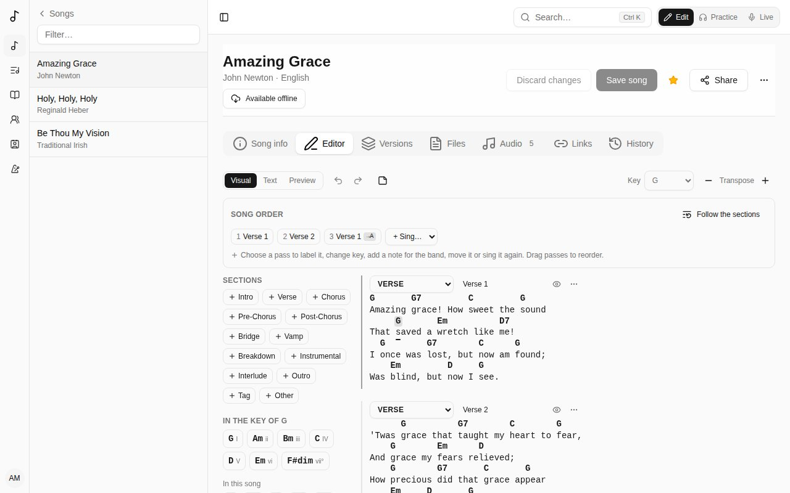
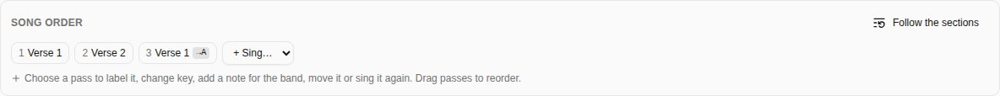
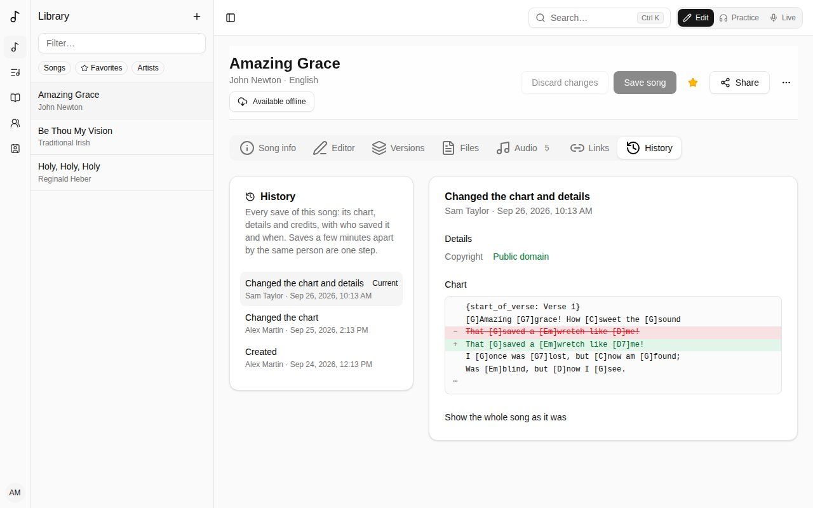

Open a song and choose the **Editor** tab.

The editor has three modes, at the top left:

- **Visual** - the chart with chords sitting over the words. This is where you'll spend most of your time.
- **Text** - the same chart as ChordPro text, for quick bulk edits. Chords and lines you don't change stay as they were.
- **Preview** - the chart as players will see it.

## Chords

- **Type a chord** in square brackets where it's played: `[G]Amazing grace`.
- **Move a chord** by dragging it onto another letter, or select it and use the ← → arrow keys.
- **Click a chord** to change it (with suggestions from the song's key and variations like `G7` or `Gsus4`) or delete it.
- The palette on the left lists the **chords in the song's key** (with their degree: I, IV, V…) and the chords **In this song**. Click one to add it at the cursor, or drag it onto a word. **Another chord** adds any other.

Editing the words keeps the chords with them: typing before a chord carries it along, and deleting words that carry chords leaves the chords where the words were, so you can place them again. Enter splits a line and its chords go with their words.

## Sections

Each block is a section: verse, chorus, bridge and so on.

- **Add a section** from the palette's **Sections** list.
- Change a section's **type** or **label** ("Verse 2") at its top. The eye button hides its label on the chart.
- The **⋯** menu moves, duplicates or deletes it.
- A line can be a **note for the band** ("×2, build") rather than lyrics.

## Key and transposing

Set the song's **Key** at the top right. **Transpose** − and + move every chord and the key by a semitone.

## The song order

The **Song order** above the chart is the order the song is sung in, each time through a section being a *pass*.

- **+ Sing…** adds a pass: the chorus again, say.
- **Choose a pass** to label it ("Final chorus"), change key for it, add a note for the band, move it earlier or later, sing it again right after, or remove it.
- **Drag passes** to reorder them.
- **Follow the sections** goes back to singing each section once, in order.

Key changes and notes show on the chart at that pass.

## Pasting a chart

Paste a whole chart anywhere - ChordPro, or chords written above the lyrics - and it's turned into sections with chords in place. Pasting plain words just types them.

## Saving

**Save song** saves the chart and the song's details together. If someone else saved the song after you opened it, Songverse tells you instead of overwriting their changes.

## History

The **History** tab lists every save of the song, newest first: who saved it, when, and what changed - the **chart**, the **details** (title, key, rights…) or the **credits**. Saves by the same person a few minutes apart count as one step.

Choose a step to see what it changed: details and credits with the old value struck out and the new one beside it, and the chart's lines removed and added. **Show the whole song as it was** shows the song at that step.

If you can edit the song, **Restore this** puts its chart, details and credits back as they were at that step. It's saved like any other change, so it shows in the history and can itself be undone. Tags, files, links and versions aren't part of the history and stay as they are. Save or discard your own changes before restoring.

Songs created before the history was kept start with **Before the history was kept**: the song as it was then.
