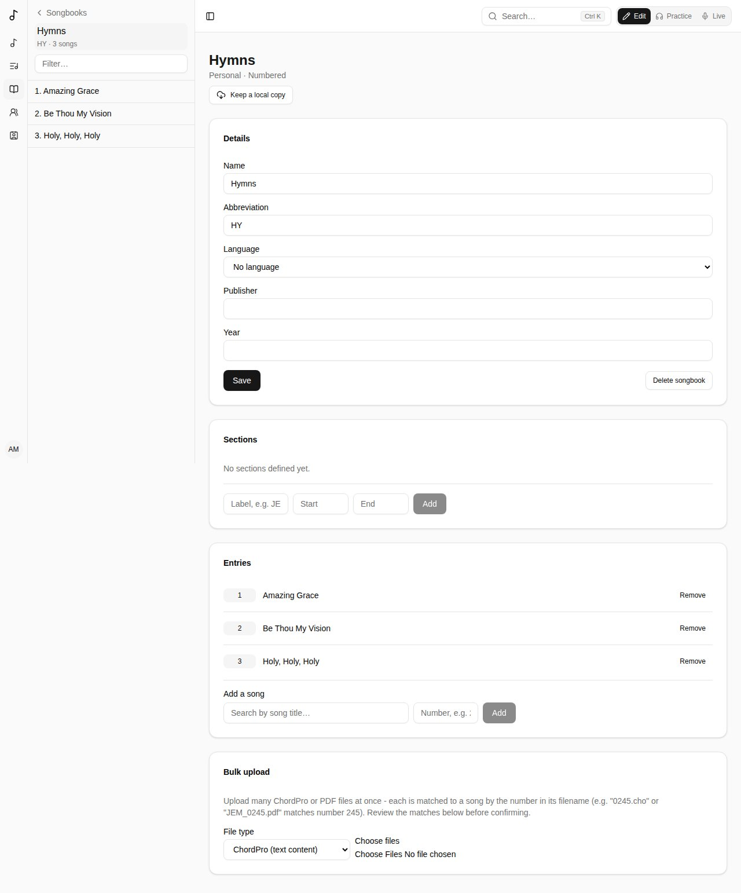

A **songbook** is a collection of songs. Yours are listed under **Songbooks** in the sidebar.

## Creating a songbook

Choose **Create songbook** and pick its **Type**:

- **Simple** - an unordered collection; songs have no number.
- **Numbered** - songs are numbered to match a printed edition, and numbers must be unique.

Give it a name, and optionally an abbreviation, language, publisher and year. Choose who owns it: you, a team, or everyone (global admins only).

A songbook's page is about its entries: its name, with how many entries it has (and its publisher and year), then the entries. **Details** opens what describes it - its name, abbreviation, language, publisher and year, a numbered songbook's sections - and **Delete songbook**.

### Colour and picture

Whoever manages a songbook gives it a **Colour** and a picture under **Details**, in **Colour and picture**, as a team's (see [Colour and picture](/teams/#colour-and-picture)): shown beside its name in the sidebar and in lists.

## Songs in a songbook

Under **Entries**, **Add a song** by searching for it and, in a numbered songbook, giving its number.

Songs are listed in number order (1, 2, 10, 100), and a plain number is kept without leading zeros: "0245" is 245.

A numbered songbook can have **sections**: ranges of numbers with a label, like a hymnal's printed volumes (1-371 is "JEM1", 372-721 "JEM2"…). You can then filter the songbook by section.

A song's page lists its songbooks with its full reference - the songbook's abbreviation, the number and the volume: **JEM 855 · JEM3** - and **Copy** puts "Title — JEM 855 · JEM3" on the clipboard, to give someone who doesn't use Songverse. A set shows it under each song too.

## Sharing a songbook

To let your band use a songbook you started - find its songs by number, see **JEM 683** in Live, put its songs in their sets - open it and tap **Share**. Choose one of your [people](/people/) or one of your teams, and what they can do:

- **Can view** - it shows in their songbooks (marked **Shared with you**), with its numbers and the songs in it, read-only: they open them, find them with the search box, add them to their sets and play them. A team's share is for its members, now and later.
- **Can edit** - they also add, remove and renumber its songs and change its details. They add songs they can see; those songs stay theirs, now readable by everyone the songbook is shared with.

The songs stay yours. Taking a song out of the songbook, or stopping the share, takes that access away. Only you (or your team's admins) share it, delete it and bulk-upload into it. In the same dialog, change what someone can do, or stop sharing with them (**×**). Someone it's shared with can take it out of their songbooks.

## From a published songbook's catalog

The **Songbook catalog** (**Browse catalog**) is a directory of known published songbooks: their numbers, titles, credits, keys and more - but no lyrics or chords.

A catalog can list its printed volumes, the same way as a songbook's sections. Starting a songbook from it copies them; a songbook started before the catalog had them offers **Use the catalogue's volumes**.

Starting a songbook from a catalog gives you every entry at once. Entries whose song isn't in your library yet are listed under **Pending entries**: **Start** one to create the song with the catalog's details filled in, then add its words and chords.

## Bulk upload

To fill a numbered songbook quickly, **Bulk upload** many ChordPro or PDF files at once. Each file is matched to a song by the number in its name (`0245.cho` or `JEM_0245.pdf` matches number 245). Check the matches, then **Confirm upload**. Two files with the same number are both marked as a conflict, each naming the other ("Same number as …"), and neither is uploaded. Only files of the kind chosen are matched (a PDF beside a ChordPro file isn't a conflict). System files, like macOS's `._0245.cho` copies or `.DS_Store`, are left out and only counted. A whole songbook can go at once: the files are sent a hundred at a time, and the button counts them ("Uploading 300 of 1199…").

Each ChordPro file becomes its song's chart, and the file is kept with the song. Files written as songbooks write them are understood:
- a comment naming a section (`{c: Verse 2}`, `{c: Strophe 1}`, `{c: Refrain}`, `{c: Pont}`, in English, French, Spanish, German, Italian or Portuguese) sets that section's kind;
- a verse's "2. " at the start of its first line is left out;
- a chorus written out again each time is sung again, rather than stored twice;
- a `© …` line before the first section becomes the song's copyright, and the song's key comes from `{key}`, when the song doesn't have them yet;
- the site's address and "key change" comments are left out;
- chords are read as French books spell them too (`G7maj`, `C7M`, `F#d`, `A4`, `F9/6`).
