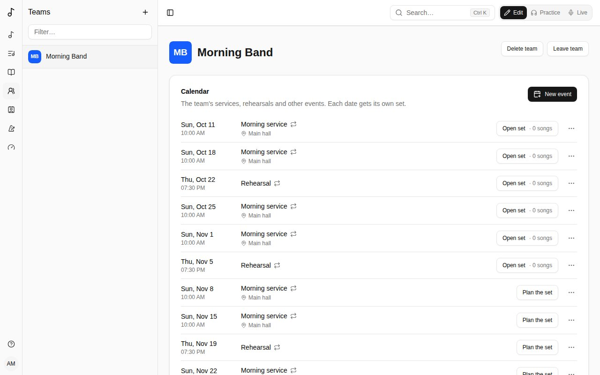

A **team** is a band or a group that shares songs, versions, sets and songbooks. Your teams are listed under **Teams** in the sidebar.

## Members and roles

- **Admins** manage the team: they change its songs, versions and sets, and invite people.
- **Members** see and use everything the team has.

Next to each name, the team shows what they play or do (see [Roles](/account/#roles)).

## Creating a team and inviting people

**Create team** from the Dashboard's **Teams** card; you're its first admin.

To invite people, create an **invite link**: choose the role they get when they join, when it expires and how many times it can be used, then **Copy link** and send it. Anyone who opens it and signs in joins the team. **Revoke** a link to stop it working.

## Colour and picture

A team's admins give it a **Colour** and a picture on its page, in **Colour and picture**: the picture (**Add a picture**, cropped square) or the team's initials on its colour show beside its name in the sidebar and in lists, for everyone who sees it. **From its name** picks a colour from the team's name.

## Leaving or deleting a team

**Leave team** takes you out of it. If you're its only admin, promote another member first. An admin can **Delete team**.

## What belongs to a team

Versions, sets and songbooks can be the team's rather than yours: choose the team when you create one (you need to be one of its admins). Team things stay with the team when people come and go.

A song of yours becomes the team's when you hand it over: see [Moving a set to a team](/sets/#moving-a-set-to-a-team-or-back).
