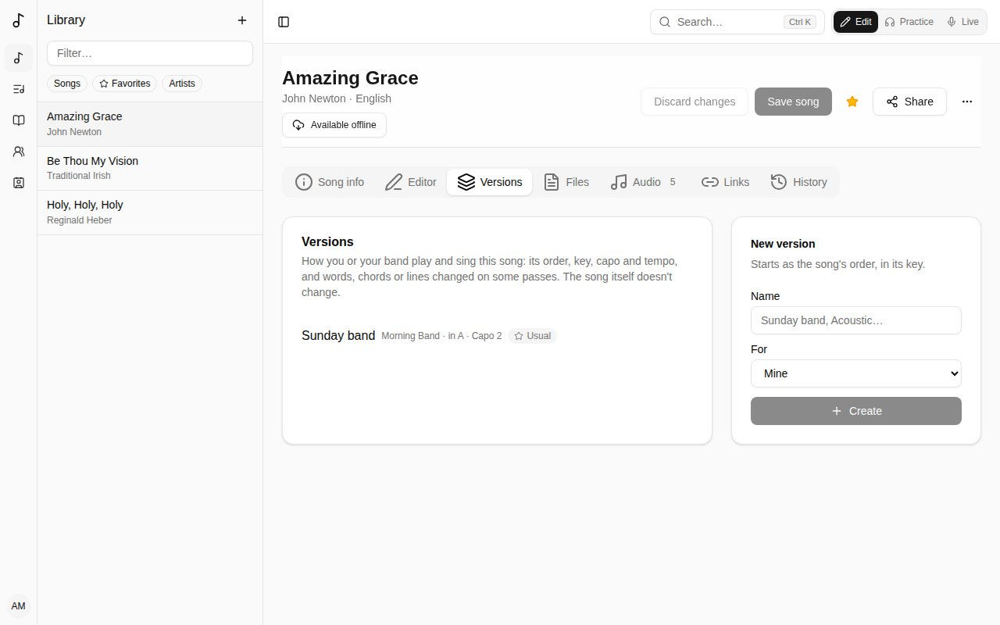
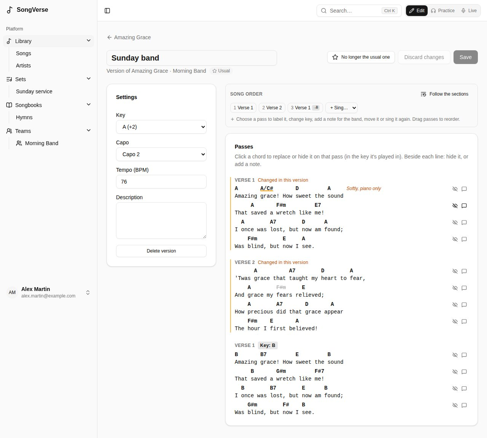
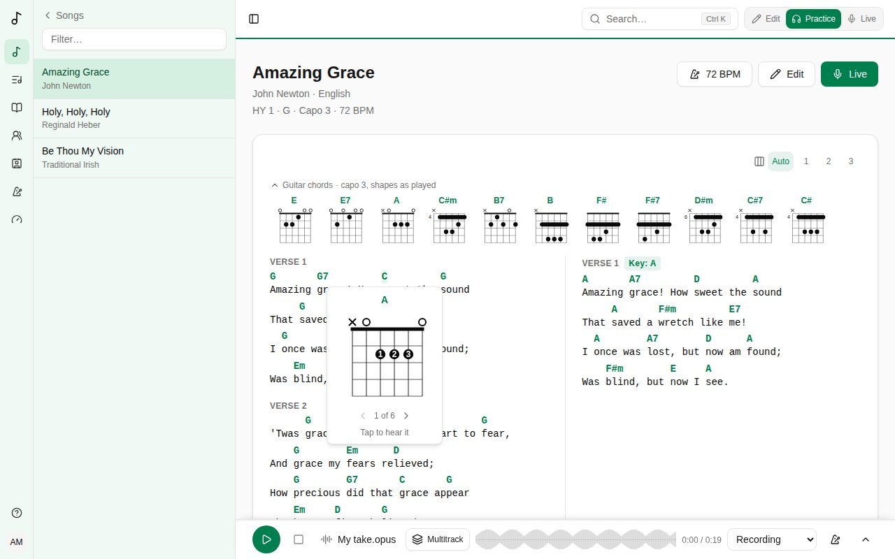

A **version** is how you or your band play and sing a song: its order, key, capo and tempo, and chords, words or lines changed on some passes. **The song itself never changes**, so you can make your version of songs you can't edit, like global catalogue songs. (A translation is something else: a song of its own, linked to its original - see [Linked songs](/library/#linked-songs).)

## Making one

On a song's **Versions** tab, give it a name ("Sunday band", "Acoustic") and choose who it's **For**: you, or a team you're an admin of. It starts as the song's order, in its key.

A team's versions are seen by the team's members and changed by its admins.

## Editing it

- **Settings** - its **Key** (from the song's), **Capo**, **Tempo** and a description.
- **Song order** - which passes are played, in what order, with key changes and notes, like [the song's own order](/song-editor/#the-song-order).
- **Passes** - the chart as this version plays it, in the key each pass is played in:
  - **click a chord** to replace it on that pass (type it in the key it's played in), **hide** it for the band, or put it back **as in the song**. **Move** puts it on another character: click the one it goes on;
  - beside each line, **hide the line** on that pass, add a **note** to it ("Softly, piano only"), or **change the words** on that pass - a line sung in another language, "we" for "I" on the last chorus. The chords stay on the same characters (pulled in to the end of a shorter line; **Move** them if needed), and the line is marked **words changed**. **Back to the song's words** undoes it;
  - **add a line** after any line, or **at the start** of the pass: a tag line, a spoken intro. Type it with its chords in brackets, before the word or syllable they're on: `[G]Sing it a[D]gain`. It's marked **added**; its chords can be replaced, moved or hidden like the others, and beside it you **edit** or **remove** it.

Passes you've changed are marked **Changed in this version**, here and on the band's charts. **Save** when you're done.

### The team's usual version

A team admin can make one of the team's versions **the team's usual one** for a song. When the song is added to one of the team's sets, that's the version it plays.

### When the song changes

If the song is edited after you last checked the version, the version editor says so. It keeps working meanwhile. Changes that point at something since removed from the song (a chord or line that's gone) are listed on their pass: remove them, or leave them - they do nothing. **Mark as checked** once you've looked it over.

A version made when your own copy of a song was folded into the catalogue song (see [Submitting to the global catalogue](/library/#submitting-to-the-global-catalogue)) plays the song as you had it, with its words changed and lines added the same way - and you edit them the same way too.

## Your own view of a chart

When you open a song in a set, the **My view** bar changes the chart **for you only**:

- **Hide chords** - then tap a chord to hide it (one that's too fast for you, say). **Show hidden** brings them back.
- **Simpler chords** - Gmaj7 shows as G, Bm7b5 as Bdim.
- **No bass notes** - D/F# shows as D.
- **Do Ré Mi** - chord names in solfège.
- **Capo shapes** - with a capo, chords as the shapes you play rather than as they sound.
- **Diagrams** - **None**, **Guitar** or **Ukulele**: see [Chord diagrams](/versions/#chord-diagrams) below.

Hidden and simpler chords are kept per song (and per version). Solfège, capo shapes and diagrams apply to every chart; you can also set them in [your account](/account/#chart-display).

## Chord diagrams

Choose **Guitar** or **Ukulele** under **Chord diagrams** in [Chart display](/account/#chart-display) (or **Diagrams** in **My view**), and the charts you read - in Practice, a set's songs, Live and offline - show how to play their chords. They're off until you choose; nothing ever covers the words, and the chart itself doesn't move.

- At the top of the chart, the song's chords as small diagrams, each once, in the order they come. Tap one to hear it strummed (down, then up on the next tap). The arrow beside **Guitar chords** folds them to a single line of names, remembered on the device.
- Tap a chord on the chart for its diagram, bigger, with the fingers to use. **‹ ›** go through the other ways to play it; tap the diagram to hear it.
- A diagram shows the strings up and down and the frets across: × is a string not played, ○ an open one, each dot a finger (its number in the bigger diagram), and a bar one finger across several strings. Near the nut, it's drawn thick; further up the neck, the number on the left is the fret it starts at.
- With a capo, guitar diagrams are the shapes you play with the capo on (**capo 2, shapes as played**), whatever your **With a capo** setting shows on the chart. Ukulele diagrams are the chords as they sound.
- They follow everything else: the set's key, a last-minute transpose in Live, a key change, **Simpler chords** and **No bass notes**. Every chord Songverse can read has a diagram, worked out on the device, so they work offline too.

In a set's **Hide chords** mode, tapping a chord still hides it.

